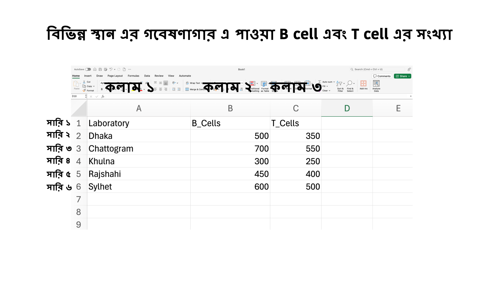

## ৩.৩ ডেটা ফ্রেম (Data Frames)
R এর আরেকটি ডেটা স্ট্রাকচার হল ডেটা ফ্রেম (Data Frame) যা ম্যাট্রিক্স এর মত দুই মাত্রিক (two dimensional) ডেটা ধারণ করে। ম্যাট্রিক্স এর মত ডেটা ফ্রেম এও সারি আর কলাম এ বিভক্ত। তবে ডেটা ফ্রেম এ একটি গুরুত্বপূর্ণ বৈশিষ্ট্য হচ্ছে এটি একইসাথে ভিন্ন রকম এর ডেটা সংরক্ষণ করতে পারে। অর্থাৎ মান বা সংখ্যা (numeric), টেক্সট (character), এবং লজিক্যাল (TRUE/FALSE) ডেটা একসাথে রাখা সম্ভব। একদম সহজ করে যদি বলি, আপনারা excel এ যেরকম ডেটা রাখেন তাকেই ডেটা ফ্রেম বলে। 

## ডেটা ফ্রেম এর সাথে ম্যাট্রিক্স এবং Pandas এর পার্থক্য 

ম্যাট্রিক্স এর সাথে ডেটা ফ্রেম এর মূল পার্থক্য হল ডেটা ফ্রেমে একটি কলামে সংখ্যা থাকতে পারে, অন্য একটি কলামে শব্দ বা টেক্সট থাকতে পারে কিন্তু ম্যাট্রিক্স এ এক রকম ডেটা থাকা লাগে, যেমন শুধুমাত্র সংখ্যা অথবা শুধুমাত্র টেক্সট। আমদের দৈনন্দিন গবেষণার কাজে ডেটা ফ্রেম বহুল ব্যাবহার হচ্ছে। বিশেষ করে কম্পিউটেশনাল বায়োলজি, জনস্বাস্থ্য সহ অন্যান্য যেকোনো গবেষণার কাজে আপনি যদি R অথবা python ব্যাবহার করেন তাহলে আপনি ডেটা ফ্রেম ব্যাবহার করেছেন, জেনে অথবা না জেনে, হতে পারে excel – এ ডেটা নিবন্ধ করার মাধ্যমে। এখানে এটা বলে রাখি যারা python নিয়ে কাজ করতে চান, Pandas নামে একটি লাইব্রেরি আছে python এ যা R এর ডেটা ফ্রেম এর মত কাজ করে। R এর ডেটাফ্রেম ব্যাবহার হচ্ছে ১৯৯০ সাল থেকে অন্যদিকে python এ Pandas লাইব্রেরি এসেছে ২০০৮ সাল এর দিকে এবং এটি ডেটাফ্রেম ধারণার উপর ভিত্তি করে এ তৈরি করা হয়েছে। 

## ডেটা ফ্রেম তৈরি করা (Creating a Data Frame)
ডেটাফ্রেম তৈরি করার পদ্ধতি হল data.frame() ফাংশন ব্যাবহার করা। আমরা একটি বা একটির বেশি ভেক্টরকে ডেটা ফ্রেম এ সংরক্ষণ করতে পারি যেখানে প্রতিটি কলাম একটি ভেক্টরকে সংরক্ষণ করে।
### উদাহরণ: একটি ডেটা ফ্রেম তৈরি করা
আরেকটু বিস্তারিত বলি। আমরা ম্যাট্রিক্স অধ্যায়ে B cell এবং T cell এর কথা বলেছি, যেখানে আমরা পাঁচটি ভিন্ন বাটিতে (petridish) এ পুষ্টি দিয়ে সংখ্যা বৃদ্ধি করেছি। আচ্ছা আমরা ধরি এই গবেষণাটি পাঁচটি ভিন্ন স্থান এর গবেষণাগার এ করা হয়েছে অর্থাৎ প্রতিটি গবেষণাগার এ একটি বাটি ছিল । আপনারা যদি এই ডেটা লিপিবদ্ধ করতে চান, তাহলে কিভাবে করবেন। আমি excel এ ডেটা টি লিপিবদ্ধ করার একটি উদাহরণ দিচ্ছি। নিচের ছবিটি লক্ষ্য করুন। 



এটা আপনারা একটি excel- এ লিপিবদ্ধ করতে পারেন। আচ্ছা আমরা চাইলে এই পুরো ডেটাটি ডেটাফ্রেম এ লিখতে পারি R এর মাধ্যমে। 
```r
# Create vectors for lab names, B cell counts, and T cell counts
lab_names <- c("Dhaka", "Chattogram", "Khulna", "Rajshahi", "Sylhet")
b_cell_counts <- c(500, 700, 300, 450, 600)
t_cell_counts <- c(350, 550, 250, 400, 500)

# Create a data frame
cell_data <- data.frame(Laboratory = lab_names, B_Cells = b_cell_counts, T_Cells = t_cell_counts)

# Print the data frame
print(cell_data)

```
Output:
```r
  Laboratory B_Cells T_Cells
1      Dhaka     500     350
2 Chattogram     700     550
3     Khulna     300     250
4  Rajshahi     450     400
5    Sylhet     600     500
```
** ব্যাখ্যা ** এখানে আমরা প্রথমে তিনটি ভিন্ন ভেক্টরকে তিনটি ভেরিয়াবল এ সংরক্ষণ করেছি। মূলত এই ভেক্টর গুলো এ আমাদের ডেটাফ্রেম এর তিনটি কলাম হবে।  পরবর্তীতে, data.frame() ফাংশনের মাধ্যমে তিনটি ভেক্টরকে একত্রিত করে একটি ডেটা ফ্রেম তৈরি করেছি।এখানে লক্ষ্য করুন যে আমরা একদিকে ভেক্টর কে বিভিন ভেরিয়াবল এ সংরক্ষণ করেছিলা এবং তাদের ভিন্ন নাম ছিল। আমরা যখন data.frame() ফাংশন ব্যাবহার করলাম, আমরা তখন ডেটাফ্রেম এর কলাম এর নাম ঠিক করে দিলাম  Laboratory, B_Cells এবং T_Cells। এখন Output এর দিকে লক্ষ্য করুন। এটি দেখতে উপরের excel এর মতই। অর্থাৎ আমরা R এর ভেতরে কোড করে excel এর মত ডেটা সংরক্ষণ করতে পারি। 

## ডেটা ফ্রেমের উপাদান নির্বাচন করা (Selecting Elements from a Data Frame)

ডেটা ফ্রেম থেকে নির্দিষ্ট উপাদান, সারি, বা কলাম নির্বাচন করা যায়। এক্ষেত্রে ঠিক [row, column] ব্যাবহার করে অংশ বের করে আনা যায়। এছাড়া, ডেটা ফ্রেমের নির্দিষ্ট কলামের নাম ব্যবহার করেও ডেটা বের করা সম্ভব। আপানরা উপাদান নির্বাচন নিয়ে আরেকটু বিস্তারিত জেনেছেন ম্যাট্রিক্স অংশে। আপনারা না দেখে থাকলে দেখার অনুরোধ করছি । 

### উদাহরণ: নির্দিষ্ট উপাদান নির্বাচন করা
আমরা চাচ্ছি তৃতীয় গবেষণাগার এর B cell er সংখ্যা বের করতে চাচ্ছি। অর্থাৎ খুলনাতে গবেষণায় কয়টি B cell পেয়েছি সেটা জানতে চাচ্ছি। 
```r
# Select the B cell count for the 3rd laboratory
third_lab_bcells <- cell_data[3, 2]
print(third_lab_bcells)
```
Output:
```r
[1] 300
```
** ব্যাখ্যা ** এখানে আমরা ডেটা ফ্রেমের সারি ৩ এবং কলাম ২ এর সংখ্যা বের করেছি, যা ৩০০। আপনারা সারি আর কলাম বোঝার জন্য উপরে দেওয়া ছবির দিকে লক্ষ্য করুন। আচ্ছা, আমরা কি আর কোন উপায়ে এটা করতে পারতাম উত্তর হচ্ছে আরও বেশ কিছু উপায়ে এই কাজটি করা যেত। আপনারা third_lab_bcells <- cell_data[3, "B_Cells"] দিয়ে চেষ্টা করে দেখুন। আচ্ছা আগের প্রশ্নটি আবার করি। আর কোন উপায়ে কি নির্বাচন করা যেতো? এবার আমি উত্তর দিচ্ছি না। এটার বের করার কাজ আপনাদের। 

### উদাহরণ: নির্দিষ্ট কলাম নির্বাচন করা
চাইলে, আপনারা একটি পূর্ণ কলাম নির্বাচন করতে পারবেন। এক্ষেত্রে নিয়ম হচ্ছে [row,column] এর মধ্যে সব সারি এবং যেই কলাম চাই সেটা যুক্ত করে দিতে হবে। একটি সহজ উপায় হচ্ছে, যখন সবগুলো সারি চাই, তখন আমরা সারি এর যায়গায় কিছু বসাব না। ধরুন আমরা সম্পূর্ণ T_cells কলামটি চাচ্ছি। 
```r
# Select the column for T cell counts
t_cell_column <- cell_data[,3]
print(t_cell_column)
```
Output:
```r
[1] 350 550 250 400 500
```
** ব্যাখ্যা ** লক্ষ্য করুন আমরা সারি এর জায়গায় কিছু বসাইনি। এটা দিয়ে R বুঝতে পারে যে আপনি সবগুলো সারি চাচ্ছেন। এই বিষয়টি একইভাবে ম্যাট্রিক্স এর ক্ষেত্রেও প্রযোজ্য। 

এটা ছাড়াও আরেকটি উপায়ে একটি কলাম এর সম্পূর্ণ ডেটা বের করে আনা যায়। সেটা হচ্ছে ডেটাফ্রেম এর নাম এর সাথে $ চিহ্ন ব্যাবহার করে এরপর ওই কলাম এর নাম লেখা। এক্ষেত্রেও আমরা আগের মত ফলাফল পাবো। 
```r
# Select the column for T cell counts
t_cell_column <- cell_data$T_Cells
print(t_cell_column)
```
Output:
```r
[1] 350 550 250 400 500
```
** ব্যাখ্যা **  এখানে আমরা cell_data$T_Cells ব্যবহার করে ডেটা ফ্রেম থেকে শুধুমাত্র T cell এর সংখ্যা বের করেছি।

### উদাহরণ: নির্দিষ্ট সারি নির্বাচন করা
আপনারা যদি আগের অংশ ঠিকভাবে বুঝতে পারেন তাহলে আপনাদের বলতে পারার কথা যে আমরা যদি যেকোনো সারি এর ডেটা বের করে আনতে চাই তাহলে কিভাবে করবো। একটু চিন্তা করুন পরের অংশ দেখার আগের। আচ্ছা আমরা আগের মত [row,column] ব্যাবহার করতে পারি। অর্থাৎ সারি ২ এবং সব কলাম। লিখতে হবে [2,] যেখানে কলাম এর ঘরটি ফাকা থাকবে। 
```r
# Select all information for the 2nd laboratory
second_lab_data <- cell_data[2, ]
print(second_lab_data)
```
Output:
```r
  Laboratory B_Cells T_Cells
2 Chattogram     700     550
```
** ব্যাখ্যা ** এখানে আমরা ডেটা ফ্রেমের ২য় সারির সম্পূর্ণ তথ্য বের করেছি, যেখানে Chattogram পরীক্ষাগারের B cell এবং T cell এর সংখ্যা দেখানো হয়েছে।

## ডেটা ফ্রেমের সাথে গাণিতিক অপারেশন (Mathematical Operations with Data Frames)
ডেটা ফ্রেমে যোগ বিয়োগ গুন ভাগ করা যায়। যেমন B cell এবং T cell এর সংখ্যা আমরা যোগ করতে পারি। 
### উদাহরণ: B cell এবং T cell এর সংখ্যা যোগফল নির্ণয় করা
```r
# Calculate total cell counts by adding B cell and T cell counts for each lab
total_cell_counts <- cell_data$B_Cells + cell_data$T_Cells
print(total_cell_counts)
```
Output:
```r
[1]  850 1250  550  850 1100
** ব্যাখ্যা **এখানে আমরা প্রতিটি পরীক্ষাগারের B cell এবং T cell এর সংখ্যা যোগ করে মোট সেলের সংখ্যা বের করেছি। এখানের দেখতে পাচ্ছেন যে দ্বিতীয় গবেষণাগারে, চট্টগ্রাম এ  সবচেয়ে বেশি সংখ্যা বৃদ্ধি হয়েছে। 
```

## ডেটাফ্রেম এ নতুন কলাম যোগ করা (Adding New Column to Data Frames)
আমরা যে total_cell_counts বের করেছি আগের উদাহরণে, আমরা চাইলে সেটি আমাদের মূল ডেটাফ্রেম এ যুক্ত করতে পারি। এক্ষেত্রে আমরা $ চিহ্ন ব্যাবহার করে ওই নতুন কলাম এর নাম লিখে দিলে যোগফলটি ডেটাফ্রেম এর সাথে যুক্ত হয়ে যাবে। 
### উদাহরণ: B cell এবং T cell এর সংখ্যা যোগফল কে নতুন কলাম এ যুক্ত করা 
```r
# Add B cell and T cell counts for each lab and add to new column
cell_data$total_cell_counts <- cell_data$B_Cells + cell_data$T_Cells
print(cell_data)
```
Output:
```r
  Laboratory B_Cells T_Cells total_cell_counts
1      Dhaka     500     350               850
2 Chattogram     700     550              1250
3     Khulna     300     250               550
4   Rajshahi     450     400               850
5     Sylhet     600     500              1100
```

** ব্যাখ্যা ** এখানে আমরা প্রতিটি পরীক্ষাগারের B cell এবং T cell এর সংখ্যা যোগ করে মোট সেলের সংখ্যা বের করে তাকে মূল ডেটাফ্রেম cell_data এ সংরক্ষণ করেছি। এক্ষেত্রে আমরা ব্যাবহার করেছি cell_data$total_cell_counts যা বুঝায় যে R cell_data এই ডেটাফ্রেম এ নতুন কলাম total_cell_counts তৈরি করবে এবং যোগফলকে ওই কলাম এ যুক্ত করবে। 


# আপডেট পাওয়ার জন্য নিবন্ধন করুন (Register for Updates)

আপনি যদি এই ব্লগের নিয়মিত আপডেট পেতে চান, তাহলে নিচের ফর্মটি পূরণ করুন। আমি নতুন কোনো কন্টেন্ট যোগ করার সাথে সাথেই আপনাকে ইমেইলের মাধ্যমে জানিয়ে দেব।

# [**ফর্ম পূরণ করতে এখানে ক্লিক করুন**](https://forms.gle/6qyRGiE7WSpLJ9SA9)

