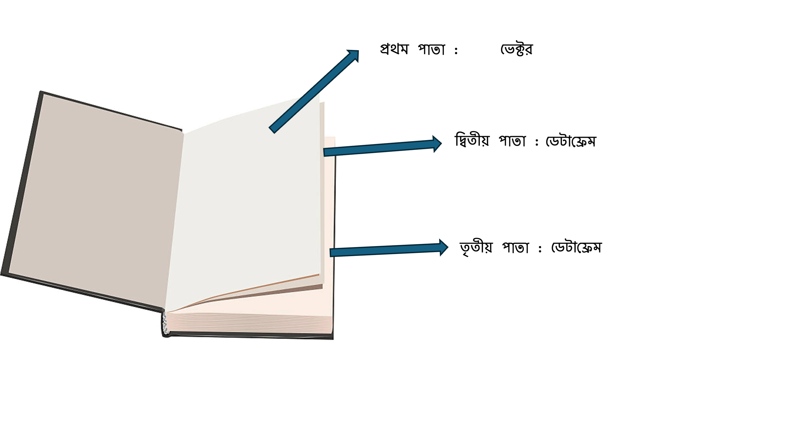
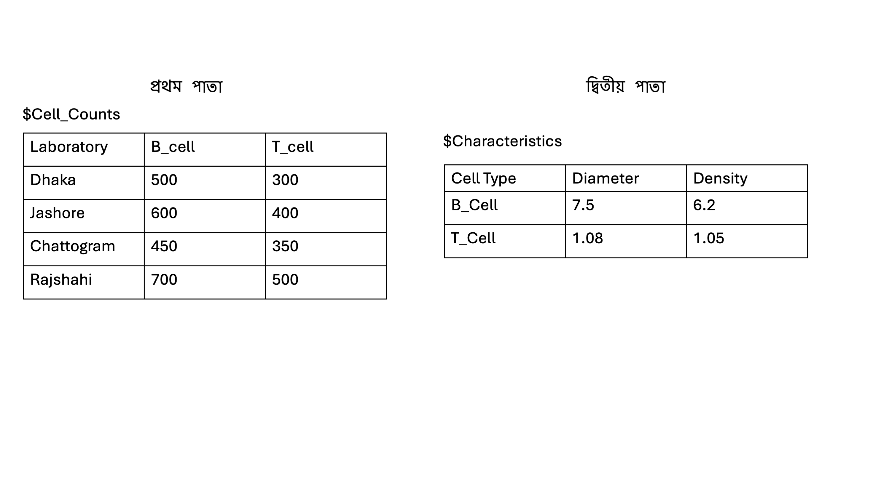

## ৩.৪ লিস্ট (Lists)
আমরা বিগত অধ্যায়গুলোতে ভেক্টর, ম্যাট্রিক্স এবং ডেটাফ্রেম এর মাধ্যমে ডেটা সংরক্ষণ করেছি। আমরা যদি আগের বিষয়গুলো একটু চিন্তা করি, ভেক্টর এবং ম্যাট্রিক্স একই ধরনের ডেটা সংরক্ষণ করে। অন্যদিকে ডেটাফ্রেম ব্যবহার করে আমরা বিভিন্ন ধরনের ডেটা সংরক্ষণ করতে পারি। লিস্ট (List) আরেকটি ডেটা সংরক্ষণ পদ্ধতি। লিস্ট এর বৈশিষ্ট্য হচ্ছে এটি সংখ্যাসূচক, টেক্সট ছাড়াও অন্য ভেক্টর, ম্যাট্রিক্স, ডেটাফ্রেম অথবা অন্য লিস্টকেও সংরক্ষণ করতে পারে একসাথে। 
ব্যাপারটা একটু অন্যভাবে বলি। আমি লিস্টকে চিন্তা করি একটা খাতার মত। একটা খাতায় যেরকম অনেকগুলো পাতা থাকে। আমরা ডেটা কে এরকম একটি খাতার বিভিন্ন পাতায় সংরক্ষণ করতে পারি। যেমন ধরুন খাতার প্রথম পাতায় একটি ভেক্টর সংরক্ষণ করলেন , দ্বিতীয় পাতায় একটি ম্যাট্রিক্স আর তৃতীয় পাতায় একটি ডেটাফ্রেম কিন্তু সবগুলো একটি খাতার মধ্যে। এই খাতাটি হল লিস্ট। 
 
উপরের ছবিতে আপনারা দেখতে পাচ্ছেন, এই সংরক্ষণ করার পদ্ধতিতে একটা অতিরিক্ত বিষয় আছে, সেটা হচ্ছে আমরা ডেটা কোন পাতায় সংরক্ষণ করছি। আচ্ছা এখানে এই বিষয়টা বলে নেওয়া ভাল যে, এই খাতার বিষয়টি আমি বলছি শুধু বোঝার সুবিধার জন্য এবং ঠিকভাবে উপলব্ধি করার জন্য। এটা আমার মনে হয়না কোথাও এইভাবে উল্লেখ করা আছে। এখানে যে বিষয়টি মাথায় থাকতে হয় সেটা হচ্ছে, আপনি ডেটা সংরক্ষণ করবেন বিভিন্ন পাতায় এবং আপনি যখন ডেটা বের করে আনতে যাবেন তখন আপনাকে প্রথমে ওই পাতায় যেতে হবে তারপর ওই ডেটা বের করতে হবে। মানে হচ্ছে আপনি ধরুন ভেক্টর এর তৃতীয় উপাদান বের করতে চাচ্ছেন। এক্ষেত্রে আপনার ধাপগুলো হল , প্রথমে খাতার প্রথম পাতায় যাবেন এরপর ওইখানে যে ভেক্টর আছে তার তৃতীয় উপাদান বের করে আনবেন। ব্যাপারটি আরেকটু পরিষ্কার হবে যখন আমরা উদাহরণ দেখব। 

### উদাহরণ: একটি লিস্ট তৈরি করা (Creating a List)

এই অধ্যায়ে আমরা B cell এবং T cell গবেষণার উদাহরণ ব্যবহার করে দেখাবো কিভাবে একটি লিস্টে বিভিন্ন ধরনের ডেটা সংরক্ষণ করা যায়।
আমাদের আগের উদাহরণগুলোর মত এখানেও আমরা B cell এবং T cell এর সংখ্যা মাপব। আমরা বাংলাদেশ এর বিভিন্ন স্থান এর গবেষণাগার এ B cell এবং T cell গণনার কাজ করছি। প্রতিটি গবেষণাগার আমাদের বিভিন্ন সংখ্যা দিবে। এইটুকু আমাদের আগের মত। এখানে নতুন হল, ধরুন এই সংখ্যাগুলো ছাড়াও আপনার কাছে B cell এবং T cell এর কিছু বৈশিষ্ট্য এর ডেটা আছে, যেমন ধরুন ওদের ব্যাসার্ধ এবং ঘনত্ব। আমরা এই ডেটাগুলোও সংরক্ষণ করবো। যেহেতু সবকিছু একই গবেষণার অংশ, আমরা সবগুলো ডেটা একসাথে একটি লিস্ট এ সংরক্ষণ করতে পারি। নিচের ছবির দিকে লক্ষ্য করুন। 
 
আমরা প্রথম পাতায় B cell এবং T cell এর  সংখ্যা গুলো সংরক্ষণ করেছি। আর দ্বিতীয় পাতায় তাদের বৈশিষ্ট্য সংরক্ষণ করেছি। 
এখন এই পুরো জিনিস যদি আমরা তৈরি করতে চাই তাহলে ৩ টা ধাপে করতে হবে। 

### ধাপ ১: পরীক্ষাগারের B cell এবং T cell সংখ্যা সংরক্ষণ করা
```r
# Data frame for B and T cell counts across different laboratories
lab_cell_counts <- data.frame(
  Laboratory = c("Dhaka", "Jashore", "Chattogram", "Rajshahi"),
  B_Cells = c(500, 600, 450, 700),
  T_Cells = c(300, 400, 350, 500)
)

# Print the cell counts data frame
print(lab_cell_counts)
```
Output:
```r
  Laboratory B_Cells T_Cells
1      Dhaka     500     300
2    Jashore     600     400
3 Chattogram     450     350
4   Rajshahi     700     500
```
**ব্যাখ্যা** এখানে আমরা বিভিন্ন পরীক্ষাগারে B cell এবং T cell সংখ্যা একটি ডেটা ফ্রেমে সংরক্ষণ করেছি।

### ধাপ ২: B এবং T cell এর বৈশিষ্ট্য সংরক্ষণ করা
এখন আমরা B cell এবং T cell-এর কিছু বৈশিষ্ট্য যেমন diameter এবং density সংরক্ষণ করব।
```r
# Data frame for B and T cell characteristics
cell_characteristics <- data.frame(
  Cell_Type = c("B_Cell", "T_Cell"),
  Diameter = c(7.5, 6.2),
  Density = c(1.08, 1.05)
)

# Print the cell characteristics data frame
print(cell_characteristics)
```
Output:
```r
  Cell_Type Diameter Density
1   B_Cell      7.5    1.08
2   T_Cell      6.2    1.05
```
**ব্যাখ্যা** এখানে আমরা B এবং T cell-এর বৈশিষ্ট্যগুলো (Diameter এবং Density) সংরক্ষণ করেছি।

### ধাপ ৩: উভয় ডেটা ফ্রেমকে একটি লিস্টে একত্রিত করা
উপরের দুটো ধাপ আগের অধ্যায় এ আপনারা করেছেন। এখন যেই দুটি ডেটাফ্রেম আমরা তৈরি করেছি এই দুটো ডেটাফ্রেম কে  এখন আমরা ছবির মত লিস্ট এ সংরক্ষণ করবো। আপনারা যদি ছবি টি লক্ষ্য করেন তাহলে দেখবেন প্রতিটি ডেটাফ্রেম কে আমরা নির্দিষ্ট নাম দিয়ে চিহ্নিত করেছি। এখন আসি লিস্ট কিভাবে বানাতে হয়। list লিখে এর মধ্যে আমরা যেই ডেটাফ্রেম গুলো লিখেছি সেগুলো বসাবো। এক্ষেত্রে আমরা এদের বিভিন্ন নাম ও দিতে পারি সনাক্ত করার সুবিধার জন্য অথবা নাম যদি নাও দেই তারপরও আমরা কোন পাতায় সংরক্ষিত আছে সেই তথ্য ব্যবহার করে ডেটা বের করতে পারব। 
```r
# Create a list to store both lab cell counts and cell characteristics
cell_data <- list(
  Cell_Counts = lab_cell_counts,
  Characteristics = cell_characteristics
)

# Print the list
print(cell_data)
```
Output:
```r
$Cell_Counts
  Laboratory B_Cells T_Cells
1      Dhaka     500     300
2    Jashore     600     400
3 Chattogram     450     350
4   Rajshahi     700     500

$Characteristics
  Cell_Type Diameter Density
1    B_Cell      7.5    1.08
2    T_Cell      6.2    1.05

```
**ব্যাখ্যা** এখানে আমরা cell_data নামে একটি লিস্ট তৈরি করেছি, যেখানে দুটি ডেটা ফ্রেম সংরক্ষিত আছে—Cell_Counts এবং Characteristics।

### লিস্টের উপাদান নির্বাচন করা (Accessing Elements in a List)
আমরা চাইলে লিস্টের নির্দিষ্ট উপাদান নির্বাচন করতে পারি। আপনাদের যদি মনে থাকে আমরা ডেটাফ্রেম অথবা ম্যাট্রিক্স এ উপাদান নির্বাচন এর সময় [ ] ব্যবহার করেছিলাম। লিস্ট এর ক্ষেত্রে আমরা যেহেতু বলেছিলাম যে এটি একটি খাতার মত যার প্রথমে থাকে পাতা এর পর ওই পাতায় থাকে আমদের তথ্য গুলো। উপরের উদাহরণ এ আমার প্রথম পাতায় আছে Cell_Counts এবং দ্বিতীয় পাতায় আছে Characteristics । এখন আমি যদি প্রথম পাতায় Cell_Counts পেতে চাই তাহলে কি করতে হবে? এক্ষেত্রে নিয়ম হচ্ছে [[]] দুইটি bracket ব্যবহার করতে হবে। অর্থাৎ cell_data[[1]].
```r
# Access the cell counts data frame
lab_counts <- cell_data[[1]]
print(lab_counts)
```
Output:
```r
  Laboratory B_Cells T_Cells
1      Dhaka     500     300
2    Jashore     600     400
3 Chattogram     450     350
4   Rajshahi     700     500
```
**ব্যাখ্যা** এখানে [[]]ব্যবহার করে আমরা Cell_Counts আলাদাভাবে বের করেছি।
পুরো জিনিসটি চাইলে আমরা ওই উপাদান এর নাম ব্যবহার করে বের করতে পারি। এক্ষেত্রে কোডটি নিছে দেওয়া হল। 
```r
# Access the cell counts data frame
lab_counts <- cell_data[["Cell_Counts"]]
print(lab_counts)
```
Output:
```r
  Laboratory B_Cells T_Cells
1      Dhaka     500     300
2    Jashore     600     400
3 Chattogram     450     350
4   Rajshahi     700     500
```
** ব্যাখ্যা ** এখানে [[]]ব্যবহার করে ওই উপাদান এর নাম ব্যবহার করে আমরা Cell_Counts আলাদাভাবে বের করেছি।কোনটি আপনি ব্যবহার করবেন সেটা নির্ভর করবে আপনি কোনটা সুবিধার মনে করেন। 


### লিস্টে নির্দিষ্ট কোন উপাদান বের করে আনা (Picking out Specific Element)

ধরুন আমি চাচ্ছি যে লিস্ট থেকে B cell এর density বের করবো। এক্ষেত্রে প্রক্রিয়া ধাপে ধাপে চিন্তা করি। প্রথম ধাপে আমরা খুঁজব কোন পাতায় আছে এবং পরের ধাপে আমরা ওই ডেটাফ্রেম এর কোন জায়গায় আছে সেটা বের করতে হবে। তার মানে দাঁড়াচ্ছে দ্বিতীয় পাতার ডেটা ফ্রেম এর প্রথম সারি এর  তৃতীয় কলাম। অর্থাৎ [[1]][1,3]

```r
# Identify the density of B cell
Den_b_cell <- cell_data[[2]][1,3]
print(Den_b_cell)
```
Output:
```r
[1] 1.08
```
**ব্যাখ্যা** এখানে [[2]][1,3] ব্যবহার করে দ্বিতীয় পাতার ডেটা ফ্রেম এর প্রথম সারির তৃতীয় উপাদান বের করে এনেছি 
### লিস্টে নতুন উপাদান যোগ করা (Adding New Elements to a List)
আমরা চাইলে লিস্টে আরও নতুন উপাদান যোগ করতে পারি। ধরুন,  আমরা চাচ্ছি যে এই গবেষণা যারা করেছে তাদের নামগুলো সংরক্ষণ করে রাখতে। তার মানে দাঁড়াচ্ছে আমরা লিস্ট এ নতুন একটু পাতা যোগ করবো যেখানে একটি ভেক্টর সংরক্ষণ করবো যাতে গবেষণাগুলো যারা করেছে যাদের নাম থাকবে। 
```r
#Adding name of the scientist to the list
cell_data[["Name_scientist"]] <- c("Sadia" ,"Asif", "Tasnuba" ,"Jalish")
#Print the updated list
print(cell_data)
```
Output:
```r
$Cell_Counts
  Laboratory B_Cells T_Cells
1      Dhaka     500     300
2    Jashore     600     400
3 Chattogram     450     350
4   Rajshahi     700     500

$Characteristics
  Cell_Type Diameter Density
1    B_Cell      7.5    1.08
2    T_Cell      6.2    1.05

$Name_scientist
[1] "Sadia"   "Asif"    "Tasnuba" "Jalish" 

```
**ব্যাখ্যা** আমরা লিস্টে Name_scientist নামে একটি নতুন উপাদান যোগ করেছি, যেখানে প্রতিটি পরীক্ষাগারের যারা গবেষণা করেছে তাদের নাম সংরক্ষণ করা হয়েছে।

R-এ লিস্ট এমন একটি ডেটা স্ট্রাকচার যা বিভিন্ন ধরনের ডেটা একসাথে সংরক্ষণ করতে পারে। আমাদের উদাহরণে, B cell এবং T cell-এর সংখ্যা ও বৈশিষ্ট্য সংরক্ষণ করার জন্য আমরা একটি লিস্ট ব্যবহার করেছি। এই পদ্ধতিতে গবেষণার বিভিন্ন ধরনের ডেটা একসাথে সংরক্ষণ এবং বিশ্লেষণ করা খুবই সহজ।

# আপডেট পাওয়ার জন্য নিবন্ধন করুন (Register for Updates)

আপনি যদি এই ব্লগের নিয়মিত আপডেট পেতে চান, তাহলে নিচের ফর্মটি পূরণ করুন। আমি নতুন কোনো কন্টেন্ট যোগ করার সাথে সাথেই আপনাকে ইমেইলের মাধ্যমে জানিয়ে দেব।

# [**ফর্ম পূরণ করতে এখানে ক্লিক করুন**](https://forms.gle/6qyRGiE7WSpLJ9SA9)
