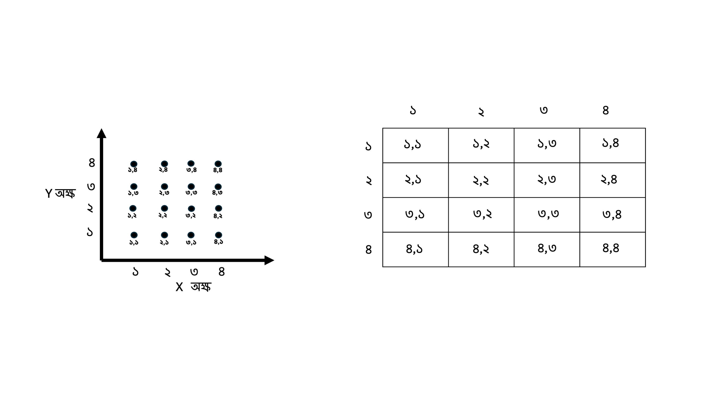
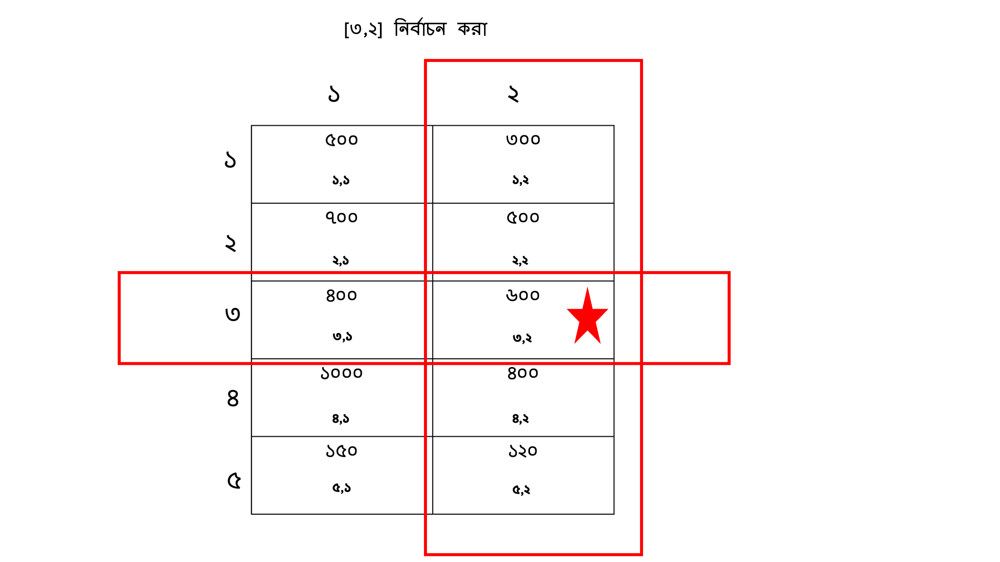

## ৩.২ ম্যাট্রিক্স (Matrices)
আমরা এই অধ্যায় এ মূলত সংরক্ষণ এর পদ্ধতি (storage system) নিয়ে কথা বলছি এবং প্রথম অংশে ভেক্টর এর কথা বলেছি । ভেক্টর এর মত ম্যাট্রিক্স R এর একটি ডেটা স্ট্রাকচার যা দুই-মাত্রিক (two-dimensional) ডেটা সংরক্ষণ করতে পারে। আমাদের এক্ষেত্রে এক মাত্রিক আর দুই মাত্রিক বিষয়টি একটু বুঝতে হবে। আমরা দেখেছি যে ভেক্টর এক মাত্রিক ডেটা সংরক্ষণ করে এবং ভেক্টর এর ডেটাগুলো একটু রেখা এর উপর বসানো যায়। একইভাবে আমরা ডেটা কে দুই মাত্রিক ক্ষেত্রে সংরক্ষণ করতে পারি। এক্ষেত্রে ডেটার মধ্যে একটি x-অক্ষ এবং একটি y-অক্ষ থাকবে। তবে একদম সোজাভাবে বলতে হলে আপনারা যদি excel-এ কাজ করেন। সেটা যেই স্ট্রাকচার এ থাকে ওই ধরনটি একটি ম্যাট্রিক্স থাকে। আচ্ছা আপনারা এখন নিচের ছবিটি লক্ষ্য করুন। 



আমারা ম্যাট্রিক্স এর ডেটা কে x-অক্ষ এবং y-অক্ষ দিয়ে বুঝতে পারব। বামদিকের ছবি তে আপনারা দেখতে পাচ্ছেন আমরা যেভাবে প্রতিটি স্থান ঠিক করি। যেমন আমরা যদি ডাঙ দিকে এক ঘর যাই আর উপর দিকে এক ধর যাই তাহলে আমরা ১,১ স্থান এ পৌছাব। একইভাবে আমরা ডানদিকে ৩ ঘর আর উপর দিকে ২ ঘর গেলে পাব ৩,২। আমরা বুঝতে পারছি যে আমরা x-অক্ষ আর y-অক্ষ দিয়ে আমরা যেকোনো স্থান এ পৌঁছাতে পারছি। এক্ষেত্রে আমরা হিসাব করি (x,y) অর্থাৎ প্রথমে x-অক্ষ আর পরে y-অক্ষ। 

একইভাবে আমরা ম্যাট্রিক্স এও স্থান হিসাব করতে পারি। এক্ষেত্রে প্রথমে থাকে সারি বা row এবং পরে থাকে কলাম বা column। ধরুন একদম বামদিকের সবচেয়ে উপরের স্থান হচ্ছে ১,১। অর্থাৎ  (row,column)। একইভাবে আপনি একদম ডানদিকের নিচের শেষ স্থান হবে ৪,৪। অর্থাৎ ৪তম সারি এবং ৪তম কলাম। এই বিষয়টি আরেকটু পরিষ্কার হবে যখন আমরা ম্যাট্রিক্স এর উপাদান বের করার কাজ শিখব।

আরেকটি বিষয় প্রথমে জেনে রাখা দরকার সেটা হচ্ছে ম্যাট্রিক্স এবং ভেক্টরে শুধুমাত্র একই ধরনের ডেটা সংরক্ষণ করতে পারে অর্থাৎ শুধুমাত্র সংখ্যা বা মান (numeric), অথবা শব্দ বা বাক্য বা টেক্সট (character) অথবা লজিকাল  (TRUE, FALSE) ডেটা। ভিন্ন ভিন্ন রকমের ডেটা একসাথে সংরক্ষণ করা যায় না। 

## ম্যাট্রিক্স তৈরি করা (Creating a Matrix)
R-এ ম্যাট্রিক্স তৈরি করার জন্য আমরা matrix() ফাংশন ব্যবহার করি। ম্যাট্রিক্সের প্রতিটি উপাদান ভেক্টরের মতই একরকম হতে হবে। এছাড়া ডেটাগুলো সারি আর কলাম এ সাজানো থাকতে হবে। নিচে একটি উদাহরণ এর মাধ্যমে দেখি। 

### উদাহরণ: একটি ম্যাট্রিক্স তৈরি করা
যেহেতু আমরা B cell আর T cell এর সংখ্যা নিয়ে কাজ করছিলাম আগের উদাহরণগুলোতে। এক্ষেত্রে আমরা একই  B cell আর T cell কে উদাহরণ হিসেবে ধরি। আরেকটি বিষয় এখানে বলে নেই, সেটা হচ্ছে আমি যেই উদাহরণগুলো ব্যাবহার করছি সেগুলো শুধুমাত্র প্রতিটি বিষয় বোঝার ব্যাবহার করছি। 

এখন ধরুন আপনি গবেষণা কাজের জন্য B cell এবং T cell এর সংখ্যা পরিমাপ করছেন। আপনি পাঁচটি বাটিতে (petri dish) B cell এবং T cell আছে। আপনার কাজ হচ্ছে এই গবেষণায় B cell এবং T cell এর সংখ্যা কিভাবে পরিবর্তন হচ্ছে তা নির্ণয় করা এবং কোন বাটিতে B cell বা T cell বেশি আছে তা বের করবেন। অর্থাৎ গবেষণাটি এরূপ হবে, আমরা পাঁচটি বাটি(petri dish) নিব একবং সেখানে কিছু B cell এবং  T cell দিব। পরবর্তীতে আমরা প্রত্যেকটি বাটিতে ভিন্ন ভিন্ন পরিমাণ পুষ্টি (nutrient) উপাদান দিব। আমাদের কাজ হচ্ছে দেখা ভিন্ন পুষ্টি উপাদান এর জন্য কি B cell এবং  T cell এর বৃদ্ধি এর পরিমান কি ভিন্ন ভিন্ন হচ্ছে কি না। 

এতটুকু যদি আমরা বুঝি, তাহলে এই গবেষণা এর পর আমরা প্রতিটি বাটিতে ভিন্ন ভিন্ন B cell এবং  T cell এর সংখ্যা পাব। আমদের প্রথম কাজ হবে এই ডেটাগুলো সংরক্ষণ করা। আমরা চাইলে ভেক্টর এর মাধ্যমে আলাদা ভাবে সংরক্ষণ করতে পারি। আবার এরথেকে ভাল পদ্ধতি হল এই ডেটাগুলোকে ম্যাট্রিক্স এ সংরক্ষণ করা। এরফলে আমরা B cell এবং T cell ডেটাগুলো কে একসাথে সংরক্ষণ করতে পারি এবং পরবর্তীতে সহজে বিশ্লেষণ করতে পারি। 

ধরুন, আমাদের কাছে পাঁচটি ভিন্ন ধরনের সেল রয়েছে এবং আমরা এই সেলগুলোর B cell এবং T cell সংখ্যা একটি ম্যাট্রিক্সে সংরক্ষণ করতে চাই। matrix() ফাংশন যেটা আমরা ব্যাবহার করছি তার ভেতর কিছু parameter আছে। যেমন, data, যেখানে আপনি আপনার পরিমাপ করা cell এর সংখ্যা গুলো দিবেন, তারপর ncol, যেখানে আপনার কলাম এর সংখ্যা যুক্ত করতে হবে। এক্ষেত্রে যেহেতু আমরা B cell এবং T cell ব্যাবহার করছি, তাহলে কলাম হবে ২। আবার যেহেতু আমাদের গবেষণায় পাঁচটি বাটি (petri dish) ব্যাবহার করা হয়েছে, সেহেতু আমরা nrow তে ব্যাবহার করবো ৫। 
```r
# Create a matrix for B cell and T cell counts
cell_counts <- matrix(data = c(500, 700, 400, 1000, 150, 300, 500, 600, 800, 120), 
                      nrow = 5, ncol = 2)
# Print the matrix
print(cell_counts)
```
Output:
```r
     [,1] [,2]
[1,]  500  300
[2,]  700  500
[3,]  400  600
[4,] 1000  800
[5,]  150  120
```
**ব্যাখ্যা** এখানে আমরা matrix() ফাংশনের মাধ্যমে একটি ম্যাট্রিক্স তৈরি করেছি, যেখানে B cell এবং T cell-এর সংখ্যা সংরক্ষণ করা হয়েছে। nrow প্যারামিটারটি ম্যাট্রিক্সের সারির সংখ্যা নির্ধারণ করে এবং ncol কলামের সংখ্যা নির্ধারণ করে

এখন আমরা ডেটাকে সংরক্ষণ করে ফেলেছিন cell_count নামের ভেরিয়াবল এ। কিন্তু বিষয়টি সম্পূর্ণরূপে শেষ হয়নি। আমদের এর সাথে যুক্ত করতে হবে কোন কলামটি কোন cell। আপনারা যদি ভেক্টর এর কথা মনে করেন, আমরা names() নামের একটি ফাংশন ব্যাবহার করেছিলাম কিন্তু ম্যাট্রিক্স এ এটা একটু ভিন্ন। কেন সেটা কি একটু চিন্তা করতে পারেন? কারণ হচ্ছে ম্যাট্রিক্স এ ডেটা দুই ম্যাট্রিক্স, মানে আমাদের সারি row আর কলাম column দুই রকম ডেটা আছে। তাই, আমরা যদি কলাম এর নাম দিতে চাই তা একটু ভিন্ন। এক্ষেত্রে আমরা ব্যাবহার করি colnames() ফাংশন। আর যেহেতু আমাদের দুই রকম ডেটা, B cell আর T cell, তাই আমরা এই দুটি স্ট্রিং বা শব্দ সংরক্ষণ করব। কিভাবে নিচের উদাহরণ এ দেখান হল।  
```r
# Name the columns
colnames(cell_counts) <- c("B Cells", "T Cells")

# Print the matrix
print(cell_counts)
```
Output:
```r
     B Cells T Cells
[1,]     500     300
[2,]     700     500
[3,]     400     600
[4,]    1000     800
[5,]     150     120
```
**ব্যাখ্যা** আমরা colnames() ফাংশন ব্যবহার করে ম্যাট্রিক্সের কলামগুলোকে "B Cells" এবং "T Cells" নামে চিহ্নিত করেছি।

### ম্যাট্রিক্সের উপাদান নির্বাচন করা (Selecting Elements from a Matrix)

ম্যাট্রিক্সের নির্দিষ্ট উপাদান বা একটি সম্পূর্ণ সারি বা কলাম নির্বাচন করা যায়। ম্যাট্রিক্সের উপাদান নির্বাচন করার জন্য [row, column] এই রূপে বের করা হয়। আমরা ধরুন তৃতীয় rowবা সারি আর দ্বিতীয় কলাম বা column এর data বের করতে চাচ্ছি। আমাদের ফরম্যাট হবে [3,2]। ছবিটি লক্ষ্য করুন, কিভাবে নির্বাচন করা হয় ম্যাট্রিক্স থেকে ডেটা।


### উদাহরণ: ম্যাট্রিক্স থেকে নির্দিষ্ট উপাদান নির্বাচন করা
```r
# Select the T cell count from the 3rd sample
third_sample_tcells <- cell_counts[3, 2]
print(third_sample_tcells)
```
Output:
```r
[1] 600
```
**ব্যাখ্যা** এখানে আমরা ম্যাট্রিক্সের ৩য় সারির ২য় কলামের উপাদান (T cell সংখ্যা) নির্বাচন করেছি, যা ৬০০।

### উদাহরণ: একটি সম্পূর্ণ কলাম নির্বাচন করা
ধরুন, আমরা শুধুমাত্র B cell-এর সংখ্যা দেখতে চাই। তখন আমরা পুরো কলামটি নির্বাচন করতে পারি।
```r
# Select the entire column for B cells
bcell_column <- cell_counts[, 1]
print(bcell_column)
```
Output:
```r
[1]  500  700  400 1000  150
```
**ব্যাখ্যা** এখানে আমরা ম্যাট্রিক্সের প্রথম কলাম নির্বাচন করেছি, যা শুধুমাত্র B cell-এর সংখ্যা প্রদর্শন করছে।। এক্ষেত্রে আপনারা দেখুন আমরা সারি বা row এর জায়গায় কিছু বসায়নি। এটি দিয়ে R বুঝে আপনি সবগুলো ডেটা দেখতে চান। আপনারা চাইলে row এর স্থান এ যদি c(1,2,3,4,5) বসান তাহলে দেখবেন যে এক এ ফলাফল পেয়েছেন। চেষ্টা করে দেখতে পারেন। 
এক্ষেত্রে কোডটি হবে bcell_column <- cell_counts[c(1,2,3,4,5), 1]

### ম্যাট্রিক্সে গণিত (Mathematical Operations in Matrices)
R-এ ম্যাট্রিক্সের উপর সহজে গাণিতিক অপারেশন চালানো যায়। উদাহরণস্বরূপ, যদি আমরা প্রতিটি cell সংখ্যা দ্বিগুণ করতে চাই, আমরা পুরো ম্যাট্রিক্সের উপর গাণিতিক অপারেশন করতে পারি।
### উদাহরণ : ম্যাট্রিক্সের প্রতিটি উপাদান দ্বিগুণ করা
```r
# Double the cell counts in the matrix
double_cell_counts <- cell_counts * 2
print(double_cell_counts)
```
Output:
```r
     B Cells T Cells
[1,]    1000     600
[2,]    1400    1000
[3,]     800    1200
[4,]    2000    1600
[5,]     300     240
```
**ব্যাখ্যা** এখানে আমরা পুরো ম্যাট্রিক্সের প্রতিটি উপাদানকে ২ দিয়ে গুণ করেছি। এটি দেখায় কিভাবে ম্যাট্রিক্সের উপর গাণিতিক অপারেশন খুব সহজে করা যায়।

# আপডেট পাওয়ার জন্য নিবন্ধন করুন (Register for Updates)

আপনি যদি এই ব্লগের নিয়মিত আপডেট পেতে চান, তাহলে নিচের ফর্মটি পূরণ করুন। আমি নতুন কোনো কন্টেন্ট যোগ করার সাথে সাথেই আপনাকে ইমেইলের মাধ্যমে জানিয়ে দেব।

# [**ফর্ম পূরণ করতে এখানে ক্লিক করুন**](https://forms.gle/6qyRGiE7WSpLJ9SA9)
