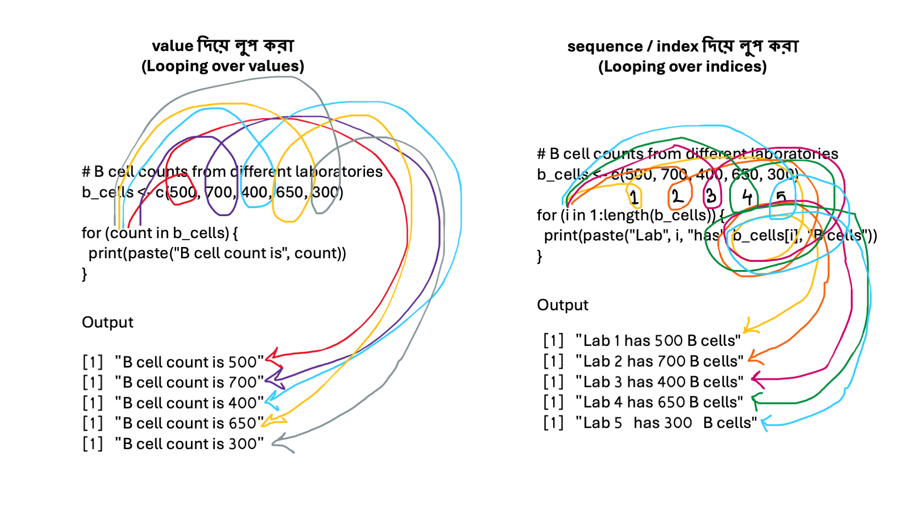

## ৪.২ লুপিং (Looping in R)
## লুপিং আসলে কী?
লুপিং বলতে মূলত একই কাজ বারবার করাকে বোঝায়। সত্যি বলতে প্রোগ্রামিং এর একদম শুরুতে আমরা যখন শুনতাম যে এটি কি করতে পারে। তখন অনেক বেশি শুনতাম যে repetitive (বারংবার) করতে হয় এমন কাজ সহজে প্রোগ্রামিং করতে পারে। 
প্রোগ্রামিংয়ে এটি খুবই গুরুত্বপূর্ণ, কারণ গবেষণায় আমরা কখনোই শুধু একটি মান নিয়ে কাজ করি না। আমাদের প্রায় সবসময়ই একাধিক স্যাম্পল, একাধিক ল্যাব, বা একাধিক পরিমাপ নিয়ে কাজ করতে হয়। এই একাধিক বিষয় যেখানে আসে এবং এই একাধিক বিষয় এর উপর বারংবার করতে হয় এমন কোন কাজের ব্যাপার যখন আসে তখনই আমাদের লুপিং এর প্রয়োজন পরে।
একটি উদাহরণ দিয়ে বিষয়টি বোঝানোর চেষ্টা করি। ধরুন, আপনার কাছে ১০টি ল্যাব থেকে পাওয়া B cell সংখ্যা আছে। আপনি যদি এক এক করে প্রতিটা ল্যাবের জন্য আলাদা কোড লেখেন, তাহলে অনেক সময় লাগবে এবং একইসাথে ভুল হওয়ার সম্ভাবনাও বেশি থাকবে। 
এই সমস্যার সমাধানই হলো loop।
 
লুপিং কয়েক প্রকার এর আছে। for লুপিং, while লুপিং এবং repeat। আমি কাজের সুবাদে মূলত for লুপ ই ব্যবহার করি, সেজন্য আমি এই for লুপ দিয়ে এ ব্যাখ্যা করবো। 
## for loop: ধাপে ধাপে বোঝা
### for loop কখন ব্যবহার করি?
আমরা তখনই for loop ব্যবহার করি, যখন আমরা জানি:
•	কতগুলো মান আছে
•	কতবার একই কাজ করতে হবে
For লুপ দুইভাবে করা যায়। 
### ১। value দিয়ে লুপ করা (looping over values)
### ২। equence / index দিয়ে লুপ করা (looping over indices)

দুটোই খুব গুরুত্বপূর্ণ, কিন্তু কাজের ধরন আলাদা। নিচে একই B cell উদাহরণ দিয়ে দুটোই বোঝাচ্ছি, যেন পার্থক্যটা পরিষ্কার হয়।
 
## ১।  value দিয়ে লুপ করা (Looping over values)
এক্ষেত্রে আমরা সরাসরি ডেটার মানগুলো নিয়ে লুপ চালাই।
অর্থাৎ, লুপের ভেতরের ভেরিয়েবলটি প্রতিবার একটি মান নেয়।
### উদাহরণ: প্রতিটি ল্যাবের B cell সংখ্যা দেখা (value দিয়ে)
```r
# B cell counts from different laboratories
b_cells <- c(500, 700, 400, 650, 300)

for (count in b_cells) {
  print(paste("B cell count is", count))
}
```
Output:
```r
[1] "B cell count is 500"
[1] "B cell count is 700"
[1] "B cell count is 400"
[1] "B cell count is 650"
[1] "B cell count is 300"
```
এখানে কী হচ্ছে?

•	count প্রতিবার b_cells ভেক্টরের একটি মান নেয়

•	প্রথমবার count = 500


•	দ্বিতীয়বার count = 700

•	এভাবে শেষ পর্যন্ত। বিষয়টি বুঝতে ছবিটি লক্ষ্য করুন। 


এখানে আমরা ল্যাব নম্বর জানি না, শুধু মান নিয়ে কাজ করছি।
এই পদ্ধতি ভালো যখন:

•	শুধু মান নিয়ে কাজ করতে হবে

•	index বা position দরকার নেই
## ২। sequence / index দিয়ে লুপ করা (Looping over indices)
এক্ষেত্রে আমরা সরাসরি মান না নিয়ে, অবস্থান (position / index) নিয়ে লুপ চালাই।
তারপর সেই index ব্যবহার করে মান বের করি। এক্ষেত্রে ধরুন উপরের যে উদাহরণ দেওয়া আছে, আমরা যদি আমাদের ভেক্টর এর ধারণা থেকে কাজে লাগাই তাহলে বুঝতে সুবিধা হবে। যেমন ধরুন b_cells এর প্রথম উপাদান বের করতে চাই তাহলে আমরা লিখব b_cells[1]। আমাদের output আসবে 500। কারণ এটি প্রথম উপাদান। একইভাবে আমরা সবগুলা অবস্থানকে যদি print করি তাহলে সবগুলো উপাদান বের হয়ে আসবে। যেমন ধরুন b_cells[2], b_cells[3], b_cells[4], b_cells[5]। এক্ষেত্রে আমরা লুপিং করবো position এর উপর লুপ ঘুরিয়ে। ছবিতে লক্ষ্য করুন আরেক্তু ভালভাবে বোঝার জন্য। 
### উদাহরণ: ল্যাব নম্বরসহ B cell সংখ্যা দেখা (index দিয়ে)
```r
# B cell counts from different laboratories
b_cells <- c(500, 700, 400, 650, 300)

for (i in 1:length(b_cells)) {
  print(paste("Lab", i, "has", b_cells[i], "B cells"))
}
```
Output
```r
[1] "Lab 1 has 500 B cells"
[1] "Lab 2 has 700 B cells"
[1] "Lab 3 has 400 B cells"
[1] "Lab 4 has 650 B cells"
[1] "Lab 5 has 300 B cells"
```
এখানে কী হচ্ছে?
•	i প্রথমে 1, তারপর 2, তারপর 3 …

•	b_cells[i] দিয়ে আমরা নির্দিষ্ট অবস্থানের মান নিচ্ছি


•	ফলে আমরা ল্যাব নম্বর + মান দুটোই পাচ্ছি

এই পদ্ধতি দরকার যখন:
•	position গুরুত্বপূর্ণ

•	একাধিক ভেক্টর একসাথে ব্যবহার করতে হবে


•	রিপোর্ট বা তুলনা করতে হবে
## কখন কোনটি ব্যবহার করবো? 
আপনি কখন কোন পদ্ধতি ব্যবহার করবেন সেটা আপনার কাজের উপর depend করবে। আমাকে যদি প্রশ্ন করেন তাহলে আই বলবো আমি সবসময় index দিয়ে লুপিং করি। কিছু সুবিধা আছে, এখানে একটি উদাহরণ দেওয়া হল যখন আপনি শুধুমাত্র value দিয়ে লুপিং করলে কাজ হবে না। 
### উদাহরণ B cell + T cell যদি একসাথে বের করতে চান। 
value দিয়ে করা যাবে না (সমস্যা হবে)। কিন্তু index দিয়ে করা যাবে (ঠিক পদ্ধতি)
```r
b_cells <- c(500, 700, 400, 650, 300)
t_cells <- c(300, 450, 350, 500, 200)

for (i in 1:length(b_cells)) {
  print(paste("Lab", i,
              "- B cells:", b_cells[i],
              "| T cells:", t_cells[i]))
}
```
Output
```r
[1] "Lab 1 - B cells: 500 | T cells: 300"
[1] "Lab 2 - B cells: 700 | T cells: 450"
[1] "Lab 3 - B cells: 400 | T cells: 350"
[1] "Lab 4 - B cells: 650 | T cells: 500"
[1] "Lab 5 - B cells: 300 | T cells: 200"
```
এখানে index দিয়ে এই কাজ করা হয়েছে। এখন একটা কথা এখানে বলা ভাল। value দিয়ে এই কাজটি করা যাবে, সেক্ষেত্রে দুটি আলাদা আলাদা লুপিং করতে হবে। আপনারা চাইলে নিজেরা করার চেষ্টা করতে পারেন। 
এই সম্পূর্ণ পদ্ধতিতে একটি ফাংশন এর কথা বলে রাখি। আপনারা ফাংশন সম্পর্কে পরের অধ্যায় এ জানতে পারবেন। কিন্তু এখন জেনে রাখেন যে R এ কিছু কাজ করার জন্য কিছু ফাংশন থাকে। এরা নিজেরা কিছু কাজ করে যা আমরা সরাসরি দেখতে পারি না কিন্তু তাদের output দেখতে পারি। ফাংশন লেখার নিয়ম name_of_function() অর্থাৎ নাম এবং পরে “()”। ifelse এমনি একটি ফাংশন। ifelse ফাংশনটি if else condition এবং for লুপ এর কাজ একসাথে করে। 
## ifelse() ব্যবহার করে সিদ্ধান্ত নেওয়া
### ifelse() কী?
ifelse() হলো একটি ফাংশন যা আমাদের এক লাইনে সিদ্ধান্ত নিতে সাহায্য করে।
এর গঠন:
ifelse(condition, value_if_TRUE, value_if_FALSE)
 
### উদাহরণ B cell সংখ্যা দেখে ল্যাব শ্রেণিবিভাগ।
যদি সংখ্যা ৫০০ এর বেশি হয় তাহলে High B cell count নাহলে Low B cell count। লেখার নিয়ম হচ্ছে 
```r
# B cell counts
b_cells <- c(500, 700, 400, 650, 300)

# Classify B cell levels
b_cell_status <- ifelse(b_cells > 500, "High B cell count", "Low B cell count")

print(b_cell_status)
```
Output
```r
[1] "Low B cell count"  "High B cell count" "Low B cell count"  "High B cell count"
[5] "Low B cell count"
```
**ব্যাখ্যা:**
•	b_cells > 500 → একটি শর্ত

•	যেসব মান ৫০০ এর বেশি → "High B cell count"


•	যেসব মান ৫০০ বা কম → "Low B cell count"

এখানে কোনো লুপ না লিখেও আমরা সব ল্যাবের জন্য একসাথে সিদ্ধান্ত নিতে পারছি।
এটাকে বলে vectorised operation, যা R-এর একটি বড় শক্তি।
## কেন এই ধারণাগুলো গুরুত্বপূর্ণ?
### গবেষণার দৃষ্টিকোণ থেকে
•	বাস্তব জীবনে ডেটা সবসময় একটার বেশি হয়

•	লুপ ছাড়া বড় ডেটা বিশ্লেষণ করা প্রায় অসম্ভব


•	ifelse() আপনাকে দ্রুত সিদ্ধান্ত নিতে সাহায্য করে

•	এই দুটি একসাথে ব্যবহার করলেই আপনি অনেক বিশ্লেষণ করতে পারবেন

## পরিশেষে কিছু নিজের মত  
প্রোগ্রামিং এ লুপ এর ধারনা খুবই গুরুত্বপূর্ণ। সকল প্রোগ্রামিং এ লুপ এর ধারণা আছে এবং প্রোগ্রামিং এতকিছু করতে পারার পিছনে এই লুপ এর অবদান অনেক। আমার মতে এই conditional এবং লুপ এর ধারণা খুবই ভালভাবে বুঝতে পারলে আপনাদের প্রোগ্রামিং এর একটা বড় অংশ আপনারা শিখে যাবেন। 


# আপডেট পাওয়ার জন্য নিবন্ধন করুন (Register for Updates)

আপনি যদি এই ব্লগের নিয়মিত আপডেট পেতে চান, তাহলে নিচের ফর্মটি পূরণ করুন। আমি নতুন কোনো কন্টেন্ট যোগ করার সাথে সাথেই আপনাকে ইমেইলের মাধ্যমে জানিয়ে দেব।

# [**ফর্ম পূরণ করতে এখানে ক্লিক করুন**](https://forms.gle/6qyRGiE7WSpLJ9SA9)

