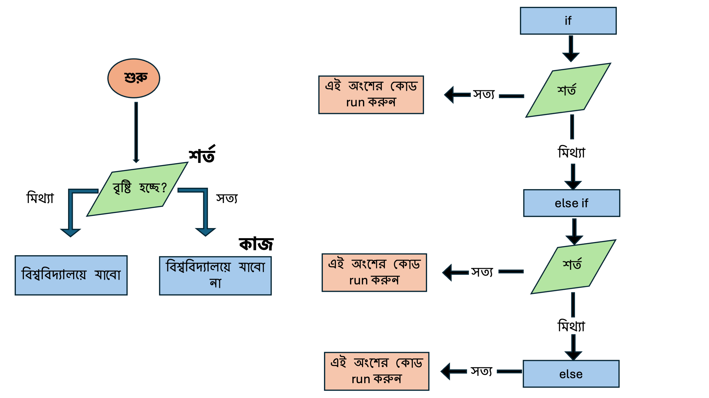

## ৪.১ Conditional Statements
কন্ডিশনাল স্টেটমেন্টস (Conditionals) মূলত আমাদের শর্ত অনুযায়ী বিভিন্ন সিদ্ধান্ত নিতে সাহায্য করে। আচ্ছা এখন প্রশ্ন আসবে শর্ত বলতে কি বোঝায়? ধরুন আমি বলছি, আজকে যদি বৃষ্টি হয়, তাহলে আমি বিশ্ববিদ্যালয় যাবো না। অথবা যদি আজকে বৃষ্টি না হয় তাহলে আমি বিশ্ববিদ্যালয় যাবো (আমি বৃষ্টি হলে বিশ্ববিদ্যালয় যাবো না ব্যাপারটা একদম ই সমর্থন করি না)। এখানে আপনি খেয়াল করলে দেখবেন এখানে একটি শর্ত আছে, বৃষ্টি হওয়া আর না হওয়া। এবং এই বৃষ্টি হওয়া আর না হওয়ার সাথে আপনার কাজের ভিন্নতা আছে, সেটা হচ্ছে আপনি বিশ্ববিদ্যালয়  যাবেন অথবা যাবেন না। সাধারনভাবে এটাই Conditionals। নিচের বাম দিকের ছবি এর দিকে লক্ষ্য করলে কোডটিকে এভাবে চিন্তা করতে পারেন। প্রথমে কোড শুরু করবেন, এর পর আসবে শর্ত। এখানে শর্ত হল বৃষ্টি হচ্ছে। এই প্রশ্নের উত্তর হয় সত্য হবে অথবা মিথ্যা হবে। সত্য হলে ওই অংশের কাজ করবেন মানে বিশ্ববিদ্যালয় এ যাবেন  (কোড run করবেন) আর মিথ্যা হলে অন্য অংশের কাজ করবেন মানে  বিশ্ববিদ্যালয় এ যাবেন  না। (কোড run করবেন)। আরেকটি জিনিস বলে রাখি, শর্ত শুধু দুটিই হতে হবে এমন কথা নেই। আপনি যতগুলো শর্ত ইচ্ছা যোগ করতে পারেন। এক্ষেত্রে নিয়মটি হচ্ছে প্রথমে আপনি if লিখে প্রথম শর্ত দিবেন, এরপরের যতগুলো শর্ত আছে সেগুলো প্রত্যেকটি else if এর মধ্যে দিবেন আর শেষে else ব্যবহার করবেন যেখানে উপরের কোন শর্তই পরে না। 
 
অর্থাৎ যা দাড়াচ্ছে, R-এ if, else if, এবং else কন্ডিশনাল স্টেটমেন্টের মাধ্যমে আমরা শর্ত পরীক্ষা করতে পারি। এখন উপরের ছবি এর ডানদিকের অংশতই লক্ষ্য করুন। ধাপগুলো হল 

১। যদি প্রথম if শর্তটি সত্য (TRUE) হয়, তবে সেই অংশের কোড run হয়।
২। যদি if শর্তটি মিথ্যা (FALSE) হয় এবং else if থাকে, তবে else if শর্তটি দেখা করা হয়। else if এর শর্ত সত্য হলে ওই কোড run হয়। 
৩।এভাবে ধাপে ধাপে অনেকগুলো else if এর শর্ত থাকতে পারে। যদি কোনো শর্তই সত্য না হয়, তবে else অংশের কোড run হয়।

কারো কাছে যদি পুরো জিনিসটি এখনও বুঝতে অসুবিধা হয় তাহলে নিচের উদাহরণটি দেখুন। আমি নিজে প্রথমে বুঝি নাই। উদাহরণ দিয়ে বুঝাতে সহজ মনে হয় আমার কাছে। 
## ১. Simple Conditional Statements

### উদাহরণ: B Cell এবং T Cell এর সংখ্যা তুলনা করা
ধরুন, আমাদের একটি গবেষণায় প্রতিটি পরীক্ষাগারে B Cell এবং T Cell এর সংখ্যা রয়েছে। আমরা দেখতে চাই,

•	B Cell এর সংখ্যা বেশি কিনা,
•	T Cell এর সংখ্যা বেশি কিনা,
•	নাকি দুইটির সংখ্যা সমান।

ধরুন আপনার B Cell আছে ৫০০ টি আর T cell আছে ৪০০ টি। আমরা যদি উপরের শর্ত বিবেচনা করি তাহলে কিভাবে চিন্তা করবো? প্রথমে আসবে B Cell > T Cell দ্বিতীয়টি হবে T Cell > B Cell  অথবা এই দুই শর্ত ছাড়া যেকোনো শর্ত। আপনি যদি একটু ভেবে দেখেন তাহলে আপনার শেষ শর্ত এটাই সম্ভব যে দুটো Cell এর সংখ্যা সমান। 
এক্ষেত্রে লেখার নিয়ম হচ্ছে আপনি প্রথমে if লিখবেন এরপর () এর মধ্যে শর্ত লিখবেন তারপর {} এর মধ্যে আপনার যে কোড বা কাজ সেটা লিখবেন। তারপর } শেষ হওয়ার পরে থেকে else if লিখে আবার একইভাবে ()এর মধ্যে  শর্ত আর এরপর {} এর মধ্যে কোড বা বা কাজ লিখবেন। 
তাহলে পুরো প্রক্রিয়াটি আমরা ব্যাখ্যা করতে পারি এভাবে, 
**শর্ত ১:** "B Cell সংখ্যা কি বেশি?"
যদি সত্য  (TRUE), তাহলে ফলাফল হবে "B Cells are greater than T Cells"।
**শর্ত ২:** যদি প্রথম শর্ত মিথ্যা হয়, তাহলে "T Cell সংখ্যা কি বেশি?"
যদি সত্য (TRUE), তাহলে ফলাফল হবে "T Cells are greater than B Cells"।
**শেষ শর্ত:** যদি কোনো শর্তই সত্য না হয়, তাহলে ফলাফল হবে "B Cells and T Cells are equal"।

```r

# Number of B Cells and T Cells
b_cells <- 500
t_cells <- 400

# Conditional statement
if (b_cells > t_cells) {
  print("B Cells are greater than T Cells")
} else if (b_cells < t_cells) {
  print("T Cells are greater than B Cells")
} else {
  print("B Cells and T Cells are equal")
}
```
Output
```r
[1] "B Cells are greater than T Cells"
```
**ব্যাখ্যা:**
•	প্রথমে if শর্তটি দেখি, যদি b_cells > t_cells হয়। এখানে শর্তটি সত্য, তাই প্রথম অংশের কোড run হয়।
•	যদি শর্তটি মিথ্যা হতো, তবে এটি else if শর্ত পূরণ করে কি না সেটা দেখত।
•	যদি কোনো শর্তই সত্য না হত, তবে else ব্লকের কোড run হত।

## ২. Nested Conditionals
আপনার যদি এতটুকু পড়ে মনে হয় যে ব্যাপারটি অনেক সহজ, তাহলে আপনার জীবন কঠিন করতে চলে এসেছে Nested Conditionals । সহজ ভাষায় এটি তখন ব্যবহৃত হয় যখন একটি শর্তের মধ্যে আরেকটি শর্ত চেক করা দরকার হয়। এই ধারণাটি প্রোগ্রামিং কে অনেক শক্তিশালী করে তুলেছে। আপনি যদি ধাপে ধাপে চিন্তা করেন তাহলে ব্যাপারটি কঠিন লাগবে না। 
আমি এখানে যেই উদাহরণ ব্যবহার করবো তার সাথে inception movie যদি দেখে থাকেন তার তুলনা করতে পারেন। একটি স্বপ্নের ভেতরে আরেকটি স্বপ্ন তার ভেতরে আরেকটি স্বপ্ন। এখানে অনেকটা একইভাবে আমরা প্রথমে if (শর্ত ) else করবো। কিন্তু else এর ভেতরে আমরা নতুন করে আবার if – else condition চালাব। নিচের উদাহরণটি দেখি। 
### উদাহরণ: B Cell এবং T Cell এর শ্রেণিবিভাগ
আমরা প্রতিটি পরীক্ষাগারের জন্য দেখতে চাই যে,
•	যদি B Cell এর সংখ্যা ৫০০ এর বেশি হয়, তাহলে এটি "High B Cell Count"।
•	যদি না হয় এবং T Cell এর সংখ্যা ৫০০ এর বেশি হয়, তাহলে এটি "High T Cell Count"।
•	অন্যথায় এটি "Normal Cell Count"।


নিচের অংশটি পড়ার আগের নিজে একটু চিন্তা করে দেখুন। আপনি এই সমস্যাটি কিভাবে সমাধান করবেন। 
আচ্ছা এখন আসি সমস্যা সমাধান কিভাবে করবো। আপনারা নিচের কোড এর দিকে লক্ষ্য করুন। 
```r
# Number of B Cells and T Cells
b_cells <- 400
t_cells <- 600

# Nested conditional statements
if (b_cells > 500) {
  print("High B Cell Count")
} else {
  if (t_cells > 500) {
    print("High T Cell Count")
  } else {
    print("Normal T Cell Count")
  }
}
```
Output
```r
[1] "High T Cell Count"
```
**ব্যাখ্যা:**
•	প্রথমে if এর শর্ত এর মাধ্যমে দেখা হয়েছে B Cell এর সংখ্যা ৫০০ এর বেশি কিনা। যেহেতু এটি মিথ্যা, তাই else অংশে কোড run করা হয়েছে।

•	else ব্লকের মধ্যে আমরা আবার নতুন করে if – else conditionals শুরু করেছি। এখানে আবার if এর মধ্যে আমরা দেখেছি T cell সংখ্যা ৫০০ এর বেশি কি না। হলে High T Cell Count অন্যথায় else এর মধ্যের কোড run করে এবং print করে Normal T Cell Count


## ৩. Using Logical Operators
Logical Operator ব্যবহার করে একাধিক শর্ত একসাথে পরীক্ষা করতে পারি। এই বিষয় একটি আলাদাভাবে পুরো ব্লগ লিখা হতে পারে। if-else দিয়ে যেমন শর্ত ব্যবহার করে কাজ করা হয় সেভাবে logical operator প্রোগ্রামিং কে আরও জটিল logic তৈরি করতে সাহায্য করে। মূলত তিনটি logical Operator আছে। 
১। **& (AND):** উভয় শর্ত সত্য হতে হবে। অর্থাৎ “&” এর আগে এবং পরে দুটি শর্ত সত্য হতে হবে, তাহলেই ওই অংশের কোড run করবে। 
২। **| (OR):** অন্তত একটি শর্ত সত্য হতে হবে। অর্থাৎ “|” এর আগের এবং পরের একটি শর্ত সত্যও হলে কোড run করবে । 
৩। **! (NOT):** শর্তটি উল্টো (যদি সত্য হয়, তাহলে মিথ্যা করা, আর মিথ্যা হলে সত্য করা)। শেষে দেখা হবে সত্য নাকি মিথ্যা থাকে এবং সত্য হলে কোড run করবে আর মিথ্যা হলে কোড run করবে না। 
আমরা উদাহরণ দিয়ে প্রতিটা operator বোঝার চেষ্টা করি .
### উদাহরণ: & (AND) Operator
আমরা দেখতে চাই যে B Cell এবং T Cell উভয়ের সংখ্যা ৫০০ এর বেশি কিনা।
```r
# Number of B Cells and T Cells
b_cells <- 600
t_cells <- 550

# Logical AND operator
if (b_cells > 500 & t_cells > 500) {
  print("Both B Cells and T Cells are above 500")
} else {
  print("One or both are below 500")
}
```
Output
```r
[1] "Both B Cells and T Cells are above 500"
```
**ব্যাখ্যা:**
1.	b_cells > 500 এবং t_cells > 500 উভয় শর্ত দেখা হয়েছে।

2.	যেহেতু & ব্যবহার করা হয়েছে এবং উভয় শর্তই সত্য, তাই if অংশের  কোড run হয়েছে এবং "Both B Cells and T Cells are above 500" print হয়েছে।


3.	যদি যে কোনো একটি শর্ত মিথ্যা হতো (যেমন B Cell সংখ্যা ৫০০ এর কম), তাহলে else ব্লকের কোড run হতো।

ব্যাপারটি আপনি যদি নিজে মুখে মুখে বলেন, যে B cell “এবং” T cell কি ৫০০ এর বেশি। যেহেতু দুটোই বেশি তাই ওই অংশের কোড run হল। 
 
### উদাহরণ : | (OR) Operator
আমরা দেখতে চাই যে B Cell অথবা T Cell এর মধ্যে অন্তত একটি সেল সংখ্যা ৫০০ এর বেশি কিনা।
```r
# Number of B Cells and T Cells
b_cells <- 600
t_cells <- 550

# Logical OR
if (b_cells > 500 | t_cells > 500) {
  print("At least one cell type is above 500")
} else {
  print("Both cell types are below 500")
}
Output
```r
[1] "At least one cell type is above 500"
```
**ব্যাখ্যা:**
1.	b_cells > 500 এবং t_cells > 500 শর্ত দুটি দেখা  হয়েছে।
2.	যেহেতু প্রথম শর্তটি সত্য (b_cells > 500), তাই if ব্লকের কোড run হয়েছে এবং "At least one cell type is above 500" প্রিন্ট হয়েছে।
3.	OR অপারেটরের ক্ষেত্রে একটি শর্ত সত্য হলেই if ব্লক কার্যকর হয়। যদি উভয় শর্ত মিথ্যা হতো, তবেই শুধু  else অংশের কোড run হতো।
 
### উদাহরণ: ! (NOT) Operator
আমরা দেখতে চাই যে B Cell সংখ্যা ৫০০ এর কম নয় (অর্থাৎ, এটি ৫০০ বা তার বেশি কিনা)।
```r
# Number of B Cells and T Cells
b_cells <- 600
t_cells <- 550


# Logical NOT
if (!(b_cells < 500)) {
  print("B Cells are not less than 500")
} else {
  print("B Cells are less than 500")
}
```
Output:
```r
[1] "B Cells are not less than 500"
```
**ব্যাখ্যা:**
1.	b_cells < 500 শর্তটি দেখা হয়েছে। যেহেতু এটি মিথ্যা (FALSE), তাই ! অপারেটর এটি উল্টো করে সত্য (TRUE) করেছে। অর্থাৎ, b_cell < 500 এর ফলাফল হচ্ছে “মিথ্যা” কিন্তু এর সামনে যখন আমরা “! “ ব্যবহার করছি তখন দাঁড়ায় “!(মিথ্যা)” = সত্য। শেষে থাকছে সত্য। এজন্য ওই অংশের কোড run করবে। 
2.	এর ফলে if ব্লকের কোড কার্যকর হয়েছে এবং "B Cells are not less than 500" প্রিন্ট হয়েছে।
আগের মত করে বলতে গেলে এখানে আরও জটিল করা যায় যেখানে আপনি সবগুলো operator একসাথে ব্যবহার করবে। এক্ষেত্রে প্রোগ্রামিং আরও জটিল বিষয় নিয়ে কাজ করতে পারে। 

আমাকে যদি আপনি প্রশ্ন করেন যে প্রোগ্রামিং এর কোন অংশ আপনার ভাল লাগে তাহলে আমি বলবো এই conditionals। আপনি যখন আরও কাজ করা শুরু করবেন তখন দেখতে পাবেন যে এর ব্যবহার সর্বত্র। আরেকটি বিষয় আপনি conditionals ব্যবহার করে অনেক জটিল বিষয়কে ধাপে ধাপে সমস্যা সমাধান করার উপায় তৈরি করে নিতে পারবেন। এক্ষেত্রে একটা সমস্যা কে কিভাবে ছোট ছোট অংশে ভাগ করতে হয় এবং ছোট ছোট ভাগ গুলো কিভাবে কাজ করে শেষে একটা বড় সমস্যা সমাধান করে টা বুঝতে পারা যায়। 


# আপডেট পাওয়ার জন্য নিবন্ধন করুন (Register for Updates)

আপনি যদি এই ব্লগের নিয়মিত আপডেট পেতে চান, তাহলে নিচের ফর্মটি পূরণ করুন। আমি নতুন কোনো কন্টেন্ট যোগ করার সাথে সাথেই আপনাকে ইমেইলের মাধ্যমে জানিয়ে দেব।

# [**ফর্ম পূরণ করতে এখানে ক্লিক করুন**](https://forms.gle/6qyRGiE7WSpLJ9SA9)


