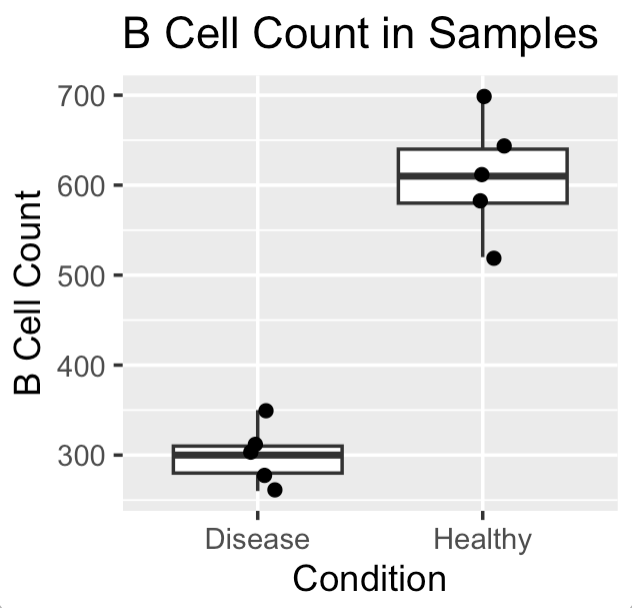
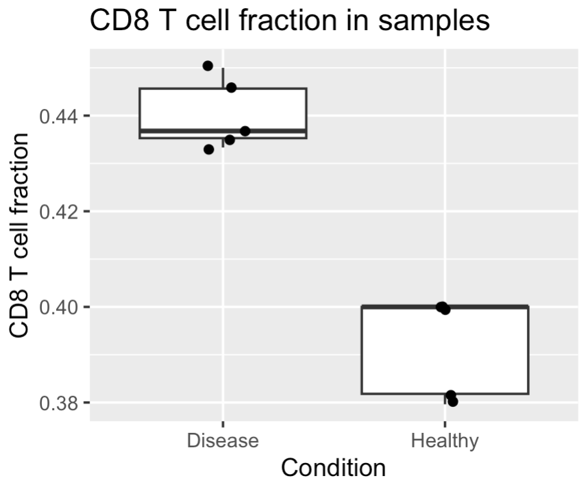

# Statistical Analysis in R in Biology Part 1 (জীববিজ্ঞানে পরিসংখ্যানিক বিশ্লেষণ)

পরিসংখ্যান বিষয়টা আমার কাছে খুবই interesting মনে হয়। এজন্য না যে বিষয়টি সঠিক কঠিন অথবা এর মাধ্যমে আপনি অনেক কাজ করতে পারবেন। আমার মনে হয় পরিসংখ্যান শিখার ক্ষেত্রে আমাদের যেভাবে পড়ানো সেটা একটু কঠিন এবং অনেক ক্ষেত্রে গাণিতিক নির্ভরশীলতা বেশি। গানিনিতিক নির্ভরশীলতা বেশি থাকা খারাপ কিছু না কিন্তু অনেক ক্ষেত্রে demotivate করে ফেলে। আমরা যখন জীববিজ্ঞানে কাজ করি তখন আমাদের অনেক ক্ষেত্রে R এর সাহায্য থাকায়, জানতে হয় না যে গাণিতিকভাবে কিভাবে কাজ করল। আমাদের জানতে হয় যে কেন আমরা ধরুন এই পরিসংখ্যান ব্যবহার করলাম। আমরা যখন সেটা জানতে পারব তখন পরিসংখ্যান ব্যবহার করাটা আমাদের কাছে সহজ মনে হবে। 
এসব বলার মূল কারণ হল আমি আমার লেখায় পরিসংখ্যানকে concept আকারে না শিখিয়ে জীববিজ্ঞানের একটা প্রশ্ন এবং তার উত্তর এর মাধ্যমে শেখার চেষ্টা করবো। শুধু mean() বা median() function শেখা না, বরং একটি biological question থেকে শুরু করে data summary, visualisation, statistical test এবং interpretation পর্যন্ত পুরো workflow দেখব। 
# আপডেট পাওয়ার জন্য নিবন্ধন করুন (Register for Updates)

আপনি যদি এই ব্লগের নিয়মিত আপডেট পেতে চান, তাহলে নিচের ফর্মটি পূরণ করুন। আমি নতুন কোনো কন্টেন্ট যোগ করার সাথে সাথেই আপনাকে ইমেইলের মাধ্যমে জানিয়ে দেব।

# [**ফর্ম পূরণ করতে এখানে ক্লিক করুন**](https://forms.gle/6qyRGiE7WSpLJ9SA9)

আমার এই লেখার মূল পরিকল্পনা হল আপনাদের একটা overall understanding তৈরি করা যাতে পরবর্তীতে আপনাদের প্রয়োজন মত অংশে আপনারা গভীরে যেতে পারবেন। 
আমার ব্লগের ধারাবাহিকতার অংশ হিসেবে আমাদের উদাহরণ হবে immunology data নিয়ে।
ধরুন, আমরা জানতে চাই:
## Disease condition-এ কি Healthy condition-এর তুলনায় B cell count কমে যায়?
এটি একটি খুব সাধারণ biological question। বাস্তব জীবনে এরকম প্রশ্ন অনেক হতে পারে। যেমনঃ 

•	রোগীর sample-এ B cell কমেছে কি? 

•	infection-এর পরে CD8 T cell বেড়েছে কি? 

•	treatment দেওয়ার পরে antibody-producing plasma cell বেড়েছে কি? 

•	cancer tissue-এ T cell infiltration কম নাকি বেশি? 


এই প্রশ্নগুলোর উত্তর দিতে হলে শুধু চোখে data দেখা যথেষ্ট না। আমাদের পরিসংখ্যানের সাহায্য নিতে হয়।

## Mean, Median and Standard Deviation (গড়, মিডিয়ান এবং স্ট্যান্ডার্ড ডেভিয়েশন)
প্রথমে আমরা একটি ছোট immunology dataset তৈরি করি।

```r
immune_data <- data.frame(
  sample_id = c("H1", "H2", "H3", "H4", "H5",
                "D1", "D2", "D3", "D4", "D5"),
  condition = c("Healthy", "Healthy", "Healthy", "Healthy", "Healthy",
                "Disease", "Disease", "Disease", "Disease", "Disease"),
  b_cells = c(520, 610, 580, 640, 700,
              300, 280, 350, 260, 310),
  t_cells = c(1100, 1150, 1080, 1200, 1250,
              900, 850, 920, 800, 870),
  cd8_t_cells = c(420, 460, 410, 480, 500,
                  390, 370, 410, 360, 380)
)

immune_data
```
Output:
```r
   sample_id condition b_cells t_cells cd8_t_cells
1         H1   Healthy     520    1100         420
2         H2   Healthy     610    1150         460
3         H3   Healthy     580    1080         410
4         H4   Healthy     640    1200         480
5         H5   Healthy     700    1250         500
6         D1   Disease     300     900         390
7         D2   Disease     280     850         370
8         D3   Disease     350     920         410
9         D4   Disease     260     800         360
10        D5   Disease     310     870         380
```

এখানে আমাদের ১০টি sample আছে। এর মধ্যে ৫টি Healthy sample এবং ৫টি Disease sample। 
প্রতিটি sample-এর জন্য আছে: B cell count , Total T cell count এবং CD8 T cell count 
## Mean বা গড় কী?
Mean হলো গড় মান। ধরুন Healthy sample-এর B cell count:
520, 610, 580, 640, 700। Mean বের করতে সব মান যোগ করে মোট sample সংখ্যা দিয়ে ভাগ করতে হয়।
কিন্তু R দিয়ে একটা ফাংশন run করলেই হয়। 
```r
mean(immune_data$b_cells)
```
Output:
```r
[1] 455
```
কিন্তু এটি Healthy এবং Disease দুই group একসাথে নিয়ে mean বের করবে। শুধু Healthy group-এর mean বের করতে:
```r
mean(immune_data$b_cells[immune_data$condition == "Healthy"])
```
Output:
```r
[1] 610
```
শুধু Disease group-এর mean:
```r
mean(immune_data$b_cells[immune_data$condition == "Disease"])
```
Output:
```r
[1] 300
```
মানে Healthy group-এ average B cell count প্রায় 610, আর Disease group-এ প্রায় 300। এটি দেখে মনে হচ্ছে Disease group-এ B cell কম। কিন্তু এখানেই থেমে গেলে চলবে না।
## Median বা মধ্যক কী?
Median হলো মাঝের মান। যদি data ছোট থেকে বড় সাজানো হয়, মাঝখানের মানটি হলো median। ধরুন, Healthy B cell values: 520, 580, 610, 640, 700। এখানে মাঝের মান 610।
R দিয়ে:
```r
median(immune_data$b_cells[immune_data$condition == "Healthy"])

```
Output:
```r
[1] 610
```
Disease group:
```r
median(immune_data$b_cells[immune_data$condition == "Disease"])
```
Output:
```r
[1] 300

```
Median অনেক সময় mean-এর চেয়ে বেশি informative হয়, বিশেষ করে যখন data-তে outlier থাকে। এখানে outlier বলতে বোঝাচ্ছি ধরুন খুবই extreme কোন সংখ্যা থাকা। আমরা যে আগের sample এর কোথা বলছিলাম ধরুন সেখানে ভুল করে একটি B cell count 5000 লেখা হয়েছে। তখন mean অনেক বেড়ে যাবে। কিন্তু median এতটা প্রভাবিত হবে না। এই জন্য biological data-তে mean এবং median দুটোই দেখা ভালো। আপনি যখন বিভিন্ন গবেষণাপত্র পড়তে যাবেন তখন দেখবেন যে mean অথবা median ব্যবহার করছে। অনেক সময় যখন R এ কোড করে তখনও না জেনে figure বানায় যেখানে তারা সঠিকভাবে বলে না যে median ব্যবহার হয়েছে নাকি mean। 
## Standard Deviation কী?
Standard deviation বা SD বলে ডেটা  কতটা ছড়ানো। দুইটি group-এর mean একই হতে পারে, কিন্তু variation আলাদা হতে পারে। মানে দাঁড়ায় যে ডেটা ছড়ানো হতে পারে।  
ধরুন:
Group A: 500, 510, 490, 505, 495
Group B: 100, 900, 300, 700, 500
দুই group-এর mean কাছাকাছি হতে পারে। কিন্তু Group B অনেক বেশি variable।
R দিয়ে SD বের করতে:
```r
sd(immune_data$b_cells[immune_data$condition == "Healthy"])
```
Output:
```r
[1] 67.08204

```
Disease group:
```r
sd(immune_data$b_cells[immune_data$condition == "Disease"])
```
Output:
```r
[1] 33.91165

```
SD biological data-তে গুরুত্বপূর্ণ, কারণ real sample সবসময় একই রকম হয় না। মানুষে মানুষে variation থাকে। tissue processing-এর variation থাকে। measurement-এর variation থাকে। তাই শুধু average দেখলেই সব বোঝা যায় না। 
## Summary Table তৈরি করা
এখন আমরা dplyr ব্যবহার করে group-wise summary table বানাব।
```r
library(dplyr)

summary_table <- immune_data %>%
  group_by(condition) %>%
  summarise(
    mean_b_cells = mean(b_cells),
    median_b_cells = median(b_cells),
    sd_b_cells = sd(b_cells),
    mean_t_cells = mean(t_cells),
    median_t_cells = median(t_cells),
    sd_t_cells = sd(t_cells),
    n = n()
  )

summary_table
```
Output:
```r
# A tibble: 2 × 8
  condition mean_b_cells median_b_cells sd_b_cells mean_t_cells median_t_cells sd_t_cells     n
  <chr>            <dbl>          <dbl>      <dbl>        <dbl>          <dbl>      <dbl> <int>
1 Disease            300            300       33.9          868            870       46.6     5
2 Healthy            610            610       67.1         1156           1150       70.2     5

```

এখন আমরা একটি proper descriptive summary পেলাম।
এখানে দেখা যাচ্ছে: Healthy group-এ B cell count বেশি। Disease group-এ B cell count কম। T cell count-ও Disease group-এ কিছুটা কম।
কিন্তু এক্ষেত্রে কিছু প্রশ্ন আপনাকে করতে হবে। যেমনঃ এই পার্থক্য কি meaningful? নাকি sample variation-এর কারণে এমন হয়েছে? এখানেই আপনাকে statistical test করতে হবে। 
## Applying Statistics to Biological Data (জীববিজ্ঞানের ডেটায় পরিসংখ্যান প্রয়োগ)
এখন আমরা পুরো statistical project হিসেবে চিন্তা করি। একটা ছোট প্রোজেক্ট চিন্তা করি। আমাদের প্রশ্ন যেটার উপর আমরা কাজ করবো। 
## Disease condition-এ কি Healthy condition-এর তুলনায় B cell count কমে যায়?
### Hypothesis
পরিসংখ্যানে আমরা সাধারণত দুই ধরনের hypothesis ব্যবহার করি।
### Null hypothesis
Null hypothesis হলো: কোনো পার্থক্য নেই।
এই উদাহরণে:
Healthy এবং Disease group-এর B cell count-এর মধ্যে কোনো পার্থক্য নেই।
### Alternative hypothesis
Alternative hypothesis হলো: পার্থক্য আছে।
Healthy এবং Disease group-এর B cell count-এর মধ্যে পার্থক্য আছে।
বা আরও নির্দিষ্টভাবে:
Disease group-এ B cell count Healthy group-এর তুলনায় কম।

### Step 1: Data দেখা
আমরা এখানে immune_data ব্যবহার করবো। প্রথমে আমরা structure দেখি।
```r
str(immune_data)
```
Output:
```r
'data.frame':	10 obs. of  5 variables:
 $ sample_id  : chr  "H1" "H2" "H3" "H4" ...
 $ condition  : chr  "Healthy" "Healthy" "Healthy" "Healthy" ...
 $ b_cells    : num  520 610 580 640 700 300 280 350 260 310
 $ t_cells    : num  1100 1150 1080 1200 1250 900 850 920 800 870
 $ cd8_t_cells: num  420 460 410 480 500 390 370 410 360 380

```
এটি খুব গুরুত্বপূর্ণ। কারণ যদি b_cells ভুল করে character হিসেবে থাকে, তাহলে statistical test ঠিকভাবে হবে না। এজন্য আমরা সবসময় যেকোনো ডেটা নিয়ে কাজ করার আগে ওই ডেটার structure check করি। 
### Step 2: Visualisation
Statistics করার আগে plot দেখা উচিত।
```r
library(ggplot2)
ggplot(immune_data, aes(x = condition, y = b_cells)) +
  geom_boxplot() +
  geom_jitter(width = 0.1) +
  labs(
    title = "B cell count in Healthy and Disease samples",
    x = "Condition",
    y = "B cell count"
  )
```
Output:

উপরের plot (ছবিতে) আমরা দেখতে পাচ্ছি Healthy group-এর B cell count বেশি এবং Disease group-এর B cell count কম। আমরা যে plot তৈরি করেছি তাকে boxplot বলে। আমরা পরের অধ্যায় এ ggplot ব্যবহার করে বিভিন্ন প্লট তৈরি করা দেখব। 
Boxplot আমাদের distribution দেখায়। আর Jitter points individual sample দেখায়।
আমি ব্যক্তিগতভাবে biological data-তে শুধু barplot পছন্দ করি না। কারণ barplot অনেক সময় individual sample variation লুকিয়ে ফেলে। Boxplot বা dot plot এ আপনি সব ডেটা কেমন এবং ডেটা তে কোন discrepancy আছে কিনা দেখতে পারবেন।
### Step 3: Normality দেখা
অনেক statistical test ডেটা distribution-এর উপর নির্ভর করে। যদি data roughly normal distribution follow করে, তাহলে t-test ব্যবহার করা যায়। যদি data খুব skewed হয় বা sample size ছোট হয়, তাহলে non-parametric test যেমন Wilcoxon test ব্যবহার করা যায়। Normality check করতে Shapiro-Wilk test ব্যবহার করা যায়। এখানে এটা বলে রাখা ভাল যে আমাদের ডেটা অনেক কম। এজন্য Shapiro-Wilk test এর result একটু বুঝে ব্যবহার করতে হবে। 
Healthy group:
```r
shapiro.test(
  immune_data$b_cells[immune_data$condition == "Healthy"]
)
```
Output:
```r
	Shapiro-Wilk normality test

data:  immune_data$b_cells[immune_data$condition == "Healthy"]
W = 0.99929, p-value = 0.9998

```
Disease group:
```r
shapiro.test(
  immune_data$b_cells[immune_data$condition == "Disease"]
)
```
Output:
```r
	Shapiro-Wilk normality test

data:  immune_data$b_cells[immune_data$condition == "Disease"]
W = 0.97757, p-value = 0.9212
```
যদি p-value 0.05-এর বেশি হয়, তাহলে আমরা strong evidence পাই না যে data non-normal।
তবে এখানে একটি সতর্কতা আছে। Sample size যদি খুব ছোট হয়, Shapiro test খুব reliable না। ৫টি sample দিয়ে normality confidently বলা কঠিন। তাই plot, biological knowledge এবং sample size সবকিছু মিলিয়ে সিদ্ধান্ত নিতে হয়।
### Step 4: t-test করা
এখন আমরা Healthy এবং Disease group-এর B cell count compare করব।
```r
t.test(b_cells ~ condition, data = immune_data)
```
Output এরকম হতে পারে:
```r
	Welch Two Sample t-test

data:  b_cells by condition
t = -9.2219, df = 5.9191, p-value = 9.921e-05
alternative hypothesis: true difference in means between group Disease and group Healthy is not equal to 0
95 percent confidence interval:
 -392.5273 -227.4727
sample estimates:
mean in group Disease mean in group Healthy 
                  300                   610
```
এখানে p-value খুব ছোট। সাধারণত p-value < 0.05 হলে আমরা বলি group দুটির মধ্যে statistically significant difference আছে। কিন্তু শুধু “significant” বললেই শেষ না।আমাদের biological interpretation করতে হবে।
এই result suggest করে যে Disease group-এ B cell count Healthy group-এর তুলনায় কম। তবে এটি dummy dataset, তাই real biological conclusion নয়।
### Step 5: Wilcoxon test করা
যদি data normal না হয়, অথবা sample size ছোট হয়, আমরা Wilcoxon rank-sum test ব্যবহার করতে পারি।
```r
wilcox.test(b_cells ~ condition, data = immune_data)
```
Output:
```r
	Wilcoxon rank sum exact test

data:  b_cells by condition
W = 0, p-value = 0.007937
alternative hypothesis: true location shift is not equal to 0

```
এই test mean compare করে না। এটি rank compare করে। সহজভাবে বলতে গেলে, Wilcoxon test দেখে একটি group-এর value অন্য group-এর তুলনায় সাধারণত বড় না ছোট। Biological data-তে Wilcoxon test খুব common, বিশেষ করে single-cell analysis-এ।
### Step 6: Effect Size
p-value গুরুত্বপূর্ণ, কিন্তু p-value সবকিছু না। ধরুন p-value significant। কিন্তু difference খুব ছোট। তাহলে biological importance কম হতে পারে।
তাই effect size দেখা দরকার।
সহজ effect size হিসেবে আমরা mean difference বের করতে পারি।
```r
mean_healthy <- mean(immune_data$b_cells[immune_data$condition == "Healthy"])
mean_disease <- mean(immune_data$b_cells[immune_data$condition == "Disease"])

mean_difference <- mean_healthy - mean_disease
mean_difference
```
Output:
```r
[1] 310
```
মানে Healthy group-এ average B cell count Disease group-এর তুলনায় 310 বেশি।
আর fold-change বের করতে:
```r
fold_change <- mean_healthy / mean_disease
fold_change
```
Output:
```r
[1] 2.033333
```
অর্থাৎ Healthy group-এ B cell count Disease group-এর তুলনায় প্রায় ২ গুণ বেশি। তবে এটি অনেক বেশি biologically interpretable।
### Step 7: CD8 T cell fraction analysis
এখন আমরা আরেকটি biological question করি।
## Disease group-এ CD8 T cell fraction কি Healthy group-এর তুলনায় বেশি?
প্রথমে CD8 fraction calculate করি।
```r
immune_data <- immune_data %>%
  mutate(
    cd8_fraction = cd8_t_cells / t_cells
  )
```
এখন summary করি।
```r
immune_data %>%
  group_by(condition) %>%
  summarise(
    mean_cd8_fraction = mean(cd8_fraction),
    median_cd8_fraction = median(cd8_fraction),
    sd_cd8_fraction = sd(cd8_fraction)
  )
```
Output:
```r
# A tibble: 2 × 4
  condition mean_cd8_fraction median_cd8_fraction sd_cd8_fraction
  <chr>                 <dbl>               <dbl>           <dbl>
1 Disease               0.440               0.437         0.00722
2 Healthy               0.392               0.4           0.0106

```
তারপর plot করি।
```r
ggplot(immune_data, aes(x = condition, y = cd8_fraction)) +
  geom_boxplot() +
  geom_jitter(width = 0.1) +
  labs(
    title = "CD8 T cell fraction in Healthy and Disease samples",
    x = "Condition",
    y = "CD8 T cell fraction"
  )
```
Output:


তারপর test:
```r
t.test(cd8_fraction ~ condition, data = immune_data)
```
Output:
```r

	Welch Two Sample t-test

data:  cd8_fraction by condition
t = 8.3616, df = 7.0607, p-value = 6.539e-05
alternative hypothesis: true difference in means between group Disease and group Healthy is not equal to 0
95 percent confidence interval:
 0.03439401 0.06145136
sample estimates:
mean in group Disease mean in group Healthy 
            0.4402122             0.3922896

```
অথবা:
```r
wilcox.test(cd8_fraction ~ condition, data = immune_data)
```
Output:
```r
	Wilcoxon rank sum test with continuity correction

data:  cd8_fraction by condition
W = 25, p-value = 0.01116
alternative hypothesis: true location shift is not equal to 0

```
এখানে আমরা একই statistical workflow অন্য variable-এর জন্য ব্যবহার করলাম।
এইটাই real data analysis-এর সৌন্দর্য। একবার workflow বুঝে গেলে, আপনি B cell, T cell, CD8 fraction, gene expression, clonotype count, cytokine level, সবকিছুর উপর একই ধরনের চিন্তা প্রয়োগ করতে পারবেন।
## Result Interpretation
আমাদের dummy dataset অনুযায়ী Healthy group-এ B cell count Disease group-এর তুলনায় বেশি দেখা যাচ্ছে। Mean, median এবং plot সবই একই দিক নির্দেশ করছে। t-test করলে p-value ছোট আসার সম্ভাবনা বেশি, যা suggest করে group দুটির মধ্যে statistical difference আছে।
কিন্তু এখানে কয়েকটি বিষয় মাথায় রাখা জরুরি।

প্রথমত, এটি একটি ছোট dummy dataset। বাস্তব biological conclusion করা যাবে না।

দ্বিতীয়ত, sample size খুব কম। মাত্র ৫টি Healthy এবং ৫টি Disease sample। বাস্তব study-তে আরও বেশি sample দরকার।

তৃতীয়ত, p-value significant হলেই biological truth প্রমাণ হয়ে যায় না। Experimental design, batch effect, sample quality, patient heterogeneity, measurement method, সবকিছু বিবেচনা করতে হয়।

চতুর্থত, effect size দেখা জরুরি। শুধু p-value না, difference কত বড় সেটাও জানতে হবে।

## p-value নিয়ে ছোট আলোচনা
p-value অনেকেই ভুল বোঝেন। p-value < 0.05 মানে এই না যে hypothesis 95% সত্য।
বরং সহজভাবে বলতে গেলে: যদি সত্যিই group দুইটির মধ্যে কোনো পার্থক্য না থাকত, তাহলে এমন data বা এর চেয়েও extreme data পাওয়ার probability কত?
p-value ছোট হলে আমরা বলি, “এই data null hypothesis-এর সাথে খুব ভালোভাবে মানাচ্ছে না।” সুতরাং আমরা null hypothesis কে reject করতে পারি। 
কিন্তু p-value biology বোঝায় না। Biology বুঝতে effect size, plot, experimental context এবং sample quality দেখতে হয়।
### Biological Data-তে Statistics করার সময় সতর্কতা
Biological data অনেক messy হয়।
কিছু common সমস্যা:

•	sample size ছোট 

•	outlier থাকে 

•	missing value থাকে 

•	batch effect থাকে 

•	measurement noise থাকে 

•	donor-to-donor variation থাকে 

•	repeated measures থাকে 

•	independent sample না-ও হতে পারে 

ধরুন একই patient থেকে before এবং after treatment sample নেওয়া হয়েছে। তাহলে সাধারণ t-test নয়, বরং আপনাকে paired t-test করতে হবে। আমরা নিছে Paired T-test নিয়ে বলবো। 
## Paired t-test Example
ধরুন একই ৫ জন patient-এর treatment-এর আগে এবং পরে B cell count মাপা হয়েছে। এখানে treatment বলতে মনে করুন covid এর vaccine দেওয়ার আগে ও পরে B cell count মাপা হচ্ছে। যখন একই patient এর ডেটা এর মধ্যে তুলনা করা হয় তখন paired t-test ব্যবহার করতে হয়। 
একটা dummy ডেটা তৈরি করি। 
```r
paired_data <- data.frame(
  patient_id = c("P1", "P2", "P3", "P4", "P5"),
  before_treatment = c(300, 320, 280, 350, 310),
  after_treatment = c(450, 480, 400, 500, 460)
)
```
Paired t-test:
```r
t.test(
  paired_data$before_treatment,
  paired_data$after_treatment,
  paired = TRUE
)

```

Output:
```r
	Paired t-test

data:  paired_data$before_treatment and paired_data$after_treatment
t = -21.527, df = 4, p-value = 2.754e-05
alternative hypothesis: true mean difference is not equal to 0
95 percent confidence interval:
 -164.8308 -127.1692
sample estimates:
mean difference 
           -146

```
এখানে paired test দরকার, কারণ before এবং after value একই patient থেকে এসেছে। যদি আমরা এটাকে independent sample ধরে test করি, সেটা ভুল analysis হবে।
## শেষ কোথা 
এই অধ্যায়ে আমরা একটি ছোট immunology statistical project দেখলাম। আমরা শিখলাম:
Mean, median, standard deviation কী। group-wise summary কিভাবে করতে হয় । plot দিয়ে data দেখতে হয়। t-test কিভাবে করতে হয় । Wilcoxon test কখন ব্যবহার করা যায় । p-value কীভাবে interpret করতে হয় । effect size কেন জরুরি । paired এবং unpaired design-এর পার্থক্য কী 
পরিসংখ্যান শেখার সময় অনেকেই প্রথমে formula মুখস্থ করার চেষ্টা করেন। কিন্তু আমার মনে হয় biological question থেকে শুরু করা বেশি ভালো।

প্রথমে প্রশ্ন করুন:

আমি কী জানতে চাই?

তারপর ভাবুন:

আমার variable কী?

আমার group কী?

Sample independent নাকি paired?

Data distribution কেমন?

Difference কত বড়?

Plot কী বলছে?

তারপর statistical test করুন।

Statistics কোনো magic button না। R-এ t.test() চালালেই science হয়ে যায় না। বরং statistics হলো biological reasoning-কে একটু disciplined করার উপায়। এটা ডেটা থেকে evidence বের করতে সাহায্য করে। কিন্তু interpretation সবসময় biology, experiment এবং common sense সবকিছু একসাথে করে কাজ করতে হয়। 

# আপডেট পাওয়ার জন্য নিবন্ধন করুন (Register for Updates)

আপনি যদি এই ব্লগের নিয়মিত আপডেট পেতে চান, তাহলে নিচের ফর্মটি পূরণ করুন। আমি নতুন কোনো কন্টেন্ট যোগ করার সাথে সাথেই আপনাকে ইমেইলের মাধ্যমে জানিয়ে দেব।

# [**ফর্ম পূরণ করতে এখানে ক্লিক করুন**](https://forms.gle/6qyRGiE7WSpLJ9SA9)

