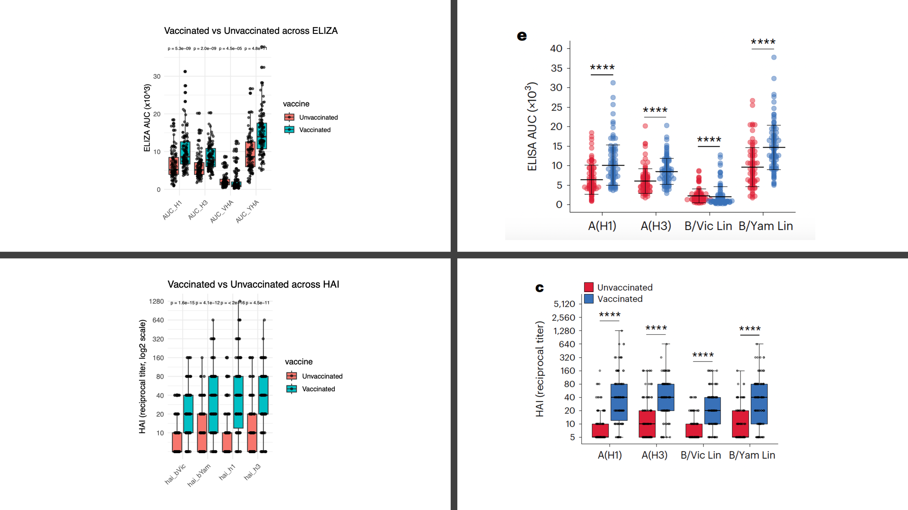

# Baseline innate and T cell populations are correlates of protection against symptomatic influenza virus infection independent of serology Journal – Nature Immunology Impact Factor: 27.6
## গবেষণার উদ্দেশ্যঃ

এই গবেষণার দেখার চেষ্টা করা হয়েছে যে, ভ্যাক্সিন নেওয়ার পরও কিছু মানুষ ইনফ্লুয়েঞ্জা আক্রান্ত হয়, আবার কেউ হয়না। এর পেছনে কি কারণ হতে পারে। 
বর্তমানে কোন ভ্যাক্সিন কাজ করে কি করে না সেটা দেখা হয় Antibody (serology) পরিমাপ করে। কিন্তু এই গবেষণায় দেখা গিয়েছে যে, 

১। শুধু Antibody নয়, একইসাথে অন্যান্য immune cell, যেমন T cell, NK cell, DC ভ্যাক্সিন কার্যকারিতায় বেশ ভূমিকা রাখে। 

২। Polyfunctional T cells, circulating T follicular helper (cTfh), mDCs, cytotoxic NK cells মানুষে সুরক্ষা প্রদানের সাথে সম্পর্কিত। 

৩। γδ T cells, Activated NK cells, TNFα+ CD8+ T cells মানুষে ইনফ্লুয়েঞ্জা তে ঝুঁকির সাথে সম্পর্কিত। 

৪। ICOS+ cTfh সবচেয়ে ভাল Prediction করতে পারে যে কারা ইনফ্লুয়েঞ্জা তে অসুস্থ হবে আর কারা হবে না। 

এই গবেষণার দ্বারা দেখানোর চেষ্টা করা হয়েছে যে ভ্যাকসিন তৈরি করার সময় শুধু অ্যান্টিবডি নয়, একইসাথে অন্যান্য immune cell সমানভাবে দেখতে হবে। 

আমি এই লেখায় এই গবেষণার প্রতিটি অংশ ব্যাখ্যা করার চেষ্টা করবো এবং একইসাথে R প্রোগ্রামিং এর মাধ্যমে ওই অংশের ডেটা বিশ্লেষণ করে দেখাব। এই গবেষণার একটি ভাল দিক হচ্ছে ওরা ডেটা আলাদা করে দিয়ে দিয়েছে। আপনি চাইলে ডেটা এখান থেকে [Download](./Mettelman_Minimum_dataframe.csv) করে নিতে পারবেন। 

আমি পুরো কাজটি কিছু ভাগে ভাগ করে প্রতিটি ভাগ আলাদা করে ব্যাখ্যা করবো। এখানে বলে রাখা ভাল যে আপনি আমার লেখা পড়ে তারপর যদি আসল গবেষণা পড়তে যান তাহলে আসা করছি সহজে বুঝতে পারবেন। 

### Study Population
এই গবেষণায় নিউজিল্যান্ড থেকে ২০৬ জন অংশগ্রহণ করে। ২০১৮ সালের ফ্লু শুরু হওয়ার আগে তাদের রক্ত সংগ্রহ করা হয়। একইসাথে তাদের রক্তে immune cell এর পরিমাপগুলো নিয়ে নেওয়া হয়। পরবর্তীতে মৌসুম শেষে কারা ইনফ্লুয়েঞ্জা তে আক্রান্ত হয়েছে তা দেখা হয়। মূলত এখানে অংশগ্রহণ কারিদের চারটি group এ ভাগ করা হয়। 
১। ভ্যাক্সিন নিয়েছে – অসুস্থ হয়নি

২। ভ্যাক্সিন নিয়েছে – ফ্লু হয়েছে

৩। ভ্যাক্সিন নেয়নি – অসুস্থ হয়নি

৪। ভ্যাক্সিন নেয়নি – ফ্লু হয়েছে 

সার্বিকভাবে ২৬.৭% অংশগ্রহণকারী সংক্রমিত এবং বাকি ৭৩.৩% সংক্রমিত হয়নি। আমি প্রত্যেকটি অংশের সাথে সম্পর্কিত Figure গুলো কোড করে তৈরি করবো আর Paper এ Figure ডান পাশে দিয়ে দিব যাতে আপনারা তুলনা করে বুঝতে পারেন। 

Figure1b: এখানে একটি Contingency Table দেখান হয়েছে। এর মাধ্যমে ২০৬ জন অংশগ্রহণকারী রা কে কোন গ্রুপ এ পড়ে এবং কোন গ্রুপ এ কয়জন আছে সেটা জানা যায়। 
```r
## Load data 
df <- read.csv("Mettelman_Minimum_dataframe.csv", stringsAsFactors = FALSE)
## Work on Few Columns
df$vaccine <- df$Flu_Vaccine_2018
## Infection outcome from inf_positive (Pos/Neg)
df$outcome <- ifelse(df$inf_positive == "Pos", "Infected", "Uninfected")
## Four-group
df$four_group <- paste(df$vaccine, df$outcome, sep = "-")
table(df$four_group)
## Figure 1b: Create a Contingency Table 
#split the column based on "-"
parts <- strsplit(df$four_group,"-")
parts
# Turn the list into 2 column matrix
parts_mat <- do.call(rbind, parts)
#get the two columns 
vaccination <- parts_mat[, 1]
infection   <- parts_mat[, 2]
status <- ifelse(infection == "Infected", "Positive", "Negative")
## 2×2 contingency table (rows: Vaccinated/Unvaccinated; cols: Negative/Positive)
ct <- table(Vaccination = vaccination, Status = status)
ct
```


Figure1c: এখানে দেখান হয়েছে ভ্যাক্সিন নেওয়া নারী-পুরুষ এর বয়স এর কোন বড় পার্থক্য আছে কি না। কারণ ডেটাতে যদি বয়সের পার্থক্য থাকবে তখন ডেটা ব্যাখ্যা করতে গেলে বয়স ফলাফল কে প্রভাবিত করতে পারে। এখানে দেখা যায় যে Vaccinated vs Unvaccinated দুই গ্রুপ এ নারী-পুরুষ এ বয়সে (significant)পার্থক্য নেই (Wilcoxon P = ০.০৭, ০.৬৩ )
```r
## Figure 1c: Age distribution by Sex within Vaccine groups 
p<- ggplot(df, aes(x = Sex, y = Age, fill = Sex)) +
  geom_boxplot(alpha = 0.1,width = 0.6) +
  geom_jitter(aes(color = Sex),alpha = 0.7)+
  facet_wrap(~ vaccine) +
  labs(title = "Age distribution by Sex within Vaccination Groups",
       x = NULL, y = "Age (years)") +
  theme_classic(base_size = 12) +
  theme(
    legend.position = "none",
    strip.text = element_text(face = "bold"),
    axis.ticks.length = unit(2, "pt")
  )+stat_compare_means(
      comparisons = list(c("Female", "Male")),
      method = "wilcox.test",
      label = "p.format",
      hide.ns = TRUE,
      tip.length = 0.01,
      bracket.size = 0.4
    )+
  coord_flip() 
pdf("Age Distribution by Sex Within Vaccination Groups.pdf", width = 7, height = 4)
print(p)
dev.off()
```


Figure1d: এই figure এ দেখানর চেষ্টা করা হয়েছে নারী-পুরুষ ভেদে কোন Strain দ্বারা আক্রান্ত হওয়ার পার্থক্য আছে কি না। যদি এই Figure এ তারা absolute সংখ্যা দেখিয়েছে, আমার মতে একানে proportion দেখালে ভাল হত, তাহলে তুলনা করা সহজ হুত কারণ আমরা তখন বুঝতে পারতাম যে ১০০ এর মধ্যে কতজন কোন strain দ্বারা আক্রান্ত। আমি এই figure তৈরি করার ক্ষেত্রে তাদের দেওয়া figure তৈরি করেছি। 
```r
# Figure 1d , distribution of Strain acrss sex group


grp <- ifelse(df$Strain %in% c("H1N1","H3N2","A"), "FluA",
              ifelse(df$Strain %in% c("B Vic","B Yam"), "FluB",
                     ifelse(df$Strain == "Cryptic", "Cryptic", "Uninfected")))
df$strain_group <- factor(grp, levels = c("FluA","FluB","Cryptic","Uninfected"))
df$Sex <- factor(df$Sex, levels = c( "Male", "Female"))
p<- ggplot(df, aes(x = Sex, fill = strain_group)) +
  geom_bar(position = "stack",width = 0.5) +  
  labs(x = NULL, y = "Count", fill = "Strain group") +
  theme_classic()+
  coord_flip()
pdf("Strain vs Sex.pdf", width = 7, height =3)
print(p)
dev.off()
```


### Baseline Serology -> Protection

এই অংশে গবেষকরা দেখিয়েছেন, মৌসুম শুরুর অ্যান্টিবডি পরিমাপ (HAI, NAI, ELISA AUC) ভবিষ্যতে লক্ষণসহ ফ্লু হওয়া/না-হওয়ার সাথে কীভাবে সম্পর্কিত।

#### ১। কোন কোন serology পরিমাপ করা হয়েছিল এবং কেন?

•  HAI (Hemagglutination Inhibition): ইনফ্লুয়েঞ্জা ভাইরাসের HA প্রোটিনকে ব্লক করতে পারে এমন অ্যান্টিবডির neutralizing ক্ষমতা। পরিমাপ যত বেশি, ততবেশি HA-ফাংশন ব্লক হবে। 
•  NAI (Neuraminidase Inhibition): NA প্রোটিনের এনজাইমেটিক কাজ বন্ধ করার ক্ষমতা। এটাও neutralizing প্রকৃতির।
•  ELISA (binding) AUC: পুরো দৈর্ঘ্যের HA/NA প্রোটিনের সাথে মোট কতটা অ্যান্টিবডি bind করে 

এই তিনটি একসাথে নিয়ে গবেষকের লক্ষ্য ছিল Humoral Immunity কতটা শক্তিশালী , এবং সেটা পরের ইনফ্লুয়েঞ্জা-ঝুঁকির সাথে কীভাবে সম্পর্কিত সেটা বোঝার চেষ্টা করা। পরিমাপগুলো H1/H3 (flu-A) ও B/Victoria, B/Yamagata (Flu-B)এর বিরুদ্ধে নেওয়া হয়েছিল। এখানে HAI ও NAI Inhibition Assay এবং HA/NA ELISA করা হয়।

#### ২। Serology মাপগুলো কিভাবে পরস্পরের সাথে সম্পর্কিত। 
গবেষণায় দেখা যায় যে HAI/NAI (inhibition titers) ELIZA AUC (binding titers) মূলত positively correlated। অর্থাৎ যাদের neutralizing টাইটার বেশি তাদের binding ও বেশি। এই অঙ্ঘসের figure আপনারা লক্ষ্য করবেন দেখতে একটু ভিন্ন কারণ আমি তুলনা সবার সাথে করেছি। আপনি একটু কাছে থেকে পর্যবেক্ষণ করলে দেখবেন যে value গুলো একই। 
```r
# Outcome for 2g–2j, 2k–2l: Symptomatic vs Protected (Uninfected + Cryptic)
df$outcome2 <- ifelse(df$PCRpositive == 1, "Symptomatic", "Uninfected/Cryptic")
table(df$outcome2)

# Serology variable sets
ha_cols <- c("hai_h1","hai_h3","hai_bVic","hai_bYam",   # HAI (HA targets)
             "AUC_H1","AUC_H3","AUC_VHA","AUC_YHA")     # HA-binding AUC
na_cols <- c("nai_h1","nai_h3","nai_bVic","nai_bYam",   # NAI (NA targets)
             "AUC_N1","AUC_N2","AUC_VNA","AUC_YNA")     # NA-binding AUC
## 2a — anti-HA correlation heatmap (Spearman)
## ================
m_ha <- suppressWarnings(cor(df[, ha_cols], use = "pairwise.complete.obs", method = "spearman"))
m_ha
library(tidyr)
#Convert matrix to data frame and preserve row names
ha_df <- as.data.frame(m_ha)
ha_df$Var1 <- rownames(ha_df)
#Use gather() to go from wide to long format
ha_long <- ha_df %>%
  gather(key = "Var2", value = "rho", -Var1)
ha_long
#Remove the AUC AUC, hai-hai and repeat in both the column as they represent the same. The comprison will only be with ALISa with HAI
ha_long <- ha_long[-intersect(grep("^AUC", ha_long$Var1) , (grep("^AUC", ha_long$Var2))), ]
ha_long <- ha_long[-intersect(grep("^hai", ha_long$Var1) , (grep("^hai", ha_long$Var2))), ]
ha_long <- ha_long[1:(nrow(ha_long)/2),]
p<-ggplot(ha_long, aes(x = Var1, y = Var2, fill = rho)) +
  geom_tile(color = "white") +
  geom_text(aes(label = sprintf("%.2f", rho)), size = 3) +
  scale_fill_gradient2(limits = c(-1, 1), midpoint = 0, name = "rho",
                       low = "purple4", mid = "white", high = "orange") +
  coord_equal() +
  theme_minimal(base_size = 12) +
  theme(
    axis.text.x = element_text(angle = 45, hjust = 1),
    panel.grid = element_blank()
  ) +
  labs(
    title = "HA protein",
    subtitle = "Spearman correlation: HAI (rows) vs ELISA (columns)",
    x = "ELISA (AUC)", y = "HAI (titer)"
  )
pdf("HA protein.pdf",height = 3, width = 4)
print(p)
dev.off()


## 2a — anti-HA correlation heatmap (Spearman)
## ================
m_na <- suppressWarnings(cor(df[, na_cols], use = "pairwise.complete.obs", method = "spearman"))
m_na

library(tidyr)

#Convert matrix to data frame and preserve row names
na_df <- as.data.frame(m_na)
na_df$Var1 <- rownames(na_df)

#Use gather() to go from wide to long format
na_long <- na_df %>%
  gather(key = "Var2", value = "rho", -Var1)
na_long

#Remove the AUC AUC, hai-hai and repeat in both the column as they represent the same. The comprison will only be with ALISa with HAI

na_long <- na_long[-intersect(grep("^AUC", na_long$Var1) , (grep("^AUC", na_long$Var2))), ]
na_long <- na_long[-intersect(grep("^nai", na_long$Var1) , (grep("^nai", na_long$Var2))), ]
na_long <- na_long[1:(nrow(na_long)/2),]
p<-ggplot(na_long, aes(x = Var1, y = Var2, fill = rho)) +
  geom_tile(color = "white") +
  geom_text(aes(label = sprintf("%.2f", rho)), size = 3) +
  scale_fill_gradient2(limits = c(-1, 1), midpoint = 0, name = "rho",
                       low = "purple4", mid = "white", high = "orange") +
  coord_equal() +
  theme_minimal(base_size = 12) +
  theme(
    axis.text.x = element_text(angle = 45, hjust = 1),
    panel.grid = element_blank()
  ) +
  labs(
    title = "NA protein",
    subtitle = "Spearman correlation: NAI (rows) vs ELISA (columns)",
    x = "ELISA (AUC)", y = "NAI (titer)"
  )
p
pdf("NA protein.pdf", height = 3, width = 4)
print(p)
dev.off()
```


#### ৩। ভ্যাক্সিন এর প্রভাব (Vaccinated – Unvaccinated)
২০১৮ সালের ভ্যাক্সিন নেওয়া ব্যক্তিদের HAI/NAI টাইটার বেশি ছিল যা প্রত্যাশিত (ভ্যাকসিন অ্যান্টিবডি বাড়ায়)। ELISA-তেও বেশিরভাগ টার্গেটে binding বেশি ছিল।  তবে বেশ কয়েকটি ব্যতিক্রম ও লক্ষ্য করা যায়। যেমন B/Victoria-HA ও A(N1)-এ ভ্যাকসিনগ্রুপে তুলনামূলক কম binding ধরা পড়ে।
```r

#Fig 2c,e — HA-side: Vaccinated vs Unvaccinated
library(tidyr)
library(dplyr)
# Reshape HA side data long
ha_long2 <- df %>%
  select(vaccine, all_of(ha_cols)) %>%
  gather(key = "assay", value = "value", -vaccine)

ha_long2$type <- "ELIZA_AUC"
ha_long2[grep("^hai", ha_long2$assay),]$type <- "HAI"
table(ha_long2$type)

ha_long2eliza<- ha_long2[ha_long2$type == "ELIZA_AUC",]
ha_long2hai<- ha_long2[ha_long2$type == "HAI",]
## ---- HA-side ELISA -
library(ggpubr)
# Define your titer levels
breaks <- c(10, 20, 40, 80, 160, 320, 640, 1280, 2560, 5120)

# Add small constant if any value is 0 (log(0) = -Inf)
ha_long2hai <- ha_long2hai %>%
  mutate(value_adj = ifelse(value == 0, 5, value))  # or drop zeros

# Plot
p <- ggplot(ha_long2hai, aes(x = assay, y = value_adj, fill = vaccine)) +
  geom_boxplot(position = position_dodge(0.9)) +
  geom_jitter(
    position = position_jitterdodge(jitter.width = 0.2, dodge.width = 0.9),
    size = 1.2,
    alpha = 0.6
  )+
  stat_compare_means(
    method = "wilcox.test",
    aes(group = vaccine),
    group.by = "assay",
    p.adjust.method = "BH",
    label = "p.format",
    label.y.npc = 0.98,
    size =2
  ) +
  scale_y_continuous(
    trans = "log2",                 # log2 scale makes doubling evenly spaced
    breaks = breaks,
    labels = breaks
  ) +
  theme_minimal(base_size = 11) +
  theme(
    axis.text.x = element_text(angle = 45, hjust = 1),
    legend.position = "right"
  ) +
  labs(
    title = "Vaccinated vs Unvaccinated across HAI",
    x = NULL,
    y = "HAI (reciprocal titer, log2 scale)"
  )

p
pdf("HAI titer.pdf", height = 4, width = 4)
print(p)
dev.off()


# Define your titer levels
ha_long2eliza$value <- ha_long2eliza$value / 1000

# Plot
p <- ggplot(ha_long2eliza, aes(x = assay, y = value, fill = vaccine)) +
  geom_boxplot(position = position_dodge(0.9)) +
  geom_jitter(
    position = position_jitterdodge(jitter.width = 0.4, dodge.width = 0.9),
    size = 1.5,
    alpha = 0.6
  )+
  stat_compare_means(
    method = "wilcox.test",
    aes(group = vaccine),
    group.by = "assay",
    p.adjust.method = "BH",
    label = "p.format",
    label.y.npc = 0.98,
    size =2
  ) +

  theme_minimal(base_size = 11) +
  theme(
    axis.text.x = element_text(angle = 45, hjust = 1),
    legend.position = "right"
  ) +
  labs(
    title = "Vaccinated vs Unvaccinated across ELIZA",
    x = NULL,
    y = "ELIZA AUC (x10^3)"
  )

p
pdf("ELIZA HA titer.pdf", height = 4, width = 4)
print(p)
dev.off()


#Figure 2df
library(tidyr)
library(dplyr)
# Reshape HA side data long
na_long2 <- df %>%
  select(vaccine, all_of(na_cols)) %>%
  gather(key = "assay", value = "value", -vaccine)

na_long2$type <- "ELIZA_AUC"
na_long2[grep("^nai", na_long2$assay),]$type <- "NAI"
table(na_long2$type)

na_long2eliza<- na_long2[na_long2$type == "ELIZA_AUC",]
na_long2nai<- na_long2[na_long2$type == "NAI",]
## ---- HA-side ELISA -
library(ggpubr)
# Define your titer levels
breaks <- c(10, 20, 40, 80, 160, 320, 640, 1280, 2560, 5120)

# Add small constant if any value is 0 (log(0) = -Inf)
na_long2nai <- na_long2nai %>%
  mutate(value_adj = ifelse(value == 0, 5, value))  # or drop zeros

# Plot
p <- ggplot(na_long2nai, aes(x = assay, y = value_adj, fill = vaccine)) +
  geom_boxplot(position = position_dodge(0.9)) +
  geom_jitter(
    position = position_jitterdodge(jitter.width = 0.2, dodge.width = 0.9),
    size = 1.2,
    alpha = 0.6
  )+
  stat_compare_means(
    method = "wilcox.test",
    aes(group = vaccine),
    group.by = "assay",
    p.adjust.method = "BH",
    label = "p.format",
    label.y.npc = 1.0,
    size =2
  ) +
  scale_y_continuous(
    trans = "log2",                 # log2 scale makes doubling evenly spaced
    breaks = breaks,
    labels = breaks
  ) +
  theme_minimal(base_size = 11) +
  theme(
    axis.text.x = element_text(angle = 45, hjust = 1),
    legend.position = "right"
  ) +
  labs(
    title = "Vaccinated vs Unvaccinated across NAI",
    x = NULL,
    y = "NAI (reciprocal titer, log2 scale)"
  )

p
pdf("NAI titer.pdf", height = 4, width = 4)
print(p)
dev.off()


# Define your titer levels
na_long2eliza$value <- na_long2eliza$value / 1000

# Plot
p <- ggplot(na_long2eliza, aes(x = assay, y = value, fill = vaccine)) +
  geom_boxplot(position = position_dodge(0.9)) +
  geom_jitter(
    position = position_jitterdodge(jitter.width = 0.4, dodge.width = 0.9),
    size = 1.5,
    alpha = 0.6
  )+
  stat_compare_means(
    method = "wilcox.test",
    aes(group = vaccine),
    group.by = "assay",
    p.adjust.method = "BH",
    label = "p.format",
    label.y.npc = 0.98,
    size =2
  ) +
  
  theme_minimal(base_size = 11) +
  theme(
    axis.text.x = element_text(angle = 45, hjust = 1),
    legend.position = "right"
  ) +
  labs(
    title = "Vaccinated vs Unvaccinated across ELIZA",
    x = NULL,
    y = "ELIZA AUC (x10^3)"
  )

p
pdf("ELIZA NA titer.pdf", height = 4, width = 4)
print(p)
dev.off()
```



#### ৪। Outcome ভিত্তিক তুলনাঃ Protected (Uninfected/Cryptic) – Symptomatic
এখন প্রশ্ন করা হয়, যারা অসুস্থ হয়নি , তারা কেন হল না। তাদের Antibody এর পরিমাপ কেমন ছিল ?এক্ষেত্রে দেখা যায় যে NAI টাইটার প্রায় সবগুলো টার্গেট এ Protected গ্রুপ এ বেশি। অর্থাৎ NA inhibitory Antibodies লক্ষণ প্রতিরোধ এ গুরুত্বপূর্ণ ভূমিকা রাখে। HA/NA ELISA-র ক্ষেত্রেও কিছু টার্গেটে Protected দলে binding (significantly) বেশি ছিল, বিশেষত A(H1) HA ও B/Yamagata NA binding।
```r
# --------- NA SIDE ---------
df$outcome2 <- factor(df$outcome2, levels = c("Uninfected/Cryptic","Symptomatic" ))
df$outcome2
#df$outcome2
na_long2 <- df %>%
  select(outcome2, vaccine, all_of(na_cols)) %>%
  gather(key = "assay", value = "value", -outcome2, -vaccine)
na_long2$type <- "ELISA_AUC"
na_long2[grep("^nai", na_long2$assay),]$type <- "NAI"
na_long2eliza <- na_long2[na_long2$type == "ELISA_AUC", ]
na_long2nai   <- na_long2[na_long2$type == "NAI", ]
# ---- Fig 2g: HAI ----
breaks <- c(10, 20, 40, 80, 160, 320, 640, 1280, 2560, 5120)
# ---- Fig 2h: NAI ----
na_long2nai <- na_long2nai %>%
  mutate(value_adj = ifelse(value == 0, 5, value))

p <- ggplot(na_long2nai, aes(x = assay, y = value_adj, fill = outcome2)) +
  geom_boxplot(position = position_dodge(0.9)) +
  geom_jitter(position = position_jitterdodge(jitter.width = 0.4, dodge.width = 0.9),
              size = 1.5, alpha = 0.6) +
  stat_compare_means(method = "wilcox.test", aes(group = outcome2),
                     group.by = "assay", p.adjust.method = "BH",
                     label = "p.format", label.y.npc = 0.98, size = 1.2) +
  facet_grid(~vaccine , scales = "free_y") +
  scale_y_continuous(trans = "log2", breaks = breaks, labels = breaks) +
  theme_minimal(base_size = 11) +
  theme(axis.text.x = element_text(angle = 45, hjust = 1),
        legend.position = "right") +
  labs(title = "Fig 2h — NAI: Symptomatic vs Protected",
       x = NULL, y = "NAI (reciprocal titer, log2 scale)")
pdf("Fig_2h_NAI_Symptomatic_vs_Protected.pdf", height = 4, width = 4)
print(p)
dev.off()
# ---- Fig 2j: NA-side ELISA ----
na_long2eliza$value <- na_long2eliza$value / 1000
p <- ggplot(na_long2eliza, aes(x = assay, y = value, fill = outcome2)) +
  geom_boxplot(position = position_dodge(0.9)) +
  geom_jitter(position = position_jitterdodge(jitter.width = 0.4, dodge.width = 0.9),
              size = 1.5, alpha = 0.6) +
  stat_compare_means(method = "wilcox.test", aes(group = outcome2),
                     group.by = "assay", p.adjust.method = "BH",
                     label = "p.format", label.y.npc = 0.98, size = 1.5) +
  facet_grid(~vaccine , scales = "free_y") +
  theme_minimal(base_size = 11) +
  theme(axis.text.x = element_text(angle = 45, hjust = 1),
        legend.position = "right") +
  labs(title = "Fig 2j — NA ELISA: Symptomatic vs Protected",
       x = NULL, y = "ELISA AUC (x10^3)")
pdf("Fig_2j_NA_ELISA_Symptomatic_vs_Protected.pdf", height = 4, width = 5)
print(p)
dev.off()
```


#### 5। ডেমোগ্রাফিক ভেরিয়েবল (Age, BMI, Sex) – কেন ও কীভাবে ধরা হলো
অন্যান্য গবেষণায় দেখা গিয়েছে বয়স/শরীরের ওজন/লিঙ্গ ইত্যাদি Humoral immunity আর অসুস্থতার ঝুঁকি প্রভাবিত করতে পারে। এই গবেষণায় তাই logistic regresssion দিয়ে আলাদা করে দেখা হয়েছে। বেশিরভাগ টার্গেটে বড় প্রভাব না থাকলেও কিছু নির্দিষ্ট টার্গেটে Age/BMI এর সাথে সম্পর্ক দেখা গিয়েছে। তাই downstream মডেলিং-এ এগুলো covariate হিসেবে রাখা হয়েছে (adjusted analysis)।

#### 6। Adjusted risk modeling (GLM): “কোন মাপ সত্যিই সুরক্ষার সাথে যুক্ত?”
এরপর প্রতিটি serology মাপ ধরে logistic regression (GLM) করা হয়। আউটকাম Symptomatic vs Protected। এখানে Symptomatic কে ১ গণনা করা হয়; এবং Age, Sex, BMI, Vaccine-status adjust করা হয়। দেখা যায় যে A(N1), A(N2), B/Victoria-NA, B/Yamagata-NA, এই NAI টাইটারগুলো OR<1 (অর্থাৎ মান যত বাড়ে, অসুস্থ হওয়ার odds কমে → সুরক্ষা)। ELISA-তে A(H1) HA এবং B/Yamagata HA bindingও OR<1 দেখিয়েছে।
আবার opposite ঘটনা ওঁ দেখা যায়, A(H3) HAI টাইটার OR>1, অর্থাৎ যাদের বেসলাইনে A(H3) HAI বেশি ছিল তাদের Symptomatic হওয়ার odds বেশি দেখা গেছে। এই paper এ এই ঘটনা ব্যাখ্যা করা হয়েছে এভাবে যে আগের মৌসুমে (২০১৭) H3N2-এর প্রাধান্যের কারণে Pre-existing antibody H1N1-প্রধান ২০১৮ মৌসুমে যথেষ্ট neutralizing না হওয়া এবং পুরাপুরি match না করা কে এই ঘটনার কারণ হিশেবে দেখিয়েছেন হিসেবে। 
```r
library(sjPlot)
All<-read.csv('Mettelman_Minimum_dataframe.csv', encoding = "utf-8")
All<-All%>%replace(. == "#XL_EVAL_ERROR#", NA)
All<- All%>%filter(
  !Study.ID %in% c(
    'wn007300',
    'wn904813',
    'wn000616',
    'wn006622',
    'wn000061',
    'wn904633'
  )
)

All%<>%mutate_at(c('BMI', 'Age'), as.double)

#Figure 2k
HAI_H1    <-glm(
  PCRpositive == 1 ~ Flu_Vaccine_2018 + Age + Sex + BMI + log2(`hai_h1`),
  family = "binomial",
  data = All
)
HAI_H3    <-glm(
  PCRpositive == 1 ~ Flu_Vaccine_2018 + Age + Sex + BMI + log2(`hai_h3`),
  family = "binomial",
  data = All
)
HAI_bVic  <-glm(
  PCRpositive == 1 ~ Flu_Vaccine_2018 + Age + Sex + BMI + log2(`hai_bVic`),
  family = "binomial",
  data = All
)
HAI_bYam  <-glm(
  PCRpositive == 1 ~ Flu_Vaccine_2018 + Age + Sex + BMI + log2(`hai_bYam`),
  family = "binomial",
  data = All
)
NAI_N1    <-glm(
  PCRpositive == 1 ~ Flu_Vaccine_2018 + Age + Sex + BMI + log2(`nai_h1`),
  family = "binomial",
  data = All
)
NAI_N2    <-glm(
  PCRpositive == 1 ~ Flu_Vaccine_2018 + Age + Sex + BMI + log2(`nai_h3`),
  family = "binomial",
  data = All
)
NAI_bVic  <-glm(
  PCRpositive == 1 ~ Flu_Vaccine_2018 + Age + Sex + BMI + log2(`nai_bVic`),
  family = "binomial",
  data = All
)
NAI_bYam  <-glm(
  PCRpositive == 1 ~ Flu_Vaccine_2018 + Age + Sex + BMI + log2(`nai_bYam`),
  family = "binomial",
  data = All
)

plot_models(
  HAI_H1,
  HAI_H3,
  HAI_bVic,
  HAI_bYam,
  NAI_N1,
  NAI_N2,
  NAI_bVic,
  NAI_bYam,
  transform = "exp",
  title = "Influenza Infection Risk",
  colors = "bw",
  ci.lvl = 0.95,
  show.legend = FALSE,
  show.values = TRUE,
  show.p = TRUE,
  p.shape = FALSE,
  p.threshold = c(0.05, 0.01, 0.001),
  dot.size = 2.2,
  line.size = .6,
  value.size = 2,
  vline.color = "red",
  rm.terms = c("Flu_Vaccine_2018Vaccinated", "Age", "SexMale", "BMI"),
  grid.breaks = c(.05, 1, 5, 10)
) +
  labs(y = "Odds Ratio (95% CI) \n\n Protective(<1) Risk-Associated(>1)") +
  theme_sjplot2(base_size = 8) +
  theme(legend.position = "right", legend.direction = "vertical") +
  guides(col = "none")


#Figure 2l
AUC_H1    <-glm(
  PCRpositive == 1 ~ Flu_Vaccine_2018 + Age + Sex + BMI + I(`AUC_H1`  / 5000) ,
  family = "binomial",
  data = All
)
AUC_H3    <-glm(
  PCRpositive == 1 ~ Flu_Vaccine_2018 + Age + Sex + BMI + I(`AUC_H3`  / 5000) ,
  family = "binomial",
  data = All
)
AUC_VHA   <-glm(
  PCRpositive == 1 ~ Flu_Vaccine_2018 + Age + Sex + BMI + I(`AUC_VHA` / 5000) ,
  family = "binomial",
  data = All
)
AUC_YHA   <-glm(
  PCRpositive == 1 ~ Flu_Vaccine_2018 + Age + Sex + BMI + I(`AUC_YHA` / 5000) ,
  family = "binomial",
  data = All
)
AUC_N1    <-glm(
  PCRpositive == 1 ~ Flu_Vaccine_2018 + Age + Sex + BMI + I(`AUC_N1` / 5000),
  family = "binomial",
  data = All
)
AUC_N2    <-glm(
  PCRpositive == 1 ~ Flu_Vaccine_2018 + Age + Sex + BMI + I(`AUC_N2` / 5000),
  family = "binomial",
  data = All
)
AUC_VNA   <-glm(
  PCRpositive == 1 ~ Flu_Vaccine_2018 + Age + Sex + BMI + I(`AUC_VNA` / 5000),
  family = "binomial",
  data = All
)
AUC_YNA   <-glm(
  PCRpositive == 1 ~ Flu_Vaccine_2018 + Age + Sex + BMI + I(`AUC_YNA` / 5000),
  family = "binomial",
  data = All
)

plot_models(
  AUC_H1,
  AUC_H3,
  AUC_VHA,
  AUC_YHA,
  AUC_N1,
  AUC_N2,
  AUC_VNA,
  AUC_YNA,
  transform = "exp",
  title = "Influenza Infection Risk",
  colors = "bw",
  ci.lvl = 0.95,
  show.legend = FALSE,
  show.values = TRUE,
  show.p = TRUE,
  p.shape = FALSE,
  p.threshold = c(0.05, 0.01, 0.001),
  dot.size = 2.2,
  line.size = .6,
  value.size = 2,
  vline.color = "red",
  rm.terms = c("Flu_Vaccine_2018Vaccinated", "Age", "SexMale", "BMI"),
  grid.breaks = c(.05, 1, 5, 10)
) +
  labs(y = "Odds Ratio (95% CI) \n\n Protective(<1) Risk-Associated(>1)") +
  theme_sjplot2(base_size = 8) +
  theme(legend.position = "right", legend.direction = "vertical") +
  guides(col = "none")
```


### Baseline immune cell profiles → Protection
এই অংশে দেখা হয়েছে যে, “মৌসুম শুরুর আগেই যদি কিছু নির্দিষ্ট T cell, B cell বা innate immune cell-এর সংখ্যা  বেশি থাকে, তাহলে ফ্লু হওয়ার ঝুঁকি কি কমে?”
এবং এই সম্পর্ক কীভাবে ভ্যাক্সিন  নেওয়া না-নেওয়ার উপর নির্ভর করে বদলায় কি না? 
মৌসুম শুরুর আগেই শরীরের কিছু নির্দিষ্ট immune cell population (যেমন CD8+ effector T cells, dendritic cells, γδ T cells, NK cells) কতটা উপস্থিত ছিল, সেটি পরবর্তীতে ফ্লুতে আক্রান্ত হওয়ার সম্ভাবনার সঙ্গে জড়িত। Vaccinated ও unvaccinated অংশগ্রহণকারীদের আলাদা করে বিশ্লেষণ করে দেখা গেছে, কিছু cell বেশি থাকলে সুরক্ষা দেয় (OR<1), আবার কিছু cell ঝুঁকি বাড়ায় (OR>1)। উদাহরণস্বরূপ, vaccinated গ্রুপে mDC ও CD8+ effector বেশি থাকলে ফ্লু হওয়া কম দেখা গেছে, অন্যদিকে unvaccinated গ্রুপে γδ T cell ও activated NK বেশি থাকলে আক্রান্ত হওয়ার ঝুঁকি বেশি ছিল। সব মিলিয়ে বলতে গেলে, শুধুমাত্র antibody নয়, baseline cellular immunity-ও ফ্লু থেকে সুরক্ষা পাওয়ার সম্ভাবনাকে প্রভাবিত করে।
আপনারা figure লক্ষ্য করলে দেখবেন, যে লাল লাইন এর বাম পাশে odds ratio <1, এজন্য যেই cell গুলো বামে থাকে তারা সুরক্ষা প্রদান করে। আপনারা paper দেখলে আরও দেখতে পারবেন যে আরা এখানে একটি venn diagram ও তৈরি করেছে overlap দেখানর জন্য। 
```r
# Vaccination variable (assume it's named 'Flu_Vaccine_2018')
# If not, modify accordingly
df <- df %>% filter(!is.na(PCRpositive), !is.na(Flu_Vaccine_2018))

# Define relevant immune features (from earlier list)
immune_cells <- c(
  "pDC", "mDC", "Gamma.Delta", "NK.Activated", "NK.CK.Producing", 
  "NK.Cytotoxic", "NK.GZBp.IFNp", "CD8.Effector", "CD8.TNFa", 
  "CD8.Tcells", "CD8.Memory.CCR5p", "CD8.DP", "CD4.Effector", 
  "CD4.PD1", "CD4.Naive", "CD4.Th17", "CD4.Tcells", "CD4.DP", 
  "cTfh.ICOSp", "cTfh.CXCR3p", "cTfh"
)

# Helper function to fit model and extract results
run_logit_by_group <- function(data, group_label) {
  map_dfr(immune_cells, function(cell) {
    formula <- as.formula(paste("PCRpositive == 1 ~", cell))
    model <- glm(formula, family = binomial, data = data)
    tidy(model, exponentiate = TRUE, conf.int = TRUE) %>%
      filter(term == cell) %>%
      mutate(cell = cell, group = group_label)
  })
}

#Run models by vaccination group
df_vacc <- df %>% filter(Flu_Vaccine_2018 == "Vaccinated")
df_unvacc <- df %>% filter(Flu_Vaccine_2018 == "Unvaccinated")

res_vacc <- run_logit_by_group(df_vacc, "Vaccinated")
res_unvacc <- run_logit_by_group(df_unvacc, "Unvaccinated")

#Combine
results <- bind_rows(res_vacc, res_unvacc)

#Plot

p<- ggplot(results, aes(x = estimate, y = fct_reorder(cell, estimate), color = group)) +
  geom_point(position = position_dodge(width = 0.6)) +
  geom_errorbarh(aes(xmin = conf.low, xmax = conf.high), height = 0.2, position = position_dodge(width = 0.6)) +
  geom_vline(xintercept = 1, linetype = "dashed", color = "red") +
  scale_x_log10(limits = c(0.1, 3)) +
  theme_minimal(base_size = 11) +
  labs(
    title = "immune cells on symptomatic influenza",
    x = "Odds Ratio (log scale)",
    y = NULL,
    color = "Vaccination status"
  )
pdf("immunecell_symptomatics_infection.pdf")
print(p)
dev.off()

```


### Cryptic infection ও Specific Immmune Signature 
এই অংশে লেখকেরা বিশ্লেষণ করেছেন এমন কিছু অংশগ্রহণকারীকে যাদের শরীরে influenza ভাইরাসের প্রমাণ (seroconversion) পাওয়া গেছে, কিন্তু তারা অসুস্থ হননি.  এদের বলা হয় cryptic infections। Figure 4a দেখায়, এই cryptic গ্রুপের শরীরে মৌসুমের শুরুতেই বেশি পরিমাণ antibody (HAI, NAI, ELISA AUC) ছিল, তুলনায় যারা symptomatic হয়েছিল তাদের চেয়ে (OR<1)। এর মানে হলো, আগেই থাকা antibody টাইটার (pre-existing immunity) ভাইরাসকে প্রতিরোধ করতে সক্ষম হয়েছিল, যদিও তা রোগের লক্ষণ তৈরি না করেই সুস্থ হয়ে গিয়েছিল।। এই ধরনের “silent immunity” ভবিষ্যতের সুরক্ষামূলক ব্যবস্থার জন্য গুরুত্বপূর্ণ। সুতরাং, Figure 4a ইঙ্গিত দেয় যে শুধু antibody তৈরির ক্ষমতা নয়, baseline antibody-এর মান-ই অনেক সময় নির্ধারণ করে কেউ symptomatic হবে কি না।
```r
Subclinical_Symptomatic<-All%>%filter(inf_positive == 'Pos')
Age        <-glm(PCRpositive == 1 ~ Age, family = "binomial", data = Subclinical_Symptomatic)
Sex        <-glm(PCRpositive == 1 ~ Sex, family = "binomial", data = Subclinical_Symptomatic)
BMI        <-glm(PCRpositive == 1 ~ BMI, family = "binomial", data = Subclinical_Symptomatic)
FluVax2017 <-glm(PCRpositive == 1 ~ factor(fluvax2017),
                 family = "binomial",
                 data = Subclinical_Symptomatic)
FluVax2018 <-glm(PCRpositive == 1 ~ Flu_Vaccine_2018,
                 family = "binomial",
                 data = Subclinical_Symptomatic)
HAI_H1     <-glm(PCRpositive == 1 ~ log2(`hai_h1`),
                 family = "binomial",
                 data = Subclinical_Symptomatic)
HAI_H3     <-glm(PCRpositive == 1 ~ log2(`hai_h3`),
                 family = "binomial",
                 data = Subclinical_Symptomatic)
HAI_bVic   <-glm(PCRpositive == 1 ~ log2(`hai_bVic`),
                 family = "binomial",
                 data = Subclinical_Symptomatic)
HAI_bYam   <-glm(PCRpositive == 1 ~ log2(`hai_bYam`),
                 family = "binomial",
                 data = Subclinical_Symptomatic)
NAI_N1     <-glm(PCRpositive == 1 ~ log2(`nai_h1`),
                 family = "binomial",
                 data = Subclinical_Symptomatic)
NAI_N2     <-glm(PCRpositive == 1 ~ log2(`nai_h3`),
                 family = "binomial",
                 data = Subclinical_Symptomatic)
NAI_bVic   <-glm(PCRpositive == 1 ~ log2(`nai_bVic`),
                 family = "binomial",
                 data = Subclinical_Symptomatic)
NAI_bYam   <-glm(PCRpositive == 1 ~ log2(`nai_bYam`),
                 family = "binomial",
                 data = Subclinical_Symptomatic)
AUC_H1     <-glm(PCRpositive == 1 ~ I(`AUC_H1`  / 5000) ,
                 family = "binomial",
                 data = Subclinical_Symptomatic)
AUC_H3     <-glm(PCRpositive == 1 ~ I(`AUC_H3`  / 5000) ,
                 family = "binomial",
                 data = Subclinical_Symptomatic)
AUC_VHA    <-glm(PCRpositive == 1 ~ I(`AUC_VHA` / 5000) ,
                 family = "binomial",
                 data = Subclinical_Symptomatic)
AUC_YHA    <-glm(PCRpositive == 1 ~ I(`AUC_YHA` / 5000) ,
                 family = "binomial",
                 data = Subclinical_Symptomatic)
AUC_N1     <-glm(PCRpositive == 1 ~ I(`AUC_N1` / 5000),
                 family = "binomial",
                 data = Subclinical_Symptomatic)
AUC_N2     <-glm(PCRpositive == 1 ~ I(`AUC_N2` / 5000),
                 family = "binomial",
                 data = Subclinical_Symptomatic)
AUC_VNA    <-glm(PCRpositive == 1 ~ I(`AUC_VNA` / 5000),
                 family = "binomial",
                 data = Subclinical_Symptomatic)
AUC_YNA    <-glm(PCRpositive == 1 ~ I(`AUC_YNA` / 5000),
                 family = "binomial",
                 data = Subclinical_Symptomatic)


plot_models(
  Age,
  Sex,
  BMI,
  FluVax2017,
  FluVax2018,
  HAI_H1,
  HAI_H3,
  HAI_bVic,
  HAI_bYam,
  NAI_N1,
  NAI_N2,
  NAI_bVic,
  NAI_bYam,
  AUC_H1,
  AUC_H3,
  AUC_VHA,
  AUC_YHA,
  AUC_N1,
  AUC_N2,
  AUC_VNA,
  AUC_YNA,
  transform = "exp",
  title = "Influenza Infection Risk",
  colors = "bw",
  ci.lvl = 0.95,
  show.legend = FALSE,
  show.values = TRUE,
  show.p = TRUE,
  p.shape = FALSE,
  p.threshold = c(0.05, 0.01, 0.001),
  dot.size = 3.2,
  line.size = .6,
  value.size = 2,
  vline.color = "red",
  grid.breaks = c(.05, 0.5, 1, 5, 50, 5000)
) +
  labs(y = "Odds Ratio (95% CI) \n\n Protective(<1) Risk-Associated(>1)") +
  theme(legend.position = "right", legend.direction = "vertical") +
  guides(col = "none")

```
### Is it possible to explain who would be sick with flu beforehand based on immune profile
এখানে গবেষকরা বোঝার চেষ্টা করেছেন য মৌসুম এর শুরুতে যদি আমরা immune profile যানই তাহলে কি আমরা কে অসুশ্ত হবে আর ক হবে না সেটা বলে দিতে পারব?
এক্ষেত্রে তারা একটি random forest machine learning model ব্যবহার করেছেন। এই মডেলটিতে outcome ঠিক করা হয়েছে Symptomatic influenza (Yes/No)। অর্থাৎ binary outcome। আর input হিশেবে রাখা হয়েছে ৪ টি জিনিস
১। Baseline Antibody Level
২। Myeloid cell features (monocyte, DCs)
৩। Lymphoid cell features (T cells, B cells, NK)
৪। Vaccine Status, Age, Sex, BMI 
আপনার figureএ দেখবেন এখানে ROC,Sesnsitivity,Specificity বের করা হয়েছে এবং সবগুলো মডেল এর মধ্যে দেখা গিয়েছে যে সব Parameter এ Lymphoid cell এর মডেল সবচেয়ে ভাল perform করে। অর্থাৎ আমরা যদি lymphoid cell, এর মধ্যে T cell এর measurement যদি আগে থেকে পাই তাহলে আমরা মৌসুম এর শুরুতে কেঅসুস্থ হবে বলে দিতে পারব। পরের ছবিতে আরও দেখান হয়েছে lymphoid cell এর মধ্যে কোনগুলো সবচেয়ে বেশি গুরুত্বপূর্ণ এই অবস্থা ব্যাখ্যা করার জন্য। 
```r
#Figure 6
LDFG<-All[, c('cTfh.ICOSp', 'Age', 'Sex', 'Flu_Vaccine_2018', 'PCRpositive')]

LDFG%<>%mutate_at(c('cTfh.ICOSp', 'Age'), as.double)
LDFG<-na.omit(LDFG)

# LDFG$cTfh.ICOSp<-as.numeric(LDFG$cTfh.ICOSp)
set.seed(901)
train.control <- trainControl(method = "repeatedcv",
                              number = 10,
                              repeats = 10)

LDFG$PCRpositive<-as.factor(LDFG$PCRpositive)

model_ctfhicos <- train(
  PCRpositive ~ cTfh.ICOSp,
  data = LDFG,
  method = "glm",
  trControl = train.control
)

model_ctfhicos_adj <- train(
  PCRpositive ~ cTfh.ICOSp + Age + Sex + Flu_Vaccine_2018,
  data = LDFG,
  method = "glm",
  trControl = train.control
)

rocobj1 <- plot.roc(
  PCRpositive ~ as.double(cTfh.ICOSp),
 data = LDFG, main = "cTfh.ICOS", percent = TRUE, of = "se",  type = "shape",
  legacy.axes = TRUE, col = "red")
text(50, 50, labels = ("AUC(%)="), adj = c(0, 0))
text( 50, 50, labels = paste(round(rocobj1[["auc"]], 1)), adj = c(0, 1.2), col = "#1c61b6")
text(50, 50, labels = ("10x CV-10 Accuracy (%) ="), adj = c(0, 8))
text(50, 50, labels = ("AUC(%) Age, Sex, Vaccine Adj ="), adj = c(0, 11))
text( 50, 50, labels = paste(round(( 100 * model_ctfhicos_adj[["results"]][["Accuracy"]] ), 1)), adj = c(0, 12.5), col = "#008600" )
text(50, 50, labels = ("AUC(%) Age, Sex, Vaccine Adj ="), adj = c(0, 11))


# Random Forest Models and Metrics ----
library(magrittr)
#install.packages("caret")
library(caret)

lymph_myeloid<-read.csv('Mettelman_Minimum_dataframe.csv', encoding = "utf-8")
lymph_myeloid<-lymph_myeloid%>%replace(. == "#XL_EVAL_ERROR#", NA)
lymph_myeloid<- lymph_myeloid%>%filter(
  !Study.ID %in% c(
'wn007300','wn904813','wn000616','wn006622','wn000061','wn904633'  )
)

myvars<-c(
  'Age_Group','Sex','BMI_Cat','Ethnicity','Flu_Vaccine_2018','HAI_A.H1N1','HAI_A.H3N2','HAI_B.Victoria','HAI_B.Yamagata','NAI_A.H1N1','NAI_A.H3N2','NAI_B.Victoria','NAI_B.Yamagata','CD4.Tcells','CD4.CD107A','CD4.Effector','CD4.GZB','CD4.IFNg','CD4.IL2','CD4.Memory.CCR5p',
  'CD4.Naive','CD4.PD1','CD4.Tcm','CD4.Tem','CD4.TEMRA','CD4.TNFa','CD4.Th17','CD4.SP','CD4.DP',
  'CD8.Tcells','CD8.CD107A','CD8.Effector','CD8.GZB','CD8.IFNg','CD8.IL2','CD8.Memory.CCR5p','CD8.Naive','CD8.PD1','CD8.Tcm','CD8.Tem','CD8.TEMRA',
  'CD8.TNFa','CD8.SP','CD8.DP','cTfh','cTfh.CXCR3p','cTfh.ICOSp','cTfh.IL21p','cTfh.PD1p','Gamma.Delta','NK.Cells','NK.GZBp.IFNn','NK.GZBn.IFNp','NK.GZBp.IFNp',
  'MDSC','cDC1','cDC2','mDC','pDC','NK.CK.Producing','NK.Activated','NK.Cytotoxic','Monocytes.Classical','Monocytes.Intermediate','Monocytes.Nonclassical','Basophils','Eosinophils','Neutrophils',
  'DC.CD1c','Monocytes.CD80p',"AUC_H1","AUC_H3","AUC_N1","AUC_N2","AUC_VHA","AUC_VNA","AUC_YHA","AUC_YNA"
)
catvars<-c(
'Age_Group','Sex','BMI_Cat','Ethnicity','HAI_A.H1N1','HAI_A.H3N2','HAI_B.Victoria','HAI_B.Yamagata','NAI_A.H1N1','NAI_A.H3N2','NAI_B.Victoria','NAI_B.Yamagata','Flu_Vaccine_2018')

myvars_no_missing<-c(
  'Age_Group','Sex','BMI_Cat','Ethnicity','Flu_Vaccine_2018','HAI_A.H1N1','HAI_A.H3N2','HAI_B.Victoria','HAI_B.Yamagata','NAI_A.H1N1','NAI_A.H3N2','NAI_B.Victoria','NAI_B.Yamagata',
  'CD4.CD107A','CD4.Effector','CD4.GZB','CD4.IFNg','CD4.IL2','CD4.Memory.CCR5p','CD4.Naive','CD4.PD1','CD4.TNFa','CD4.Th17','CD4.SP','CD4.DP','CD8.CD107A','CD8.Effector','CD8.GZB','CD8.IFNg','CD8.IL2',
  'CD8.Memory.CCR5p','CD8.Naive','CD8.PD1','CD8.TNFa','CD8.SP','CD8.DP','cTfh.CXCR3p','cTfh.ICOSp','cTfh.IL21p','cTfh.PD1p','Gamma.Delta','NK.GZBp.IFNn','NK.GZBn.IFNp','NK.GZBp.IFNp',
  'mDC','pDC','NK.CK.Producing','NK.Activated','NK.Cytotoxic','Monocytes.Classical','Monocytes.Intermediate','Monocytes.Nonclassical','Basophils','Eosinophils','Neutrophils',
  'DC.CD1c',"AUC_H1","AUC_H3","AUC_N1","AUC_N2","AUC_VHA","AUC_VNA","AUC_YHA","AUC_YNA"
)


nonormal_vars<-myvars[!(myvars %in% catvars)]

lymph_myeloid%<>%mutate_at(catvars, factor)

lymph_myeloid%<>%mutate_at(nonormal_vars, as.double)
basevars = c(
  'PCRpositive','Age_Group','Sex','BMI_Cat','Ethnicity','Flu_Vaccine_2018',"hai_h1","hai_h3","hai_bVic","hai_bYam","nai_h1","nai_h3","nai_bVic","nai_bYam","AUC_H1","AUC_H3","AUC_N1","AUC_N2","AUC_VHA","AUC_VNA","AUC_YHA","AUC_YNA")

lymph_vars = c(
  basevars, c('CD4.Tcells','CD4.TNFa','CD4.Effector','CD4.IL2','CD4.Naive','CD4.PD1','CD4.Th17','CD4.DP','CD8.Tcells','CD8.CD107A','CD8.Effector','CD8.IFNg','CD8.IL2','CD8.Memory.CCR5p','CD8.PD1','CD8.TNFa','CD8.SP','CD8.DP','cTfh.CXCR3p','cTfh.ICOSp','Gamma.Delta','NK.GZBn.IFNp','NK.GZBp.IFNp','NK.GZBp.IFNn' )
)


myl_vars <- c(
  basevars,
  c( 'mDC','NK.CK.Producing','NK.Activated','NK.Cytotoxic','Monocytes.Intermediate', 'Monocytes.Nonclassical','Basophils','Eosinophils'  )
)


allpredictions<-list()
#Base dataset
training<-lymph_myeloid%>%filter(training == 'training')
training$PCRpositive<-factor(
  training$PCRpositive,
  levels = c(1, 0),
  labels = c('Positive', 'Negative')
)
testing<-lymph_myeloid%>%filter(training == 'testing')
testing$PCRpositive<-factor(
  testing$PCRpositive,
  levels = c(1, 0),
  labels = c('Positive', 'Negative')
)
training_base <- na.omit(training[, basevars])
testing_base  <- na.omit(testing[, basevars])
#Lymphoid Dataset
training_lymph <- na.omit(training[, lymph_vars])
testing_lymph  <- na.omit(testing[, lymph_vars])
training_lymph_cell <- na.omit(training[, c('PCRpositive', setdiff(lymph_vars, basevars))])
testing_lymph_cell  <- na.omit(testing[, c('PCRpositive', setdiff(lymph_vars, basevars))])
#Myeloid Dataset
training_myl <- na.omit(training[, myl_vars])
testing_myl  <- na.omit(testing[, myl_vars])
training_myl_cell <- na.omit(training[, c('PCRpositive', setdiff(myl_vars, basevars))])
testing_myl_cell  <- na.omit(testing[, c('PCRpositive', setdiff(myl_vars, basevars))])
#Combined Dataset
training_all <- na.omit(training[, union(lymph_vars, myl_vars)])
testing_all  <- na.omit(testing[, union(lymph_vars, myl_vars)])
training_all_cell <- na.omit(training[, c('PCRpositive', setdiff(union(lymph_vars, myl_vars), basevars))])
testing_all_cell  <- na.omit(testing[, c('PCRpositive', setdiff(union(lymph_vars, myl_vars), basevars))])
# Base Models
fitControl <- trainControl(
  method = "repeatedcv",
  number = 5,
  repeats = 3,
  ## Estimate class probabilities
  classProbs = TRUE,
  ## Evaluate performance using
  ## the following function
  summaryFunction = twoClassSummary
)
set.seed(825)
rf_base <- train(
  PCRpositive ~ .,
  data = training_base,
  method = 'rf',
  metric = 'ROC',
  tuneLength  = 15,
  trControl = fitControl
)
library(pROC)
pred<-predict(rf_base, testing_base, type = "prob")
f<-roc(testing_base$PCRpositive,
       pred$Positive,
       levels = c("Negative", "Positive"))
allpredictions<-append(allpredictions, list(rf_base = f))


# Lymphoid Models
rf_lymph <- train(
  PCRpositive ~ .,
  data = training_lymph,
  method = 'rf',
  metric = 'ROC',
  tuneLength  = 15,
  trControl = fitControl
)

pred<-predict(rf_lymph, testing_lymph, type = "prob")
f<-roc(testing_lymph$PCRpositive,
       pred$Positive,
       levels = c("Negative", "Positive"))
allpredictions<-append(allpredictions, list(rf_lymph = f))

rf_lymph_cell <- train(
  PCRpositive ~ .,
  data = training_lymph_cell,
  method = 'rf',
  metric = 'ROC',
  tuneLength  = 15,
  trControl = fitControl
)

pred<-predict(rf_lymph_cell, testing_lymph_cell, type = "prob")
f<-roc(testing_lymph_cell$PCRpositive,
       pred$Positive,
       levels = c("Negative", "Positive"))
allpredictions<-append(allpredictions, list(rf_lymph_cell = f))
# Myeloid Models
set.seed(678)
rf_myl <- train(
  PCRpositive ~ .,
  data = training_myl,
  method = 'rf',
  metric = 'ROC',
  tuneLength  = 15,
  trControl = fitControl
)
pred<-predict(rf_myl, testing_myl, type = "prob")
f<-roc(testing_myl$PCRpositive,
       pred$Positive,
       levels = c("Negative", "Positive"))
allpredictions<-append(allpredictions, list(rf_myl = f))
rf_myl_cell <- train(
  PCRpositive ~ .,
  data = training_myl_cell,
  method = 'rf',
  metric = 'ROC',
  tuneLength  = 15,
  trControl = fitControl
)
pred<-predict(rf_myl_cell, testing_myl_cell, type = "prob")
f<-roc(testing_myl_cell$PCRpositive,
       pred$Positive,
       levels = c("Negative", "Positive"))
allpredictions<-append(allpredictions, list(rf_myl_cell = f))
# Combined Model
rf_all <- train(
  PCRpositive ~ .,
  data = training_all,
  method = 'rf',
  metric = 'ROC',
  tuneLength  = 10,
  trControl = fitControl
)
pred<-predict(rf_all, testing_all, type = 'prob')
f<-roc(testing_all$PCRpositive,
       pred$Positive,
       levels = c("Negative", "Positive"))
allpredictions<-append(allpredictions, list(rf_all = f))
rf_all_cell <- train(
  PCRpositive ~ .,
  data = training_all_cell,
  method = 'rf',
  metric = 'ROC',
  tuneLength  = 10,
  trControl = fitControl
)
pred<-predict(rf_all_cell, testing_all_cell, type = 'prob')
f<-roc(testing_all_cell$PCRpositive,
       pred$Positive,
       levels = c("Negative", "Positive"))
allpredictions<-append(allpredictions, list(rf_all_cell = f))
# Print ROC curves and other Model Metrics


results<-resamples(
  list(
    'Base Model' = rf_base,
    'Base+Lymphoid Model' = rf_lymph,
    'Lymphoid Only' = rf_lymph_cell,
    'Base+Myeloid Model' = rf_myl,
    'Myeloid Only' = rf_myl_cell,
    'Base+Cell Model' = rf_all,
    'Lymphoid+Myeloid' = rf_all_cell
  )
)
library(tidyr)
results<-reshape2::melt(results$values)
results<-results %>% separate(variable, sep = '~', into = c('Model', 'Metric'))
results$Model<-factor(
  results$Model,
  levels =
    c(
      "Base Model",
      "Lymphoid Only",
      "Base+Lymphoid Model",
      "Myeloid Only",
      "Base+Myeloid Model",
      "Lymphoid+Myeloid",
      "Base+Cell Model"
    )
)
results <- results[results$Model %in% c("Base Model", "Lymphoid Only","Base+Lymphoid Model","Myeloid Only"),]
library(gridExtra)
# Model Metrics
metric_roc <- ggplot(results %>% filter(Metric == 'ROC'), aes(x = Model, y =
                                                                value, fill=Model)) +
  geom_boxplot()+
  facet_grid(. ~ Metric)+coord_flip()+theme(axis.title.x = element_blank(), axis.title.y = element_blank()) +theme_classic()+ 
pdf("roc.pdf")
print(metric_roc)
dev.off()
metric_sens <- ggplot(results %>% filter(Metric == 'Sens'), aes(x = Model, y =
                                                                  value,fill=Model)) +
  geom_boxplot()+facet_grid(. ~ Metric)+coord_flip()+theme(axis.title.x = element_blank(), axis.title.y = element_blank()) +theme_classic()
pdf("sesnitivity.pdf")
print(metric_sens)
dev.off()
metric_spec <- ggplot(results %>% filter(Metric == 'Spec'), aes(x = Model, y =
                                                                  value,fill=Model)) +
  geom_boxplot()+facet_grid(. ~ Metric)+coord_flip()+theme(axis.title.x = element_blank(), axis.title.y = element_blank()) +theme_classic()
pdf("specificity.pdf")
print(metric_spec)
dev.off()
grid.arrange(metric_roc, metric_sens, metric_spec, nrow = 1)

#Variable Importance
pdf("varimp.pdf", height = 10, width =5)
plot(varImp(rf_all))
dev.off()
```


