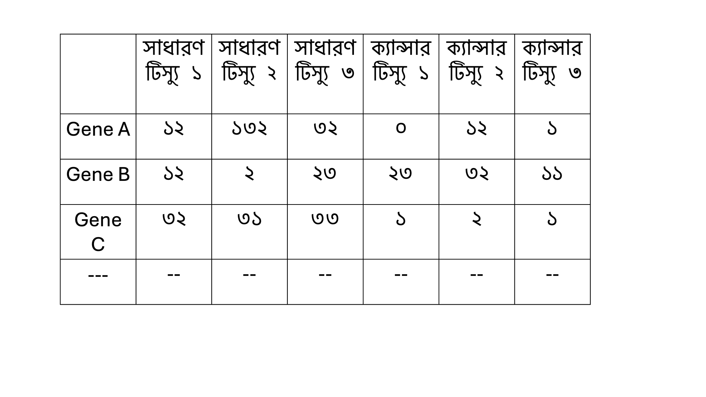
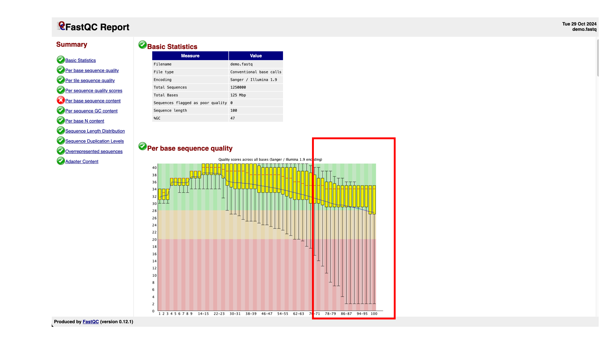
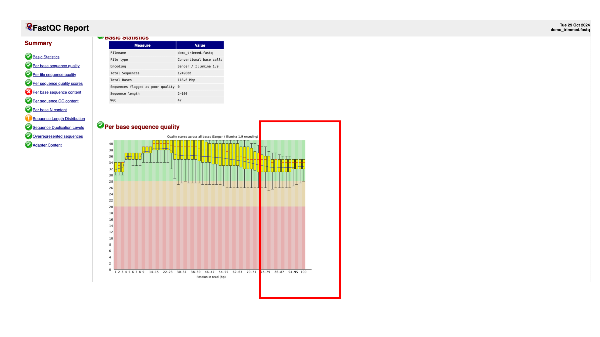
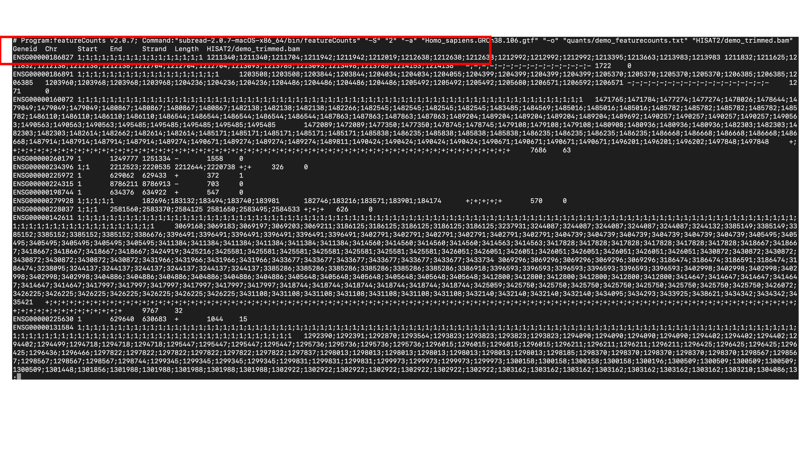
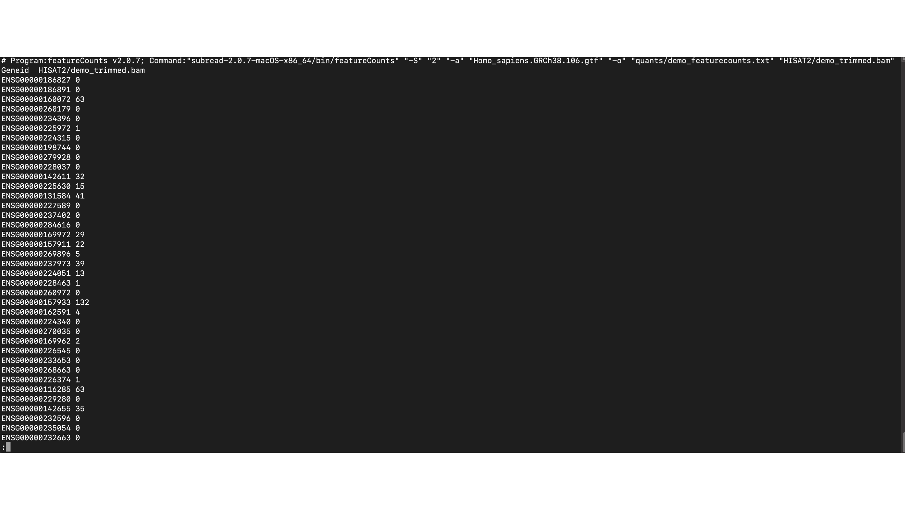

# Step-by-Step RNAseq Data Analysis Part 2 out of 4
## কেন RNA-seq বিশ্লেষণ করা হয় আর আমারা কেনই বা শিখব?
RNAseq ডেটা বিশ্লেষণ কেন করা হয় সেটা Part1 এ আমি কিছুটা যুক্ত করেছি। আমার মনে হল ব্যাপারটা আরেকটু বিস্তারিত বলা দরকার যাতে আপনারা গুরুত্ব ভালভাবে উপলব্ধি করতে পারেন। 
RNAseq বিশ্লেষণ এর মাধ্যমে আমরা জানতে পারি কোন gene সক্রিয় আর কোন gene সক্রিয় নয়। আবার সক্রিয় হলে কতটা সক্রিয় সেটাও আমরা জানতে পারি। এছাড়া জৈবিক প্রক্রিয়া বুঝতে, বায়োমার্কার খুঁজে বের করতে এবং নতুন চিকিৎসা পদ্ধতি বের করতে আমরা RNAseq বিশ্লেষণ করি। আমি প্রতিটা বিষয়কে আরেকটু গুছিয়ে বলছি। 
### ১. Differential Gene Expression এর মাধ্যমে সক্রিয় gene খুঁজে বের করা। 
Differential Gene Expression এর মাধ্যমে আমরা মূলত সুস্থ এবং রোগাক্রান্ত অবস্থার মধ্যে কোন gene গুলো সক্রিয় অথবা কম সক্রিয় সেটা জানতে পারি। উদাহরণস্বরূপ, RNAseq ডেটা বিশ্লেষণ ক্যান্সার কোষ এবং স্বাভাবিক কোষের মধ্যে সক্রিয় আর কম সক্রিয় gene বের করতে পারি যা ক্যান্সার এর মূল কারণ বের করার জন্য আর কোন পদ্ধতিতে চিকিৎসা করা যেতে পারে টা নির্ধারণে সাহায্য করে। 
### ২. নতুন প্রোটিন কোড করা gene বের করা  (Discovering New Genes)
ধরুন আপনি বিশেষ কোন প্রজাতির উদ্ভিত অথবা প্রাণীতে RNAseq বিশ্লেষণ করে নতুন প্রোটিন কোড করা gene বের করতে পারবেন। এটি জীববিজ্ঞানের মৌলিক গবেষণায় কাজে লাগে। 
### ৩. বায়োমার্কার চিহ্নিত করা (Identifying Biomarkers)
বায়োমার্কার কি সেটা আগে জানা দরকার। বায়োমার্কার বলতে এমন কিছু gene বা প্রোটিন কে বোঝায় যারা রোগ নির্ণয় করতে অথবা রোগের নির্দিষ্ট অবস্থা সনাক্ত করতে ব্যবহার করা হয়। কিছু ক্যান্সার কোষ এ কিছু gene এর expression বেশি হয়। এসব gene ব্যবহার করে ওই ক্যান্সার কে দ্রুত শনাক্ত করা যায়। এই gene গুলোই ওই ক্যান্সার এর জন্য বায়োমার্কার। 
### ৪. Gene এর নিয়ন্ত্রণ সম্পর্কে জানা (Gene Regulation and Pathway Analysis)
আমরা এতক্ষণ বারবার gene নিয়ে বলছিলাম। এখানে আরেকটা ভিন্ন দিক আছে। আমদের কোষে যেসব gene expression হয় তাদের মধ্যে কয়েকটি gene মিলে একত্রে কোন কাজ করে এবং কোন প্রক্রিয়া হয়ত পরিচালনা করে, এই বিষয়টিকে বলে Pathway বিশ্লেষণ। যেমন ধরুন একটি কোষের সাথে আরেকটি কোষের interaction এর জন্য কয়েকটি gene এর একত্রে expression হওয়া লাগে। 
### ৫. প্রতিষেধক বা ওষুধ তৈরি করতে (Drug Target Discovery)
আপনাদের এতক্ষণ যতটুকু RNAseq সম্পর্কে বলেছি, এখন যদি জিজ্ঞেস করি আপনারা কি বলতে পারবেন ওষুধ তৈরিতে কিভাবে সাহায্য করবে? আমরা RNAseq এর মাধ্যমে যেসব gene কে ক্যান্সার এর বৃদ্ধির জন্য দায়ী বলছি তাদের কাজ বন্ধ করার জন্য blocker বাঁ ওষুধ তৈরি করতে পারি। 

আশা করছি উপরের আলোচনা থেকে আপনারা RNAseq বিশ্লেষণ কেন শিখবেন সে বিষয় কিছুটা পরিষ্কার হয়েছে। আমি এখানে এটা বলে রাখতে চাই, প্রযুক্তি এখন RNAseq থেকে আরেকটু এগিয়ে গিয়েছে। এখন একক কোষ এ RNAseq বিশ্লেষণ (Single Cell RNAseq) এবং একটি টিস্যু  কাটলে সেই টিস্যু এর কোন স্থান এ প্রতিটি কোষে RNAseq বিশ্লেষণ (Spatial Transcriptomics) করা হয়। এই বিষয়গুলো আমি এখানে বিস্তারিত আলোচনা করিনি। কিন্তু আপনাদের আমি বলবো যে এই বিষয়গুলোর সম্পর্কে আপনারা জেনে রাখবেন। 

## RNA-seq ডেটা প্রসেসিংয়ের বিভিন্ন ধাপ এবং প্রাথমিক ধাপগুলোর জন্য High Performance Computing (HPC) ব্যবস্থার প্রয়োজন হয়। 
RNA-seq বিশ্লেষণে কিছু preprocessing ধাপ থাকে যেগুলা করার জন্য আপনার High-Performance Computing (HPC) ব্যবস্থার থাকা লাগবে। অনেক ক্ষেত্রে আপনার নিজের কম্পিউটার এ যদি অনেক RAM আর storage থাকে তাহলে আপনি নিজের কম্পিউটারে করতে পারবেন। কিন্তু বেশিরভাগ ক্ষেত্রে আমরা High-Performance Computing ব্যবহার করি। আমি এখন RNAseq এর পুরো ধাপ একটু বর্ণনা দিচ্ছি। আমি বর্ণনা দেওয়ার আগে একটা বিষয় এখানে বলে রাখি। আপনারা যারা এই ব্লগটি পড়ছেন তাদের বেশিরভাগ এর কাছে High-Performance Computing ব্যবস্থা থাকার কথা না। আমি নিচের অংশে সেই ধাপগুলার কিছু বর্ণনা দিব। একটা জিনিস বলে রাখি, আপনারা হয়ত কোড এর দিক দিয়ে এই ধাপগুলোর কোডগুলো খুবই ধরাবাঁধা। অর্থাৎ একই রকম কিছু কোড run করতে হয়। 

### ১. Raw Data Generation and Quality Control (QC)
Next-Generation Sequencing (NGS) প্ল্যাটফর্মের মাধ্যমে RNAseq ডেটা তৈরি করা হয়, যার ফলে আমরা raw data হিসাবে FASTQ ডেটা পাই। এই FASTQ ডেটা অনেক বড় আকার এর হয়। কারণ আমরা NGS থেকে লক্ষ-লক্ষ থেকে কয়েক কোটি ছোট ছোট RNA sequence পাই। এটিকে reads ও বলে। 
এই ডেটা পাওয়ার পর প্রথম কাজ থাকে Quality কেমন সেটা পরীক্ষা করা। অর্থাৎ আমরা যে reads গুলো পেয়েছি তারা সঠিক কি না। একটা tool আছে FastQC নামে, এর মাধ্যমে reads এর quality, GC content দেখা হয়। আবার একই কথা বলছি, যেহেতু অনেক বড় ডেটা হয় এজন্য processing power বেশি হওয়া লাগে। 
### ২. Read Trimming and Filtering
এই প্রক্রিয়া এর সময় প্রথমে trimming এবং filtering এর করা হয়। এক্ষেত্রে adapter sequence সরানো হয়। এখন প্রশ্ন আসবে adapter sequence কথা থেকে আসলো। NGS প্ল্যাটফর্ম এ যখন ছোট ছোট read এ RNA sequence করা হয় তখন এদের সনাক্ত করার জন্য প্রতিটি sequence এর সাথে কিছু অতিরিক্ত sequence যুক্ত করা হয় মূল sequence কে সনাক্ত করতে। Trimmomatic বা Cutadapt নামক tool এই ধাপে ব্যবহৃত হয় যাতে আমরা বিশ্লেষণ এর সময় এই অতিরিক্ত যুক্ত করা adapter sequence সরিয়ে ফেলতে পারি এবং শুধুমাত্র দরকারি তথ্যটি নিয়ে পরবর্তী ধাপের কাজ করতে পারি। 
### ৩. Alignment (Mapping Reads to the Reference Genome)
পুরো প্রক্তিয়া এর সবচেয়ে সময়সাপেক্ষ ধাপ হচ্ছে Alignment করা। এই ধাপে প্রতিটি read কে একটি reference এর সাথে maping করা হয় অর্থাৎ সোজাভাবে বললে মিলিয়ে দেখা হয়। আমাদের যে Human genome আছে তার সাথে প্রতিটি read কে মিলিয়ে দেখা হয় এবং ওই read টি কোন gene এর অংশ সেটা বের করা হয়। এই ধাপে STAR, HISAT2, বা Bowtie2 এর মতো টুল ব্যবহার করা হয়, যা অত্যন্ত শক্তিশালী এবং দ্রুতগতির অ্যালাইনমেন্ট অ্যালগরিদম। এই ধাপটিতে সবচেয়ে বেশি computing power দরকার হয়। 

### ৪. Quantification (Counting Reads for Each Gene)
Alignment করার পর প্রতিটি gene এ কতটি read পাওয়া গেছে টা গুনে দেখা হয়। অর্থাৎ প্রতিটি gene কত সংখ্যায় আছে টা নির্ধারণ করা হয়। এই সংখ্যার পার্থক্য ই মূলত আমরা ক্যান্সার আর সাধারণ কোষ এর মধ্যে তুলনা করে দেখি। FeatureCounts বা HTSeq এর মতো tool এই কাজটি সম্পন্ন করে।
### ৫. Raw Count Data Generation
উপরের ধাপগুলো সম্পূর্ণ হলে আমরা Raw Count ডেটা পাই। Raw Count ডেটা এর মধ্যে সারি বা row তে থাকে gene গুলো এবং কলাম এ থাকে sample গুলি। আমরা যদি ক্যান্সার এর কথা চিন্তা করি তাহলে তাহলে ধরুন আমাদের গবেষণায় ৩ টি সাধারণ টিস্যু ছিল আর ৩ টি ক্যান্সার টিস্যু ছিল। সেক্ষেত্রে আমাদের ৬ টি কলাম হবে। নিচের ছবি লক্ষ্য করুন। 

 

এখানে সারি বা row তে gene এর নামগুলো সাজানো আর কলাম এ প্রতিটি নমুনা সাজানো হয়। এক্ষেত্রে ৩ টি সাধারণ টিস্যু আর ৩ টি ক্যান্সার টিস্যু। 
### ৬. Normalization and Differential Gene Expression Analysis and Downstream Analysis
উপরে উল্লেখিত ধাপগুলো শেষ হওয়ার পর আসে Normalization and Differential Gene Expression Analysis। DESeq2 বা EdgeR এর মতো টুল ব্যবহার করে ডেটা Normalise করা হয় এবং ক্যান্সার বনাম স্বাভাবিক টিস্যু বা বিভিন্ন কন্ডিশনের মধ্যে পার্থক্য বোঝা যায়।
এই ধাপটি করা তুলনামূলক ভাবে নিজের কম্পিউটার এ করা যায়। এই ধাপটি আমরা R এর মাধ্যমে করতে পারি। 

## RNAseq বিশ্লেষণ এর প্রাথমিক প্রক্রিয়ার কোড 

আমি এই অংশ লেখার শুরুতে একটা সতর্কবার্তা দিয়ে রাখতে চাই। সেটি হচ্ছে আপনারা ভয় পাবেন না। যতগুলো tools এর কথা এখানে বলেছি, সেই tools গুলোর কিছু tutorial এবং দিকনির্দেশনামূলক জিনিস আপনি google করলে পেয়ে যাবেন। আরেকটি বিষয় এখানে বলে রাখি। এই প্রক্রিয়াটি R প্রোগ্রামিং এর অংশ নয়। আমরা আবার পরবর্তী অংশে R প্রোগ্রামিং দিয়ে বিশ্লেষণ প্রক্রিয়া করে দেখাব। এখন আমরা যা করবো তার জন্য linux এর জ্ঞান দরকার হবে। আপনারা যারা R programming শেখা শুরু করেছেন, তাদের এই অংশে এইটুক জানা দরকার যে কম্পিউটেশনাল বায়োলজি তে আপনাকে বিভিন্ন বিষয় সম্পর্কে জ্ঞান থাকা লাগবে, linux এর জ্ঞান তার মধ্যে একটি। 

এই পুরো কাজটি আমরা Terminal এ করবো। আমি আমার কম্পিউটার এ সবগুলো tools আলাদা করে install করেছি। Install করার সময় বেশ কিছু ঝামেলায় পড়তে হয়। যেমন ধরুন কিছু conda environment এ install করতে হয়, আবার কিছু Homebrew এর মাধ্যমে install করেছি। আবার কিছু সরাসরি website থেকে গিয়ে download করেছি। 

RNA-seq ডেটা বিশ্লেষণের জন্য প্রথমে প্রয়োজনীয় tools এবং software কে install করতে হবে।
### ১। Homebrew ইনস্টলেশন: 
Homebrew প্যাকেজ ম্যানেজার ইনস্টল করুন, যা Mac-এ বিভিন্ন সফটওয়্যার সহজে ইন্সটল করতে সাহায্য করবে।
```r
/bin/bash -c "$(curl -fsSL https://raw.githubusercontent.com/Homebrew/install/HEAD/install.sh)
```
### ২। FastQC: 
Quality দেখার জন্য  জন্য FastQC ইনস্টল করুন।
```r
brew install fastqc
```
### ৩। wget: 
Online থেকে আমাদের কয়েকটি file ডাউনলোড করতে হয়। যেমন ধরুন reference genome, যার সাথে আমরা Alignmnet বা তুলনা করবো। 
```r
brew install wget
```
### ৪। HISAT2: 
HISAT2 ইনস্টল করার জন্য Bioconda ব্যবহার করুন, যা RNA-seq রিডগুলোর রেফারেন্স জিনোমে ম্যাপিং করার জন্য ব্যবহৃত হয়। আপনার কম্পিউটার এ conda install করা না থাকলে সেটা install করে নিতে হবে আগে। 
```r
conda install bioconda::hisat2
```
### ৫। Trimmomatic: 
read ট্রিমিংয়ের জন্য Trimmomatic ইনস্টল করুন।
```r
conda install bioconda::trimmomatic
```
### ৬। Samtools: 
BAM ফাইল পরিচালনার জন্য Samtools ইনস্টল করুন।
```r
brew install samtools
```
### ৭। FeatureCounts: 
Quantification করার জন্য জন্য FeatureCounts ইনস্টল করুন, যা Subread প্যাকেজের অংশ।আমরা Subread এর মধ্যে featurecounts tool টি পেয়ে যাবো। আলাদা করে install করা লাগবে না। 
```r
wget https://sourceforge.net/projects/subread/files/subread-2.0.7/subread-2.0.7-macOS-x86_64.tar.gz/download
tar -xvzf subread-2.0.7-macOS-x86_64.tar.gz
```

## ডেটা Pre-processing এর ধাপে ধাপে কোড 
আমরা NGS প্লাটফরম থেকে fastq ডেটা পাই। আমরা সেই ডেটা থেকে শুরু করবো। আমি কাজের সুবিধার্থে একটা ছোট fastq ডেটা তৈরি করেছি যাতে আমরা সহজে পূর্ণ প্রক্রিয়া run করতে পারি। আপনারা চাইলে একই পদ্ধতি ব্যবহার করে আপনাদের বড় deta ও processing করতে পারবেন। 
এই demo.fastq এই ডেটাটি পেতে এখানে ক্লিক করুন 
আমি কাজের সুবিধার জন্য এই ব্লগ এ যা লিখি সেটা একটি folder এ রাখি। আমি RNAseq এর কাজের জন্য দরকারি সবগুলো ডেটা RNAseq analysis নামক একটি folder এ রেখেছি। এই ফোল্ডার এ আরও দুটি ফোল্ডার আছে। একটির নামে Data আরেকটি quants। Data folder টিতে আমি demo.fastq fileটি রেখেছি। 

### ধাপ ১। Terminal দিয়ে আপনি যেই folder এ কাজ করবেন সেই folder এ যাওয়া 
```
cd /Users/mohammads/Downloads/Various person project/Blogging/chapter 8/RNAseq analysis/
```

•	cd এই command "change directory" বা সহজে বলতে আপনের কম্পিউটার এর কোথায় থাকবেন সেটা বোঝায়। 
•	/Users/mohammads/Downloads/Various person project/Blogging/chapter 8/RNAseq analysis/ এটি আমার কম্পিউটার এর path অর্থাৎ অনেকটা এরকম যে আমি প্রথমে Userএ ক্লিক করেছি এরপর mohammads নামক folder এ, তারপর  ওই folder এর ভেতর Downloads নামক folder এ ক্লিক করেছি। 

### ধাপ ২। raw ডেটা এর Quality দেখা fastQC tool ব্যবহার করে। 
```r
fastqc Data/demo.fastq -o Data/
```
•	fastqc মূলত FastQC tools চালানোর জন্য command।
•	Data/demo.fastq বোঝায় input file। অর্থাৎ আমাদের RNAseq analysis যেই folder আছে তার মধ্যে Data folder এর মধ্যে demo.fastq file নির্দেশ করে।
•	-o Data/ বোঝায় যে output file কোথায় পাবেন। 
আপনারা এটি run করার পর দেখবেন যে ওই Data ফোল্ডার এ নতুন কিছু file তৈরি হয়েছে। তার মধ্যে একটি হল demo_fasqc.html। এখানে ক্লিক করলে দেখবেন একটা html খুলবে। দেখতে নিচের মত। 


এখানে মূলত আমরা দেখি যে GC কতপরিমাণ আছে। তাছাড়াও আমরা দেখি আপনার sequence এর quality কেমন। এখানে প্রতিটি sequence এর quality দেখাচ্ছে। সবুজ ভাল quality, হলুদ মাঝারি আর লাল খারাপ। sequence এর শেষ অংশে গুণগত মান খারাপ দেখা যাচ্ছে। আমদের কাজ হল এই খারাপ অংশগুলো না রাখা। 
### ধাপ ৩: read trimming (Trimmomatic) এবং পুনরায় গুণগত মান দেখা (fastQC)

Read থেকে নিম্নমানের sequence সরাতে Trimmomatic ব্যবহার করা হয়। এবং পরে আমরা আবার দেখি গুণগত মান কেমন । 
```r
java -jar /Users/mohammads/anaconda3/envs/rnaseq_analysis/share/trimmomatic-0.39-2/trimmomatic.jar SE -threads 4 Data/demo.fastq Data/demo_trimmed.fastq TRAILING:10 -phred33
```
•	java -jar: Java ফাইল চালানোর জন্য ব্যবহৃত হয়। এখানে উল্লেখ থাকা দরকার যে আপনার কম্পিউটার এ Java install থাকা লাগবে। 
•	/Users/mohammads/anaconda3/envs/rnaseq_analysis/share/trimmomatic-0.39-2/trimmomatic.jar: এটি Trimmomatic আমার কম্পিউটার এ কোথায় আছে সেটা দেখান হয়েছে । 
•	SE: Single-End রিডগুলির জন্য। আপনার কাজে কি আপনি Single End read ব্যবহার করেছেন নাকি paired-end read ব্যবহার করেছেন, সেটা উল্লেখ করতে হবে। 
•	-threads 4: ৪টি Processing থ্রেড ব্যবহার করে। 
•	Data/demo.fastq: FASTQ file কোথায় আছে সেটা। 
•	Data/demo_trimmed.fastq: output file যেখানে ট্রিম করা রিডগুলি সংরক্ষণ হবে সেটা কোথায় থাকবে।  
•	TRAILING:10: প্রতিটি রিডের শেষে গুণগত মান ১০-এর নিচে হলে সেই অংশ ট্রিম করা হবে। 
•	-phred33: গুণগত মানের জন্য Phred+33 স্কোরিং সিস্টেম ব্যবহার করা হয়েছে।
এগুলো খুবই সাধারণভাবে ব্যবহার করা হয়। আপনারা চাইলে documentation পরে দেখতে পারেন। 

Trim করা ডেটা পুনরায় FastQC দিয়ে কোয়ালিটি চেক করা হয়:
fastqc Data/demo_trimmed.fastq -o Data/

নিচের ছবিতে আপনারা দেখতে পাচ্ছেন যে আমাদের read এর গুণগত মান বৃদ্ধি পেয়েছে। অর্থাৎ সবগুলো সবুজ অংশে আছে। 



### ধাপ ৪। Alignment (HISAT2)
প্রথমে, HISAT2-এর জন্য একটি ডিরেক্টরি তৈরি করতে হবে এবং রেফারেন্স জিনোম ডাউনলোড করতে হবে। এরপর HISAT2 ব্যবহার করে ট্রিম করা রিডগুলোকে রেফারেন্স জিনোমের সাথে ম্যাপ করা হয় এবং BAM ফাইলে আউটপুট সেভ করা হয়।
```r
mkdir HISAT2
cd HISAT2
wget https://genome-idx.s3.amazonaws.com/hisat/grch38_genome.tar.gz
gunzip grch38_genome.tar.gz
cd ../
```

•	mkdir HISAT2: HISAT2 নামে একটি ডিরেক্টরি তৈরি করে। 
•	cd HISAT2: HISAT2 ডিরেক্টরিতে প্রবেশ করে। 
•	wget ...grch38_genome.tar.gz: রেফারেন্স জিনোম grch38_genome.tar.gz Download করে। 
•	gunzip grch38_genome.tar.gz: কমপ্রেসড ফাইলটি আনজিপ করে। 
•	cd ../: মূল ডিরেক্টরিতে ফিরে আসে।

```r
HISAT2/hisat2-2.2.1/hisat2 -q --rna-strandness R -x HISAT2/grch38/genome -U Data/demo_trimmed.fastq | samtools sort -o HISAT2/demo_trimmed.bam
```

•	HISAT2/hisat2-2.2.1/hisat2: HISAT2 প্রোগ্রাম চালানো। 
•	-q: ইনপুট ফাইলটি কোন format এ আছে। এক্ষেত্রে FASTQ ফরম্যাটে আছে। 
•	--rna-strandness R: স্ট্র্যান্ড স্পেসিফিক রিডগুলোর জন্য অপশন। 
•	-x HISAT2/grch38/genome: reference genome কম্পিউটার এ কোথায় আছে। 
•	-U Data/demo_trimmed.fastq: আমরা আগের ধাপে যে trimmed ডেটা পেয়েছি সেটা কোথায় আছে। 
•	| samtools sort -o HISAT2/demo_trimmed.bam: Samtools দিয়ে BAM ফাইলে রিডগুলো সাজানো এবং HISAT2/demo_trimmed.bam file হিসেবে output এ রাখা। 

### ধাপ ৫। Quantification (FeatureCounts)
featureCounts ব্যবহার করে প্রতিটি জিনে ম্যাপ করা রিডগুলোর সংখ্যা গণনা করা হয়, এবং আউটপুট quants/ folder এ সংরক্ষণ করা হয়।
```r
wget http://ftp.ensembl.org/pub/release-106/gtf/homo_sapiens/Homo_sapiens.GRCh38.106.gtf.gz
gunzip Homo_sapiens.GRCh38.106.gtf.gz
```

•	এটি Homo sapiens (মানুষ) এর জন্য রেফারেন্স জিনোমের GTF (Gene Transfer Format) ফাইল ডাউনলোড করে, যা gene ও genomic অঞ্চলের তথ্য দেয়।
•	আর পরের command টি gz file কে unzip kore

```r
subread-2.0.7-macOS-x86_64/bin/featureCounts -S 2 -a Homo_sapiens.GRCh38.106.gtf -o quants/demo_featurecounts.txt HISAT2/demo_trimmed.bam
```

•	featureCounts হল Subread প্যাকেজের অংশ যা BAM file এর gene অনুযায়ী গণনা  করে। 
•	-S 2: রিডের স্ট্র্যান্ড স্পেসিফিক; 2 মানে রিডগুলো রিভার্স-স্ট্র্যান্ড স্পেসিফিক। 
•	-a Homo_sapiens.GRCh38.106.gtf: এটি GTF ফাইলের পাথ। 
•	-o quants/demo_featurecounts.txt: output file যেখানে প্রতিটি জিনের জন্য read সংখ্যা সংরক্ষণ করা হবে। 
•	HISAT2/demo_trimmed.bam: ইনপুট BAM ফাইল, যেটি HISAT2 দিয়ে Align করা হয়েছে।

### ধাপ ৬। Output check করা
RNA-seq ডেটা pre-processing শেষ এ quantification ফলাফল দেখতে নিচের কোডগুলো ব্যবহার করা হয়। 
```r
cat quants/demo_featurecounts.txt | less
```
আপনারা নিচের মত একটা File দেখতে পাবেন। এটি মূলত আমা TextEdit tool অথবা notepad এ যেরকম দেখা যাই ওইরকম। এখানে GeneID, Chromosome এর নাম, শুরু শেষ, কোন strand এবং শেষ কলাম এ count ডেটা আছে। আমাদের কাজ হচ্ছে geneID আর count ডেটা টা আলাদা করে নিয়ে আশা পরবর্তী ধাপ এ কাজ করার জন্য। 
 
```r
cat quants/demo_featurecounts.txt | cut -f1,7 | less
```
আপনারা নিচের ছবি লক্ষ্য করলে দেখবেন এখানে geneID আর count ডেটা আছে। 

 

এই demo_featurecounts.txt file টি আমদের প্রয়োজনীয় file। আমরা এই প্রক্রিয়া ব্যবহার করে অন্যান্য NGS প্ল্যাটফর্ম থেকে আশা sequencing ডেটা থেকে count ডেটা বের করে আনতে পারি। এই count ডেটা ব্যবহার করে আমরা পরের বিশ্লেষণ এর কাজগুলো করবো। 


শেষ করার আগে কিছু কথা বলবো। আমি একটু ভিন্ন উপায়ে আপনাদেরকে পুরা প্রক্রিয়া দেখানর চেষ্টা করেছি । আমি নিজে যখন শুরু করেছিলাম এই উপরের ধাপগুলো বেশ কঠিন মনে হয়েছিল। এত এত কোড আর এত জিনিস বোঝার আছে। এই প্রক্রিয়া গুলো আমি অনেক পরে এসে শিখেছি। যদি এগুলো কঠিন লাগে ঘাবড়ে যাবেন না। আমাদের পরের যে অংশ আছে ব্লগ এর, আমি সেখানে খুব সহজে বিশ্লেষণ করা আর একটি জার্নাল পেপার নিয়ে সেটা পূর্ণ বিশ্লেষণ করে দেখাব। 

ধন্যবাদ।

আপনাদের আগের অংশের মতামত গুলো খুব কাজে লেগেছে আমার। আমি কিছু জিনিস পরিবর্তন করেছি লেখার মধ্যে আর নতুন অংশ যুক্ত করেছি। খুব ভাল লাগবে আপনারা যদি আমাকে প্রতিটি অংশের উপর বলতে পারেন। 
### [মতামত জানাতে এখানে ক্লিক করুন](https://forms.gle/EXzTmb9MFo3CJN6g7)

আর আপনি যদি নিবন্ধন করে না থাকেন তাহলে নিবন্ধন করুন। 

# আপডেট পাওয়ার জন্য নিবন্ধন করুন (Register for Updates)

আপনি যদি এই ব্লগের নিয়মিত আপডেট পেতে চান, তাহলে নিচের ফর্মটি পূরণ করুন। আমি নতুন কোনো কন্টেন্ট যোগ করার সাথে সাথেই আপনাকে ইমেইলের মাধ্যমে জানিয়ে দেব।

# [**ফর্ম পূরণ করতে এখানে ক্লিক করুন**](https://forms.gle/6qyRGiE7WSpLJ9SA9)

