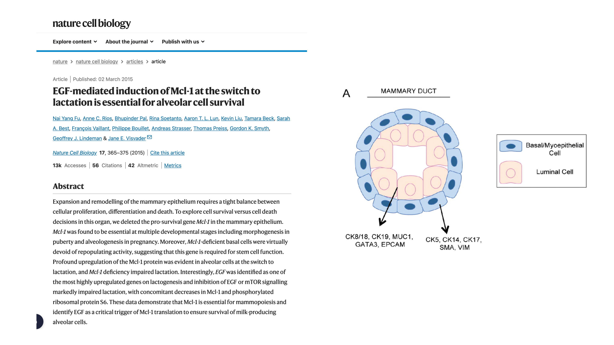
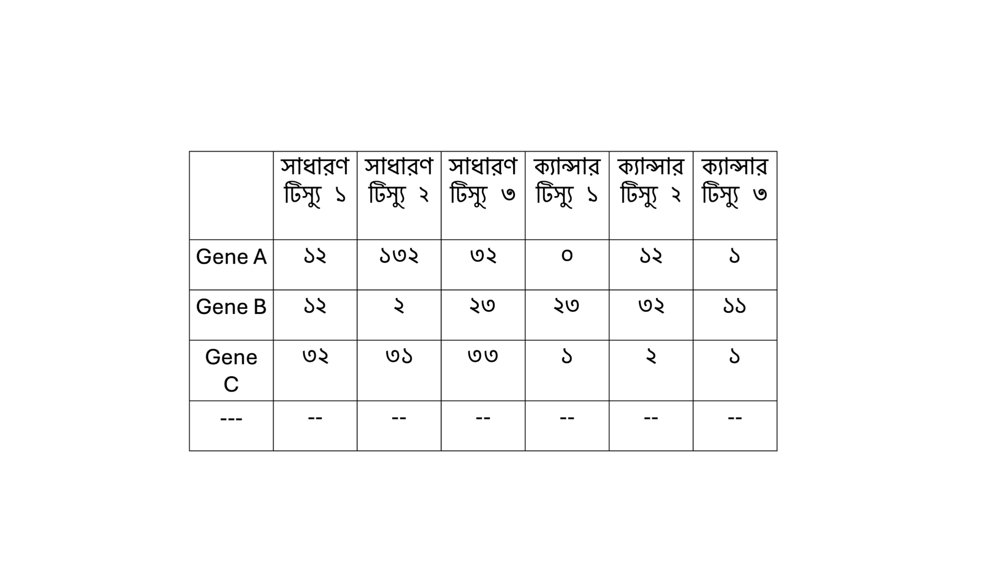
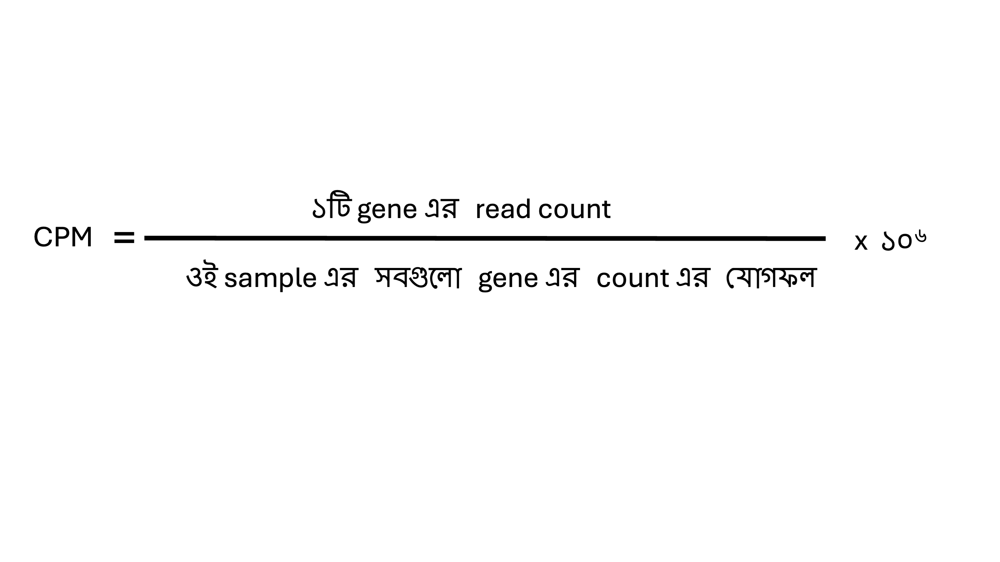
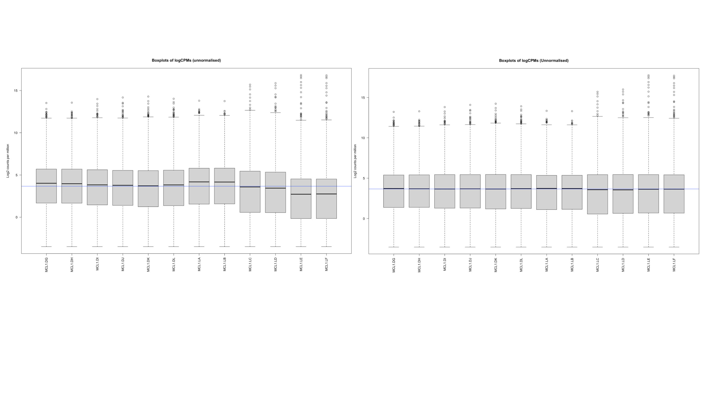
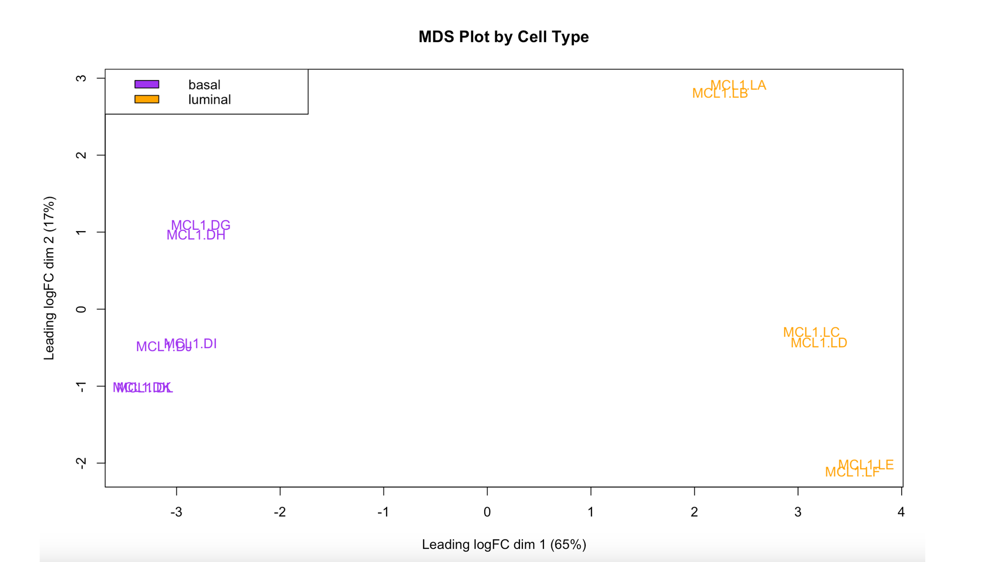
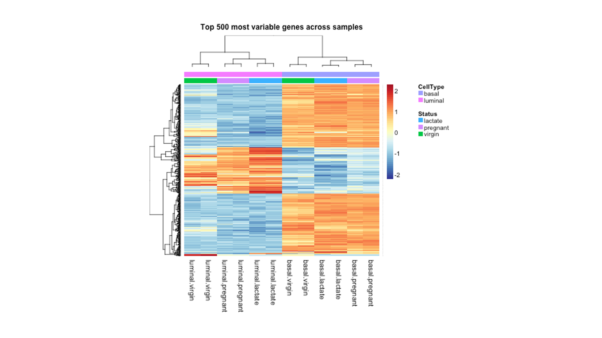

# Step-by-Step RNAseq Data Analysis Part 3 out of 4
 
শুরু করার আগে আপনারা যদি আগের দুটি অংশ না দেখে থাকেন, আমি বলবো যে আপনারা ওই দুটি অংশ দেখে নিবেন শুরু করার আগে।
দ্বিতীয় অংশে আমরা কিছু count data তৈরি করেছিলাম। আমরা আজকে এর পরবর্তী অংশ থেকে দেখব কিভাবে বিশ্লেষণ করা যাই। 
 
## আজকের অংশের লক্ষ্য  
আজকে আমারা Nature Cell Biology তে প্রকাশিত একটি paper এর ডেটা বিশ্লেষণ করবো। গবেষণাপত্রটি হচ্ছে “EGF-mediated induction of Mcl-1 at the switch to lactation is essential for alveolar cell survival”। এই গবেষণায় মূলত EGF দ্বারা Mcl-1 প্রোটিন নিয়ন্ত্রণ এর মাধ্যমে কিভাবে mammary গ্রন্থির এবং lactation এর Alveolar কোষ বেঁচে থাকে তা বিশ্লেষণ করা হয়েছে। সহজভাসায়, ইঁদুর এর pregnancy, lactation এবং virgin অবস্থার মধ্যে gene expression তুলনা করে দেখেছে যে বিভিন্ন অবস্থায় পরিবর্তন এর সাথে কোন কোন gene দায়ী। আমরা আজকে এই গবেষণাপত্র এর ডেটা থেকে বিশ্লেষণ এর কাজ করবো। 
### ডেটাসেটের বিবরণ
RNAseq ডেটা সংগ্রহ করা হয়েছে mammary গ্রন্থি থেকে তিনটি সময়কালে। ১। Pregnancy ২। Lactation ৩। virgin। এক্ষেত্রে mammary গ্রন্থির দুই রকম কোষকে আলাদাভাবে নেওয়া হছেছে। একটি হল Basal আরেকটি হল luminal। নিচের ছবি থেকে হয়ত তাদের অবস্থান আরেকটি পরিষ্কার হবে। 


 আপনারা দুইটি ডেটা সেট নামাবেন।
 ### Download dataset
[countdata](https://github.com/sharifshohan/Programming-for-Bioscience/blob/main/chapter8/RNAseq_analysis_part3/GSE60450_LactationGenewiseCounts.txt)
[Sampleinfo](https://github.com/sharifshohan/Programming-for-Bioscience/blob/main/chapter8/RNAseq_analysis_part3/SampleInfo_Corrected.txt)

১। Gene Counts: প্রতিটি gene কোনগুলো করে আছে। আপনারা যদি আগের ব্লগটি দেখে থাকেন তাহলে দেখবেন যে এই অংশটি দেখতে কেমন।
২। Sample metadata: এখানে sample গুলোর পরিচিতি এবং বৈশিষ্ট্য উল্লেখ করা থাকে। 


আপনারা দুটি ফাইল নামাবেন এবং আপনার কম্পিউটার এর একটি নির্দিষ্ট স্থান এ save (সংরক্ষণ) করে রাখবেন। 
 
 
এখন আমরা ধাপে ধাপে এই ডেটাসেটটি বিশ্লেষণ করবো। আমরা সম্পূর্ণ প্রক্রিয়া কে ৩ টি ধাপে বিবেচনা করতে পারি। 
## ১। প্রয়োজনীয় Environment Set করা , ডেটা সঠিকভাবে প্রস্তুত করা 
## ২। ডেটা এর Quality check করা এবং সকল ডেটা Normalise করা 
## ৩। Differential Gene Expression বের করা এবং পরবর্তী Downstream বিশ্লেষণ 
এখানে কয়েকরকম এর তুলনামূলক বিশ্লেষণ করা যাই। 
## ১। প্রয়োজনীয় Environment Set করা , ডেটা সঠিকভাবে প্রস্তুত করা
### Setting Up the Environment

পুরো প্রক্রিয়ার বিভিন্ন ধাপে আমাদের কয়েকটি package ব্যবহার করতে হবে। আমরা প্রথমে এই package গুলো install করে load করে নিব। 
```r
# Installing the packages from BiocManager.
if (!requireNamespace("BiocManager"))
    install.packages("BiocManager")
BiocManager::install(c("limma", "edgeR", "Glimma", "org.Mm.eg.db", "gplots", "RColorBrewer"))

#Loading the Libraries
library(edgeR) 
library(limma) 
library(org.Mm.eg.db) 
library(gplots) 
library(RColorBrewer) 

```
Output
```r
> library(edgeR)
Loading required package: limma
> library(limma)
> library(org.Mm.eg.db)
Loading required package: AnnotationDbi
Loading required package: stats4
Loading required package: BiocGenerics

Attaching package: ‘BiocGenerics’

The following object is masked from ‘package:limma’:

    plotMA

The following objects are masked from ‘package:stats’:

    IQR, mad, sd, var, xtabs

The following objects are masked from ‘package:base’:

    anyDuplicated, aperm, append, as.data.frame, basename, cbind, colnames, dirname,
    do.call, duplicated, eval, evalq, Filter, Find, get, grep, grepl, intersect,
    is.unsorted, lapply, Map, mapply, match, mget, order, paste, pmax, pmax.int, pmin,
    pmin.int, Position, rank, rbind, Reduce, rownames, sapply, setdiff, table, tapply,
    union, unique, unsplit, which.max, which.min

Loading required package: Biobase
Welcome to Bioconductor

    Vignettes contain introductory material; view with 'browseVignettes()'. To cite
    Bioconductor, see 'citation("Biobase")', and for packages 'citation("pkgname")'.

Loading required package: IRanges
Loading required package: S4Vectors

Attaching package: ‘S4Vectors’

The following object is masked from ‘package:utils’:

    findMatches

The following objects are masked from ‘package:base’:

    expand.grid, I, unname


> library(gplots)

Attaching package: ‘gplots’

The following object is masked from ‘package:IRanges’:

    space

The following object is masked from ‘package:S4Vectors’:

    space

The following object is masked from ‘package:stats’:

    lowess

> library(RColorBrewer)
```
### কাজ করার জন্য directory Set up করা 
আপনারা যেই ডেটাসেট download করেছেন সেটাকে একটি নির্দিষ্ট folder এ save করে রাখুন। আমার কম্পিউটার এর ক্ষেত্রে এই স্থানটি হচ্ছে “/Users/mohammads/Downloads/Various person project/Blogging/chapter 8/RNAseq analysis/Part3/”
আমি এখন setwd ফাংশন ব্যবহার করে ওই স্থানটিতে আমার directory set up করে রাখব। 

```r
setwd("/Users/mohammads/Downloads/Various person project/Blogging/chapter 8/RNAseq analysis/Part3/")
```
ডেটা Load করা এবং প্রাথমিকভাবে ডেটার স্ট্রাকচার দেখা 
আমাদের এখানে দুই রকম ফাইল আছে। 
১। GSE60450_LactationGenewiseCounts.txt: এটি RNAseq count ডেটা। 
২। SampleInfo_Corrected.txt: এর মধ্যে sample এর পরিচিতি এবং বৈশিষ্ট্য উল্লেখ করা আছে। 
আমরা এখন এই দুটি ফাইলকে R এর মধ্যে load করবো। 

```r
# Read the data into R

seqdata <- read.delim("GSE60450_LactationGenewiseCounts.txt", stringsAsFactors = FALSE)

# Read the sample information into R
sampleinfo <- read.delim("SampleInfo_Corrected.txt", stringsAsFactors = TRUE)

```
### ডেটার গঠন এবং বৈশিষ্ট্য পর্যালোচনা 
আমরা ডেটাটি কে একটি পর্যালোচনা করে দেখব। এক্ষেত্রে মূলত দেখা হয় যে আমরা যেভাবে ডেটা কে format করতে চাই সেইভাবে কি সাজানো আছে কি না। যদি না থাকে তাহলে আমাদের কি এবং কোথায় পরিবর্তন করতে হবে। Count data যেহেতু অনেক বড় সেজন্য আমরা head ফাংশন ব্যবহার করবো। এটি ওই ডেটা এর প্রথম ৬ লাইন দেখাবে আমাদের। 
```r
#Check first 6 lines of the count data
head(seqdata)

#Check the sample information data
sampleinfo

```

Output
```r
  EntrezGeneID Length MCL1.DG_BC2CTUACXX_ACTTGA_L002_R1 MCL1.DH_BC2CTUACXX_CAGATC_L002_R1
1       497097   3634                               438                               300
2    100503874   3259                                 1                                 0
3    100038431   1634                                 0                                 0
4        19888   9747                                 1                                 1
5        20671   3130                               106                               182
6        27395   4203                               309                               234
  MCL1.DI_BC2CTUACXX_ACAGTG_L002_R1 MCL1.DJ_BC2CTUACXX_CGATGT_L002_R1
1                                65                               237
2                                 1                                 1
3                                 0                                 0
4                                 0                                 0
5                                82                               105
6                               337                               300
  MCL1.DK_BC2CTUACXX_TTAGGC_L002_R1 MCL1.DL_BC2CTUACXX_ATCACG_L002_R1
1                               354                               287
2                                 0                                 4
3                                 0                                 0
4                                 0                                 0
5                                43                                82
6                               290                               270
  MCL1.LA_BC2CTUACXX_GATCAG_L001_R1 MCL1.LB_BC2CTUACXX_TGACCA_L001_R1
1                                 0                                 0
2                                 0                                 0
3                                 0                                 0
4                                10                                 3
5                                16                                25
6                               560                               464
  MCL1.LC_BC2CTUACXX_GCCAAT_L001_R1 MCL1.LD_BC2CTUACXX_GGCTAC_L001_R1
1                                 0                                 0
2                                 0                                 0
3                                 0                                 0
4                                10                                 2
5                                18                                 8
6                               489                               328
  MCL1.LE_BC2CTUACXX_TAGCTT_L001_R1 MCL1.LF_BC2CTUACXX_CTTGTA_L001_R1
1                                 0                                 0
2                                 0                                 0
3                                 0                                 0
4                                 0                                 0
5                                 3                                10
6                               307                               342


                            FileName SampleName CellType   Status
1  MCL1.DG_BC2CTUACXX_ACTTGA_L002_R1    MCL1.DG    basal   virgin
2  MCL1.DH_BC2CTUACXX_CAGATC_L002_R1    MCL1.DH    basal   virgin
3  MCL1.DI_BC2CTUACXX_ACAGTG_L002_R1    MCL1.DI    basal pregnant
4  MCL1.DJ_BC2CTUACXX_CGATGT_L002_R1    MCL1.DJ    basal pregnant
5  MCL1.DK_BC2CTUACXX_TTAGGC_L002_R1    MCL1.DK    basal  lactate
6  MCL1.DL_BC2CTUACXX_ATCACG_L002_R1    MCL1.DL    basal  lactate
7  MCL1.LA_BC2CTUACXX_GATCAG_L001_R1    MCL1.LA  luminal   virgin
8  MCL1.LB_BC2CTUACXX_TGACCA_L001_R1    MCL1.LB  luminal   virgin
9  MCL1.LC_BC2CTUACXX_GCCAAT_L001_R1    MCL1.LC  luminal pregnant
10 MCL1.LD_BC2CTUACXX_GGCTAC_L001_R1    MCL1.LD  luminal pregnant
11 MCL1.LE_BC2CTUACXX_TAGCTT_L001_R1    MCL1.LE  luminal  lactate
12 MCL1.LF_BC2CTUACXX_CTTGTA_L001_R1    MCL1.LF  luminal  lactate

```
এক্ষেত্রে আপনরা দেখতে পাচ্ছেন count ডেটা এর সংখ্যাগুলো সকল sample এ এবং Sample এর নাম, কোন কোষ এবং কোন অবস্থার ডেটা এখানে আছে। 

ডেটাকে সঠিক format এ সাজানো
edgeR package এ বেশ কয়েকটি ফাংশন আছে যা আমাদের ব্যবহার করতে হয়। এক্ষেত্রে একই জিনিস মাথায় রাখতে হবে যে ওই ফাংশনটি ডেটাকে যেভাবে input নিবে আমরা যেন format সেইভাবে করি। 
যেমন ধরুন count data এর ক্ষেত্রে format নিচের ছবির মত হতে হবে। 

 

অর্থাৎ এখানে একদিকে সারি এর নাম এ থাকবে gene এর নাম এবং কলাম এ থাকবে sample এর count।
আমরা যদি উপড়ে লক্ষ্য করি আমাদের seqdata এর মধ্যে প্রথম কলাম হচ্ছে GeneID আর দ্বিতীয়টি হচ্ছে length। আমরা প্রথমে সারি এর নাম পরিবর্তন করে gene এর নামগুলো বসাব আর প্রথম এবং দ্বিতীয় কলাম বাদ দিয়ে দিব। তাহলে আমাদের seqdata দেখতে উপরের ছবির মত হবে। 

```r
#Set the rowname to geneid
rownames(seqdata) <- seqdata$EntrezGeneID
# Remove first two columns from seqdata
countdata <- seqdata[,-(1:2)]
# Look at the output
head(countdata)
```

Output

```r
          MCL1.DG_BC2CTUACXX_ACTTGA_L002_R1 MCL1.DH_BC2CTUACXX_CAGATC_L002_R1 MCL1.DI_BC2CTUACXX_ACAGTG_L002_R1
497097                                  438                               300                                65
100503874                                 1                                 0                                 1
100038431                                 0                                 0                                 0
19888                                     1                                 1                                 0
20671                                   106                               182                                82
27395                                   309                               234                               337
          MCL1.DJ_BC2CTUACXX_CGATGT_L002_R1 MCL1.DK_BC2CTUACXX_TTAGGC_L002_R1 MCL1.DL_BC2CTUACXX_ATCACG_L002_R1
497097                                  237                               354                               287
100503874                                 1                                 0                                 4
100038431                                 0                                 0                                 0
19888                                     0                                 0                                 0
20671                                   105                                43                                82
27395                                   300                               290                               270
          MCL1.LA_BC2CTUACXX_GATCAG_L001_R1 MCL1.LB_BC2CTUACXX_TGACCA_L001_R1 MCL1.LC_BC2CTUACXX_GCCAAT_L001_R1
497097                                    0                                 0                                 0
100503874                                 0                                 0                                 0
100038431                                 0                                 0                                 0
19888                                    10                                 3                                10
20671                                    16                                25                                18
27395                                   560                               464                               489
          MCL1.LD_BC2CTUACXX_GGCTAC_L001_R1 MCL1.LE_BC2CTUACXX_TAGCTT_L001_R1 MCL1.LF_BC2CTUACXX_CTTGTA_L001_R1
497097                                    0                                 0                                 0
100503874                                 0                                 0                                 0
100038431                                 0                                 0                                 0
19888                                     2                                 0                                 0
20671                                     8                                 3                                10
27395                                   328                               307                               342
```

### Sampleinfo এর ফাইল এর সাথে countdata ফাইল এর sample এর নাম মেলানো

আপনারা উপড়ে দেখেন যে প্রতিটি sample এর নাম একটু উদ্ভট। দেখতে “MCL1.DG_BC2CTUACXX_ACTTGA_L002_R1” এরকম। আমরা যদি sampleinfo এর SampleName দেখি তাহলে দেখব যে “MCL1.DG” এটার মত। আমরা যদি এখন এই বড় “MCL1.DG_BC2CTUACXX_ACTTGA_L002_R1” নাম থেকে প্রথম ৭ টি অক্ষর (.) সহ আলাদা করে নেই তাহলে SampleName এর সাথে সম্পূর্ণভাবে মিলে যায়। এখন আমরা এই কাজটি করবো। 

```r
# using substr, you extract the characters starting at position 1 and stopping at position 7 of the colnames
colnames(countdata) <- substr(colnames(countdata),start=1,stop=7)
head(countdata)
#Check whether the names of the sampleinfo file and the colnames of the countdata are same or not
table(colnames(countdata)==sampleinfo$SampleName)
```
Output
```r
          MCL1.DG MCL1.DH MCL1.DI MCL1.DJ MCL1.DK MCL1.DL MCL1.LA MCL1.LB MCL1.LC MCL1.LD MCL1.LE MCL1.LF
497097        438     300      65     237     354     287       0       0       0       0       0       0
100503874       1       0       1       1       0       4       0       0       0       0       0       0
100038431       0       0       0       0       0       0       0       0       0       0       0       0
19888           1       1       0       0       0       0      10       3      10       2       0       0
20671         106     182      82     105      43      82      16      25      18       8       3      10
27395         309     234     337     300     290     270     560     464     489     328     307     342

TRUE 
  12

```

### Convert counts to DGEList object
আমরা এই ধাপে DGEList object তৈরি করবো। এটি মূলত edgeR যে package নিয়ে আমরা কাজ করবো তার কাজ করার জন্য দরকার হয়। আপনারা যদি আমার List নিয়ে লিখা অংশে জান তাহলে আপনারা দেখতে পাবেন যে আমি ওইখানে এই DGEList এর মত একটি list এর কথা বলেছি। DGEList object এ একইসাথে আমরা count ডেটা , sample এর পরিচিতি ও তথ্য একইসাথে রাখতে পারি। DGEList ফাংশনটি আরও কিছু কাজ করে যেমন প্রতিটি sample এ library size কেমন সেটাও যুক্ত করবে।

```r
#Apply DGEList fucntion on Count Data
y <- DGEList(countdata)
# have a look at y
y
```
Output
```r
An object of class "DGEList"
$counts
          MCL1.DG MCL1.DH MCL1.DI MCL1.DJ MCL1.DK MCL1.DL MCL1.LA MCL1.LB MCL1.LC MCL1.LD MCL1.LE MCL1.LF
497097        438     300      65     237     354     287       0       0       0       0       0       0
100503874       1       0       1       1       0       4       0       0       0       0       0       0
100038431       0       0       0       0       0       0       0       0       0       0       0       0
19888           1       1       0       0       0       0      10       3      10       2       0       0
20671         106     182      82     105      43      82      16      25      18       8       3      10
27174 more rows ...

$samples
        group lib.size norm.factors
MCL1.DG     1 23227641            1
MCL1.DH     1 21777891            1
MCL1.DI     1 24100765            1
MCL1.DJ     1 22665371            1
MCL1.DK     1 21529331            1
7 more rows ...

```

### যে Group তুলনা করা হবে সেটি নির্ধারণ করা এবং সেই অনুযায়ী ডেটাসেট তৈরি করা। 

ধরুন আমাদের আজকের এই বিশ্লেষণ এ আমরা দেখতে চাই যে Pregnant বনাম Lactating ইঁদুর এর Basal কোষ এর gene expression এর পার্থক্য কেমন হয় এবং কোন gene গুলো ওই অবস্থায় বেশি অবদান রাখে। 

আমাদের এজন্য প্রথম কাজ হচ্ছে এই group গুলো নির্ধারণ করা। আপনি খেয়াল করবেন আমদের sampleinfo তে দুইটি আলাদা কলাম আছে সেগুলো হচ্ছে Celltype এবং Status। অর্থাৎ কোষ এবং কোন অবস্থায় ইঁদুর আছে সেটা। আমরা যদি তুলনামূলক গবেষণার কাজ করতে চাই তাহলে আমাদেরকে এই দুইরকম তথ্যকে একত্র করতে হবে। আমরা এটি করতে পারি paste ফাংশন এর মাধ্যমে এবং পরবর্তীতে সেটিকে আমরা DGEList এর sample এর একটি কলাম এ যুক্ত করে দিতে পারি। 

```r
# paste the celltype and status together to make specific types with cell type info and status information
group <- paste(sampleinfo$CellType,sampleinfo$Status,sep=".")

# Convert to factor
group <- factor(group)


# Add the group information into the DGEList
y$samples$group <- group
y$samples
```
Output
```r
                   group lib.size norm.factors
MCL1.DG     basal.virgin 23227641            1
MCL1.DH     basal.virgin 21777891            1
MCL1.DI   basal.pregnant 24100765            1
MCL1.DJ   basal.pregnant 22665371            1
MCL1.DK    basal.lactate 21529331            1
MCL1.DL    basal.lactate 20015386            1
MCL1.LA   luminal.virgin 20392113            1
MCL1.LB   luminal.virgin 21708152            1
MCL1.LC luminal.pregnant 22241607            1
MCL1.LD luminal.pregnant 21988240            1
MCL1.LE  luminal.lactate 24723827            1
MCL1.LF  luminal.lactate 24657293            1
```

### Gene Annotation যোগ করা 

আমাদের ডেটা সঠিকভাবে তৈরির প্রক্রিয়াতে আমরা gene এর বৈশিষ্ট্যগুলো (annotation) যোগ করে নেই। এটার মূল কারণ হচ্ছে অনেক সময় ডেটাগুলো বিভিন্ন format এ থাকে। কখনও হয়ত Entrezid অথবা symbol অথবা gene এর নাম আকারে। আমরা চেষ্টা করবো যেই format এর থাকুক না কেন তারা যেন এমনভাবে থাকে যে আমি সবগুলো format এ পেতে পারি। আমরা যেহেতু এখানে ইঁদুর নিয়ে কাজ করছি আমাদের reference হিসেবে org.Mm.eg.db pacakge ব্যবহার করতে হবে।এখানে বলে নেই আপনারা যদি Human এর sample নিয়ে কজা করেন সেক্ষেত্রে আপনারা org.Hs.eg.db package ব্যবহার করতে পারেন। আমরা কোড এর এই অংশে আমরা এই package ব্যবহার করে gene গুলো annotation করে পূর্বে তৈরি করা DGEList এ নতুন একটি উপাদান আকারে যোগ করে নিতে পারি। 
```r
#Load the library for mouse
library(org.Mm.eg.db)

#Annotate the genes using the mouse as reference
ann <- select(org.Mm.eg.db,keys=rownames(y$counts),columns=c("ENTREZID","SYMBOL","GENENAME"))
#Add the genes to your DGEList
y$genes <- ann

#Check the output

head(y$genes)
```
Output
```r
   ENTREZID  SYMBOL                              GENENAME
1    497097    Xkr4     X-linked Kx blood group related 4
2 100503874 Gm19938                 predicted gene, 19938
3 100038431 Gm10568                  predicted gene 10568
4     19888     Rp1        retinitis pigmentosa 1 (human)
5     20671   Sox17 SRY (sex determining region Y)-box 17
6     27395  Mrpl15   mitochondrial ribosomal protein L15
```

## ২। ডেটা এর Quality check করা এবং সকল ডেটা Normalise করা 

### ডেটা এর Quality Control

## CPM (Counts Per Million) তৈরি করে Scaling করা এবং কম expressed gene সরিয়ে ফেলা
শুরু করি CPM কি তা বলে। আমরা যেহেতু অনেকগুলো sample নিয়ে কাজ করছি, সেহেতু sample গুলো এর read counts ভিন্ন হয়। এক্ষেত্রে কোন একটি gene এর count কে ওই sample এর মোট count দিয়ে ভাগ করে ১ মিলিয়ন (10^6) দিয়ে গুণ করা হয়। ফরমুলা টি নিচে দেওয়া হল। 


CPM এর মাধ্যমে আমরা মূলত দুটি কাজ করি একটি হল সবগুলো sample Nomralise করা আর আরেকটি হল আমরা সবচেয়ে কম expressed gene সরিয়ে ফেলতে পারি। এর ফলে আমরাদের বিশ্লেষণ এর accuracy বেড়ে যায় এবং gene এর সংখ্যা কমে যাওয়ায় processing power দ্রুত হয়ে যায়। আমরা এই বিশ্লেষণ এ CPM ০.৫ ব্যবহার করছি যা ১০-১৫ এর সমতুল্য। এবং একইসাথে ওই gene টি কমপক্ষে যাতে দুটি পৃথক sample এ না থাকলে আমরা ওই gene সরিয়ে ফেলব। 

```r
# Obtain CPMs
myCPM <- cpm(countdata)

# Which values in myCPM are greater than 0.5?
thresh <- myCPM > 0.5
# This produces a logical matrix with TRUEs and FALSEs
head(thresh)


# Summary of how many TRUEs there are in each row
# There are 11433 genes that have TRUEs in all 12 samples.
table(rowSums(thresh))

# we would like to keep genes that have at least 2 TRUES in each row of thresh
keep <- rowSums(thresh) >= 2
summary(keep)

#We Filter to keep the selected genes only

y <- y[keep, keep.lib.sizes=FALSE]
```
Output

```r
> head(thresh)
          MCL1.DG MCL1.DH MCL1.DI MCL1.DJ MCL1.DK MCL1.DL MCL1.LA MCL1.LB MCL1.LC MCL1.LD MCL1.LE MCL1.LF
497097       TRUE    TRUE    TRUE    TRUE    TRUE    TRUE   FALSE   FALSE   FALSE   FALSE   FALSE   FALSE
100503874   FALSE   FALSE   FALSE   FALSE   FALSE   FALSE   FALSE   FALSE   FALSE   FALSE   FALSE   FALSE
100038431   FALSE   FALSE   FALSE   FALSE   FALSE   FALSE   FALSE   FALSE   FALSE   FALSE   FALSE   FALSE
19888       FALSE   FALSE   FALSE   FALSE   FALSE   FALSE   FALSE   FALSE   FALSE   FALSE   FALSE   FALSE
20671        TRUE    TRUE    TRUE    TRUE    TRUE    TRUE    TRUE    TRUE    TRUE   FALSE   FALSE   FALSE
27395        TRUE    TRUE    TRUE    TRUE    TRUE    TRUE    TRUE    TRUE    TRUE    TRUE    TRUE    TRUE
> table(rowSums(thresh))
    0     1     2     3     4     5     6     7     8     9    10    11    12 
10857   518   544   307   346   307   652   323   547   343   579   423 11433 
> summary(keep)
   Mode   FALSE    TRUE 
logical   11375   15804

```

### TMM (Trimmed Mean of M-values) Normalisation
আমরা যেহেতু gene এর সংখ্যা কমিয়ে ফেলেছি এখন আমরা সবগুলা ডেটা কে Normalise করবো। TMM এমনভাবে Normalise করে যে ডেটাগুলো এর মধ্যকার পার্থক্য প্রযুক্তিগত কারণে নয়, ওদের নিজেদের মধ্যকার জৈবিক পার্থক্যের জন্য হয়। এই Nomalisation প্রক্রিয়া edgeR package এর একটি গুরুত্বপূর্ণ ধাপ। এক্ষেত্রে calcNormFactors() ফাংশন ব্যবহার করা হয়। আমরা Normalisation করার আগে এবং পরে ডেটা কিভাবে বিস্তৃত সেটা দেখব নিচের ছবিতে।

```r
#Before Normalisation
# Get log2 counts per million
logcounts <- cpm(y,log=TRUE)
# Check distributions of samples using boxplots
boxplot(logcounts, xlab="", ylab="Log2 counts per million",las=2)
# Let's add a blue horizontal line that corresponds to the median logCPM
abline(h=median(logcounts),col="blue")
title("Boxplots of logCPMs (unnormalised)")

#After Nomalisation
# Apply normalisation to DGEList object
y <- calcNormFactors(y)


# Log2 CPM on normalised data
logcounts <- cpm(y, log = TRUE)


# Create Boxplot after normalisation
boxplot(logcounts, xlab = "", ylab = "Log2 counts per million", las = 2, main = "Boxplots of logCPMs (Unnormalised)")
abline(h = median(logcounts), col = "blue")
```

 

### MDS plot তৈরি করে ডেটা এর Quality Check করা। 
Multidimensional Scaling (MDS) মূলত আপনার ডেটা এর multi-dimension থেকে 2Dimension এ পরিবর্তন করে। অনেকটা বলতে গেলে আপনার ডেটা যদি ১২ তা কলাম এর হয়, তাহলে MDS এমনভাবে পরিবর্তন করে যে ওই ১২ তা কলাম এর ডেটা কি ২ তা কলাম দিয়ে ব্যাখ্যা করা যায় কি না। আপনারা যারা একটু পরিসংখ্যান অথবা machine learning নিয়ে পরেছেন তারা বুঝতে পারছেন আমি Principle Component Analysis নিয়ে কোথা বলছি। MDS plot RNAseq এ বেশ গুরুত্বপূর্ণ ধাপ। এখানে আপনি বুঝতে পারবেন আপনি যে কাজটি সেটা কি ঠিক কি না। আপনার উপরের ধাপগুলো ঠিকভাবে করে থাকলে আপনি দেখবেন, আপনার ডেটাগুলো সুন্দরভাবে আলাদা হয়েছে। কোড এর অংশের পরে ছবি তে যদি আপনি লক্ষ্য করেন আপনি দেখতে পাচ্ছেন, basal এবং luminal sample গুলো আলাদা ভাবে আছে এবং তাদের মধ্যে overlap হয়নি। এটা বোঝায় যে আপনি যে gene সরিয়েছেন এবং Normalisation করেছেন সেগুলো ভালভাবে কাজ করেছে। 
```r
## Let's choose purple for basal and orange for luminal
col.cell <- c("purple", "orange")[sampleinfo$CellType]
#Plot MDS plot
plotMDS(y, col = col.cell)
legend("topleft", fill = c("purple", "orange"), legend = levels(sampleinfo$CellType))
title("MDS Plot by Cell Type")
```

  
### Hierarchical Clustering with Heatmaps
MDS এর জায়গায় আপনি Hierarchical Clustering ব্যবহার করে sample এর মধ্যকার তুলনা করতে পারি। Clustering এর মাধ্যমে আপনি মূলত আপনার একই রকম স্যাম্পলে গুলো একসাথে আছে কি না দেখতে পাবেন। এই ধাপটি আগের ধাপের মত Quality Assure করা আপনার sample গুলোর। আমরা শুরুতে সবচেয়ে বেশি variable gene বের করি। এরপর ওই gene গুলো দিয়ে আমরা দেখি sample গুলো একসাথে আছে কি না। আপনারা যদি নিচের ছবিটি লক্ষ্য করেন তাহলে দেখবেন যে Basal এবং luminal কোষগুলো আলাদাভাবে cluster এ স্থান পেয়েছে। 
```r
# We estimate the variance for each row in the logcounts matrix
var_genes <- apply(logcounts, 1, var)
head(var_genes)

# Get the gene names for the top 500 most variable genes
select_var <- names(sort(var_genes, decreasing=TRUE))[1:500]
head(select_var)


# Subset logcounts matrix
highly_variable_lcpm <- logcounts[select_var,]
dim(highly_variable_lcpm)

#Load the Libraries

library(RColorBrewer)
library(gplots)
library(NMF)


mypalette <- brewer.pal(11,"RdYlBu")
morecols <- colorRampPalette(mypalette)
png(file="new_High_var_genes.heatmap.png")
aheatmap(highly_variable_lcpm,col=rev(morecols(50)),main="Top 500 most variable genes across samples",annCol=sampleinfo[, 3:4],labCol=group, scale="row")
dev.off()
```


এর মাধ্যমে আমরা দ্বিতীয় ধাপ সম্পূর্ণ করলাম।  আমাদের এর পরের ধাপ এ আমরা Differential Gene Expression এর কাজ করবো। এই অংশে আমরা ডেটা তৈরি করা এবং সেখান থেকে Quality Control করার কাজ করলাম। প্রথম দুটি ধাপ সম্পন্ন হয়েছে। আমাদের এই Step by Step বিশ্লেষণ এর পরের ধাপ এ আমরা Differential Gene Expression কিভাবে করতে হয়, তার পূর্বের কিছু ধাপ এবং Downstream এ কি রকম বিশ্লেষণ করা যাই সেগুলো দেখব। 

### শেষের কিছু কথা 
আপনারা যাদের আগ্রহ বেশি, তাদের জন্য আমি Reference দিয়ে দিচ্ছি। আমি চেষ্টা করেছি খুব কঠিন না করে step অনুসরণ করে আপনারা যেন বিশ্লেষণ করতে পারেন। আজকের অংশের কাজ করতে আপনাদের কোনও High Performance System লাগবে না। আপনারা নিজেদের কম্পিউটার এ এই পুরো প্রক্রিয়া অনুসরণ করে বিশ্লেষণ করতে পারবেন।

Reference:
১। https://combine-australia.github.io/RNAseq-R/06-rnaseq-day1.html#Data_files_and_Resources
২। https://www.nature.com/articles/ncb3117#Sec9

ধন্যবাদ এতটুকু পড়ার জন্য। আপনাদের উপকারে আসলে জানাবেন।  

আপনাদের আগের অংশের মতামত গুলো খুব কাজে লেগেছে আমার। আমি কিছু জিনিস পরিবর্তন করেছি লেখার মধ্যে আর নতুন অংশ যুক্ত করেছি। খুব ভাল লাগবে আপনারা যদি আমাকে প্রতিটি অংশের উপর বলতে পারেন। 
### [মতামত জানাতে এখানে ক্লিক করুন](https://forms.gle/EXzTmb9MFo3CJN6g7)

আর আপনি যদি নিবন্ধন করে না থাকেন তাহলে নিবন্ধন করুন। 

# আপডেট পাওয়ার জন্য নিবন্ধন করুন (Register for Updates)

আপনি যদি এই ব্লগের নিয়মিত আপডেট পেতে চান, তাহলে নিচের ফর্মটি পূরণ করুন। আমি নতুন কোনো কন্টেন্ট যোগ করার সাথে সাথেই আপনাকে ইমেইলের মাধ্যমে জানিয়ে দেব।

# [**ফর্ম পূরণ করতে এখানে ক্লিক করুন**](https://forms.gle/6qyRGiE7WSpLJ9SA9)


# [Part 1 পড়তে এখানে ক্লিক করুন](https://sharifshohan.github.io/Programming-for-Bioscience/chapter8/RNAseq_analysis_part1/)

# [Part 2 পড়তে এখানে ক্লিক করুন](https://sharifshohan.github.io/Programming-for-Bioscience/chapter8/RNAseq_analysis_part2/)


