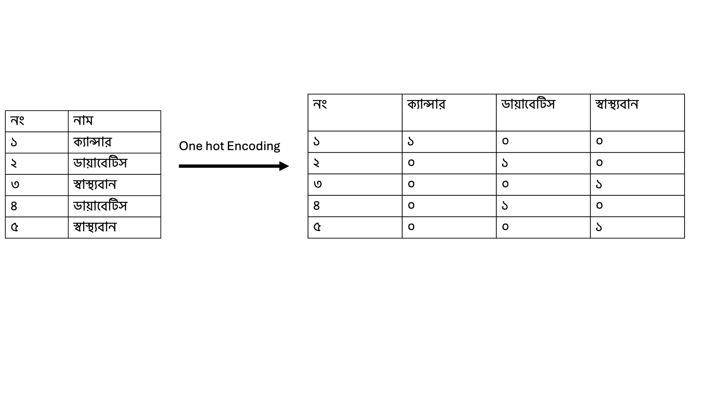
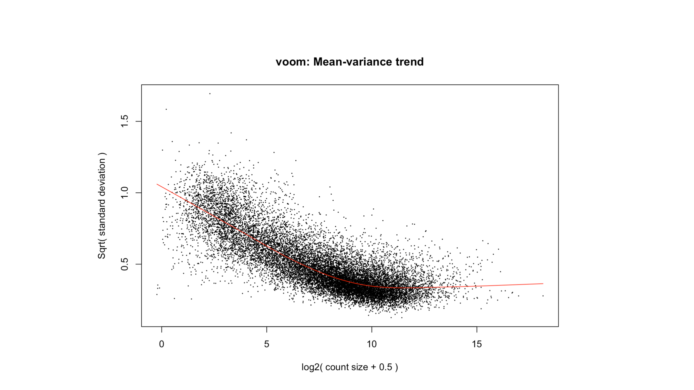
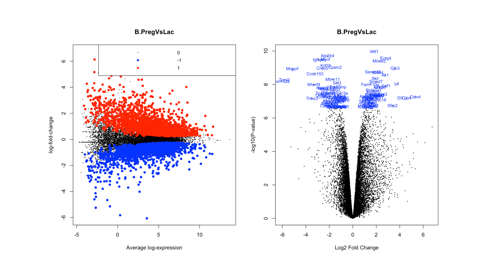

# Step by Step RNAseq Data Analysis Part 4 out of 4
RNaseq বিশ্লেষণ এর আজকের অংশটি আগের অংশের সাথে সম্পৃক্ত। সেজন্য আপনারা আগের অংশের কোড এর সাথে আজকের কোড একত্রে run করবেন। 
আমরা আগের অংশে তিন ধাপে ভাগ করেছিলাম। সেগুলো হল: 

১। প্রয়োজনীয় Environment Set করা , ডেটা সঠিকভাবে প্রস্তুত করা

২। ডেটা এর Quality check করা এবং সকল ডেটা Normalise করা

৩। Differential Gene Expression বের করা এবং পরবর্তী Downstream বিশ্লেষণ

আজকে আমরা শেষ অংশ নিয়ে দেখব। 

## Differential Expression Analysis with limma-voom
আপনারা এখন পর্যন্ত যা করেছেন তার মাধ্যমে আপনাদের ডেটা এর quality এবং normalisation করা শিখেছেন। এই ধাপগুলো মূলত আপনার ডেটা ব্যবহার উপযোগী কিনা সেটা যাচাই করার সুযোগ করে দেয়। এসব ধাপে অনেক সময় দেখা যায় যে ডেটা এর নামকরণ ঠিকভাবে হয়নাই অথবা ডেটা এর sequencing এ সমস্যা ছিল। সেক্ষেত্রে আপনাকে সিদ্ধান্ত নিতে হয় আপনি ডেটা কিভাবে ব্যবহার করবেন অথবা আদৌ করবেন কি না। নামের ভুল থাকলে সেটা ঠিক করে নিয়ে পারবেন সহজেই। এসব যখন শেষ তখন আমরা ডেটা এখন প্রস্তুত। আমি এবার মূল Differential Expression করবো। 
আজকের এই বিশ্লেষণ এ আমরা ইঁদুর এর basal কোষ এ pregnancy আর lactation অবস্থার মধ্যে gene এর expression এর পার্থক্য দেখব। আমাদের পরবর্তী বিশ্লেষণ গুলো এটাকে উদ্দেশ্য করে করবো। আপনারা একই উপায়ে অন্যান্য অবস্থার মধ্যেও তুলনা করতে পারেন। যেমন ধরুন আপনি luminal কোষ এর মধ্যে তুলনা করতে পারবেন। 

Differential Gene Expression বের করা এবং পরবর্তী Downstream বিশ্লেষণ পুরো প্রক্রিয়া আমি ৬ টি ধাপে দেখাব। 
### ১. Design matrix তৈরি করা

বিশ্লেষণ এর ধাপগুলো শুরুর আগে কিছু জিনিস আমাদের করে নিতে হবে যাতে limma এবং edgeR package গুলো ঠিকভাবে কাজ করে। প্রথমত আপনি যদি group ভেরিয়াবল দেখেন দেখবেন যে কতগুলো ভিন্ন group এর sample আছে। এগুলো একরকম vector এর মধ্যে সংরক্ষণ করা আছে। কিন্তু আমাদের পরবর্তী কাজের জন্য ডিজাইন ম্যাট্রিক্স তৈরি করবো। জিনিসটিকে সহজভাবে উপস্থাপন করা যায় One Hot Encoding হিসেবে। আপনারা নিচের ছবি তে লক্ষ্য করুন। এখানে আপনি আপনার vector character ডেটা কে numerical টেবিল এ পরিবর্তন করতে পারবেন। নিচের ছবি তে আমরা ৫ টি স্যাম্পল ক্যান্সার ডায়াবেটিস আর স্বাস্থ্যবান কে একটি টেবিল এ প্রতিস্থাপন করেছি। এই কাজটি ই করে model.matrix ফাংশনটি। আমরা পরবর্তীতে colnames ব্যবহার করে নামগুলো একটু সুন্দর করে স্থাপন করি। এইধাপ্তি মূলত পরবর্তীতে যে linear model ব্যবহার করা হয় তার্য জন্য প্রস্তুত করতে সাহায্য করে। 



```r
group
design <- model.matrix(~ 0 + group)
colnames(design) <- levels(group)
design
```
Output
```
> group
 [1] basal.virgin     basal.virgin     basal.pregnant   basal.pregnant   basal.lactate   
 [6] basal.lactate    luminal.virgin   luminal.virgin   luminal.pregnant luminal.pregnant
[11] luminal.lactate  luminal.lactate 
Levels: basal.lactate basal.pregnant basal.virgin luminal.lactate luminal.pregnant luminal.virgin

> design
   basal.lactate basal.pregnant basal.virgin luminal.lactate luminal.pregnant luminal.virgin
1              0              0            1               0                0              0
2              0              0            1               0                0              0
3              0              1            0               0                0              0
4              0              1            0               0                0              0
5              1              0            0               0                0              0
6              1              0            0               0                0              0
7              0              0            0               0                0              1
8              0              0            0               0                0              1
9              0              0            0               0                1              0
10             0              0            0               0                1              0
11             0              0            0               1                0              0
12             0              0            0               1                0              0
attr(,"assign")
[1] 1 1 1 1 1 1
attr(,"contrasts")
attr(,"contrasts")$group
[1] "contr.treatment"
```
### ২. Voom Transformation
RNAseq ডেটার মধ্যে mean-variance relationship থাকে। এটার মানে হল যেসব gene  এর expression কম হয় সেগুলোর মধ্যকার variation অনেক বেশি হয়। এই variance এর সমস্যার সমাধান করার জন্য voom transformation করা হয়। নিচের কোডটি run করলে আপনারা mean variance plot দেখতে পাবেন। এই plot টি আপনাকে দেখাবে আপনার voom ফাংশন ঠিকভাবে কাজ করেছে কি না। আপনার sample এ এমন gene আছে কি না যেটা 

```r
par(mfrow=c(1,1))
v <- voom(y,design,plot = TRUE)

```
 

### ৩. Linear Model fit করা

আমরা এখন voom transformed ডেটাতে linear model fit করবো। এর মাধ্যমে গ্রুপের মধ্যে এক্সপ্রেশনের পার্থক্য চিহ্নিত করা যায়। names(fit) মডেলের অংশগুলো দেখতে সাহায্য করে
R কোড:
```r
fit <- lmFit(v)
names(fit)
```
Output

```r
> names(fit)
 [1] "coefficients"     "stdev.unscaled"   "sigma"            "df.residual"      "cov.coefficients"
 [6] "pivot"            "rank"             "genes"            "Amean"            "method"          
[11] "design"
```
### ৪. Contrast তৈরি এবং ফিটিং

কনট্রাস্ট ম্যাট্রিক্স ব্যবহার করে নির্দিষ্ট গ্রুপগুলোর মধ্যে পার্থক্য তুলনা করা হয় । আমরা ইঁদুর এর basal কোষ এ pregnancy আর lactation অবস্থার মধ্যে gene এর expression এর পার্থক্য দেখব। এক্ষেত্রে null hypothesis হচ্ছে gene এর expression এর পার্থক্য, অর্থাৎ আপনি যদি কোন gene এর expression এর পার্থক্য দেখেন basal.pregnant - basal.lactate = 0 হবে। কিন্তু আমরা এই linear model এর মাধ্যমে দেখি তাদের মধ্যে পার্থক্য কতটুকু। makeContrasts() ফাংশন ব্যবহার করে আমরা যে নির্দিষ্ট দুটি গ্রুপ এর মধ্যে পার্থক্য তুলনা করবি সেটি নির্ধারণ করি। eBayes Bayesian পরিসংখ্যান ব্যবহার করে মডেলের প্যারামিটার এবং p-value নির্ধারণ করে।decideTests Differential Gene Expression এর ফলাফলকে শ্রেণীবদ্ধ করে, যেমন:+1: আপ-রেগুলেটেড, -1: ডাউন-রেগুলেটেড এবং 0: কোন পরিবর্তন নেই 

```r
cont.matrix <- makeContrasts(B.PregVsLac = basal.pregnant - basal.lactate, levels = design)
fit.cont <- contrasts.fit(fit, cont.matrix)
fit.cont <- eBayes(fit.cont)
summary(decideTests(fit.cont))
```
Output
```r
> summary(summa.fit)
       B.PregVsLac
Down          2635
NotSig       10464
Up            2705
```

### ৫. ফলাফল সংরক্ষণ করা এবং Visualization

### Differential Expression result সংরক্ষণ করা 

আপনি এই বিশ্লেষণ এর পর ফলাফল এ logfc, log fold change এবং p value এগুলো একটি file এ সংরক্ষণ করতে পারেন। এই ডেটাটি আপনি যদি downstream এ অন্যান্য কাজের জন্য সংরক্ষণ করে রাখতে পারেন। 
```r
# Extract all genes from the contrast fit object
all_genes <- topTable(fit.cont, coef = 1, number = Inf, adjust = "fdr")
# write all genes results in a csv file
write.csv(all_genes,"all_genes.csv")
```

### MD প্লট এবং Volcano প্লট

ডিফারেন্সিয়াল জিন এক্সপ্রেশনের সামগ্রিক পার্থক্য দেখানোর জন্য আমরা MD এবং volcano প্লট ব্যবহার করতে পারি। MD প্লট এর মাধ্যমে আমরা up এবং down regulated gene এর অবস্থা দেখতে পারি। volcano প্লট এর মাধ্যমে আমরা logFC (log fold change) এবং -log10(p-value) এর মাধ্যমে গুরুত্বপূর্ণ gene গুলো বের করে ফেলতে পারি। 

```r
# We want to highlight the significant genes. 
par(mfrow=c(1,2))
plotMD(fit.cont,coef=1,status=summa.fit[,"B.PregVsLac"], values = c(-1, 1), hl.col=c("blue","red"))

# For the volcano plot we have to specify how many of the top genes to highlight.
# We can also specify that we want to plot the gene symbol for the highlighted genes.
# let's highlight the top 100 most DE genes
volcanoplot(fit.cont,coef=1,highlight=100,names=fit.cont$genes$SYMBOL, main="B.PregVsLac")
```

### ৬. Gene Ontology বিশ্লেষণ

Gene Ontology বা GO এর মাধ্যমে আমরা বায়োলজিক্যাল ডেটাবেস ব্যবহার করে gene এর সমষ্টিগত কার্যকারিতা সম্পর্কে বুঝতে পারি। এক্ষেত্রে আমরা যেসব gene যে upregulated অথবা downregulated পেয়েছি তারা কি কাজে নিয়োজিত সে সম্পর্কে জানতে পারি। 
জিন অনটোলজি (GO) বিশ্লেষণ করার জন্য আমরা goana ফাংশন ব্যবহার করব, যা limma package এ অন্তর্ভুক্ত । GO টার্ম তিনটি ক্যাটাগরিতে বিভক্ত থাকে:
•	BP (Biological Process): 
•	MF (Molecular Function): 
•	CC (Cellular Component): 


```r
go <- goana(fit.cont, coef = "B.PregVsLac", species = "Mm")
topGO(go, n = 10)
```
Output
```r
> topGO(go, n = 10)
                                           Term Ont    N  Up Down         P.Up    P.Down
GO:0022613 ribonucleoprotein complex biogenesis  BP  428 210   26 1.155229e-53 1.0000000
GO:0042254                  ribosome biogenesis  BP  313 169   11 1.205930e-50 1.0000000
GO:1990904            ribonucleoprotein complex  CC  692 280   47 5.949851e-50 1.0000000
GO:0022626                   cytosolic ribosome  CC  124  90    2 2.837598e-42 1.0000000
GO:0016072               rRNA metabolic process  BP  248 130   11 2.663060e-37 1.0000000
GO:0006364                      rRNA processing  BP  213 118    5 4.647075e-37 1.0000000
GO:0030684                          preribosome  CC  110  78    1 1.305014e-35 1.0000000
GO:0002181              cytoplasmic translation  BP  141  90    6 3.154644e-35 0.9999992
GO:0022625    cytosolic large ribosomal subunit  CC   62  53    0 7.159734e-32 1.0000000
GO:0003723                          RNA binding  MF 1026 324  119 7.466301e-32 0.9999996

```

আমি এখানে Step by Step RNAseq Data Analysis সবগুলো part শেষ  করছি। আমি চেষ্টা করেছি সম্পূর্ণ অংশগুলো সহজভাবে উপস্থাপন করতে এবং কোডগুলো run করে Output সহ  দেখাতে, যাতে আপনারা বুঝতে পারেন। সবচেয়ে ভাল কাজ হবে যদি আপনারা কোডগুলো পড়ার সাথে সাথে run করার চেষ্টা করেন। 
আমি বলে রাখতে চাই যে একবার যখন আপনরা এই সম্পূর্ণ ধাপগুলো শেষ করবেন, একই পদ্ধতি ব্যবহার করে অন্যান্য ডেটা নিয়েও কাজ করতে পারবেন। আপনারা এই ডেটা এর অন্যান্য comparison গুলো ও চেষ্টা করে দেখবেন। একটা কাজ করে দেখতে পারেন যে সব ক্ষেত্রে কোন gene অথবা gene সমূহ বারবার আসছে এবং তারা আসলে কি কাজ এ নিয়োজিত। আপনি তখন একটি ব্যাখ্যা দাঁড় করানোর চেষ্টা করবেন যে কি কারণে এই gene ওই অবস্থায় বেশি expression হয়েছে। Downstream এর বিশ্লেষণ এ gene ontology ছাড়াও আরও অনেক কাজ করার সুযোগ রয়েছে। আপনাদের directory যেখানে ডেটা সংরক্ষণ করা আছে ওইখানে all_gene.csv file আছে। এটি ব্যবহার করে আপনারা অন্যান্য আরও বেশ কিছু কাজ করতে পারবেন।

খুশি হব যদি জানান আপনারা এর সাথে আর কি কি কাজ করেছেন। আমাকে চ্যাপ্টার এর comment এ জানাতে পারেন। 

ধন্যবাদ যারা এখান পর্যন্ত এসেছেন আর লেখাগুলো পরেছেন। 

Reference:

১। https://combine-australia.github.io/RNAseq-R/06-rnaseq-day1.html#Data_files_and_Resources

২। https://www.nature.com/articles/ncb3117#Sec9

আপনাদের আগের অংশের মতামত গুলো খুব কাজে লেগেছে আমার। আমি কিছু জিনিস পরিবর্তন করেছি লেখার মধ্যে আর নতুন অংশ যুক্ত করেছি। খুব ভাল লাগবে আপনারা যদি আমাকে প্রতিটি অংশের উপর বলতে পারেন। 
### [মতামত জানাতে এখানে ক্লিক করুন](https://forms.gle/EXzTmb9MFo3CJN6g7)

আর আপনি যদি নিবন্ধন করে না থাকেন তাহলে নিবন্ধন করুন। 

# আপডেট পাওয়ার জন্য নিবন্ধন করুন (Register for Updates)

আপনি যদি এই ব্লগের নিয়মিত আপডেট পেতে চান, তাহলে নিচের ফর্মটি পূরণ করুন। আমি নতুন কোনো কন্টেন্ট যোগ করার সাথে সাথেই আপনাকে ইমেইলের মাধ্যমে জানিয়ে দেব।

# [**ফর্ম পূরণ করতে এখানে ক্লিক করুন**](https://forms.gle/6qyRGiE7WSpLJ9SA9)


# [Part 1 পড়তে এখানে ক্লিক করুন](https://sharifshohan.github.io/Programming-for-Bioscience/chapter8/RNAseq_analysis_part1/)

# [Part 2 পড়তে এখানে ক্লিক করুন](https://sharifshohan.github.io/Programming-for-Bioscience/chapter8/RNAseq_analysis_part2/)

# [Part 3 পড়তে এখানে ক্লিক করুন](https://sharifshohan.github.io/Programming-for-Bioscience/chapter8/RNAseq_analysis_part3/)

