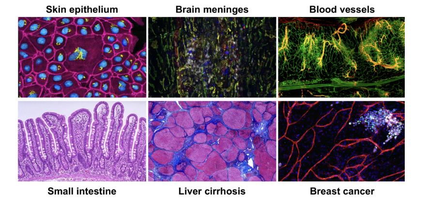

# Step By Step Single Cell RNAseq Analysis using CellRanger and R (Part 1 out of 6)

এই অংশে আমি Single cell RNAseq এর বিস্তারিত বর্ণনা করবো। আমার লেখার মূল target হল এই পদ্ধতি এর ডেটা বিশ্লেষণ এর অংশটি আপনাদের সামনে তুলে ধরা। আপনারা যেন এই লেখাগুলো অনুসরণ করলে শুরু থেকে শেষ পর্যন্ত Single cell RNAseq বিশ্লেষণ করতে পারেন। 
এখানে বলে রাখা ভাল যে আপনারা যদি কেউ নতুন দেখে থাকেন এই ব্লগটি তাহলে দুটি কাজ করবেন। প্রথমতই হচ্ছে, আমার লেখা step by step RNAseq analysis ব্লগটি আগে পড়ে নিবেন, তাহলে এই অংশের অনেকগুলা বিষয় বুঝতে সুবিধা হবে। না পড়লেও সমস্যা নেই। আমি এমনভাবে লিখার চেষ্টা করবো যাতে এই ব্লগে সবকিছু ব্যাখ্যা পেয়ে যান। দ্বিতীয়ত হচ্ছে আমার ব্লগটি subscribe করে নিবেন, যাতে ব্লগ এর পরবর্তী লেখাগুলো আমি যখন লিখব তখন আপনাদেরকে email এর মাধ্যমে জানাতে পারি। 

আসুন শুরু করি। 
## Single cell RNAseq (scRNA-seq) কি এবং কেন দরকার?
আমাদের শরীরের প্রতিটি টিস্যু (যেমন: হৃদপিণ্ড, মস্তিষ্ক, কিডনি, লিভার ইত্যাদি) বিভিন্ন রকমের  কোষের সমন্বয়ে তৈরি। এই কোষগুলো দেখতে একরকম হলেও, তারা কি কাজ করবে, তাদের বর্তমান অবস্থা এবং তারা নিজেদের মধ্যে কিভাবে তথ্য আদান প্রদান করে সেটা ভিন্ন রকমের হতে পারে। এই সবকিছুর সমন্বয় সঠিকভাবে হলেই একটি টিস্যু সঠিকভাবে কাজ করতে পারে। 
গবেষণার সময় বিজ্ঞানীরা বিভিন্ন প্রশ্নের উত্তর খোজার চেষ্টা করেন। এগুলোর মধ্যে একটি হল বিজ্ঞানীরা বোঝার চেষ্টা করেন যে একটি টিস্যুতে কি কি কোষ আছে এবং কোষগুলোর মধ্যে কোন কোন জিন কাজ করছে। এই প্রশ্নের উত্তর খোজার জন্য যেই পদ্ধতি ব্যবহার করা হত সেটা হল "bulk RNA-seq" নামক একটি পদ্ধতি। এই পদ্ধতিতে বেশ অনেক বছর ধরে চলে আসছে এবং এখন খুবই জনপ্রিয়। আমি আমার আগের ব্লগ এর লেখায় এই পদ্ধতি সম্পর্কে বিশদভাবে বর্ণনা করার চেষ্টা করেছি। এই পদ্ধতির একটি গুরুত্বপূর্ণ দিক হচ্ছে পুরো টিস্যুর কোষগুলো একসঙ্গে বিশ্লেষণ করা হয় যার ফলে একটি গড় হিসাব পাওয়া যায়। যেমন ধরুন ১০০টা কোষে মোট কতটা জিন কাজ করছে। কিন্তু এক্ষেত্রে সমস্যা হচ্ছে, কোন কোষে কোন জিন কাজ করছে সেটা জানা সম্ভব হয় না। অর্থাৎ, আপনি জানতে পারবেন  যে একটা জিন expressed হচ্ছে কিন্তু আপনি জানবেন না যে ঠিক কোন কোষ এ এটা হচ্ছে। আর এখানেই single-cell RNA-seq বা scRNA-seq কাজে আসে। (বিদ্রঃ এখানে বলে রাখা ভাল যে এখন বেশ কিছু Deep Learning দিয়ে তৈরি কিছু পদ্ধতি বের হয়েছে যার মাধ্যমে আপনি এই তথ্য ও বের করতে পারবেন। কিন্তু এই method গুলো খুব বেশি popular হয়নি এবং অনেক বেশি prediction এর উপর নির্ভরশীল। আমাদের যেহেতু মাত্র শুরু Single cell RNAseq এ টাই আমরা ধরে নিব যে এই বিষয়টি আমরা এখন জানি না। )

এই single-cell RNA-seq পদ্ধতি তে প্রতিটি কোষ আলাদাভাবে বিশ্লেষণ করা হয়। ফলে, প্রতিটি কোষে কোন কোন জিন কাজ করছে তা বিশ্লেষণ করা যায়। ফলে আমরা অনেক বেশি নির্দিষ্ট এবং বিস্তারিত তথ্য পাই।
## এই প্রযুক্তির মাধ্যমে কী জানা যায়?
### ১. কোষের প্রকারগুলো জানা যায় 
কোনো টিস্যুতে কী কী ধরণের কোষ আছে, সেটা আলাদা করে শনাক্ত করা যায়। bulk RNA-seq এ যেগুলো একসঙ্গে মিশে থাকত, এই পদ্ধতিতে আলাদা করা সম্ভব।
### ২. নতুন অথবা rare কোষ চিহ্নিত করা
মাঝে মাঝে টিস্যুতে কিছু কিছু কোষ খুবই কম সংখ্যায় থাকে। bulk পদ্ধতিতে তাদের খুঁজে পাওয়া সম্ভব হয় না। কিন্তু scRNA-seq এ তাদেরও খুঁজে পাওয়া যায়।
### ৩. কোষের পরিবর্তন পর্যবেক্ষণ করা
একটি কোষ কীভাবে এক রকম অবস্থা থেকে অন্য রকম অবস্থায় (যেমন স্টেম সেল থেকে নার্ভ সেল) পরিবর্তিত হচ্ছে এবং  সেই সময়ের মধ্যে gene expression এ কী কী পরিবর্তন হচ্ছে, তা বোঝা যায়। এক্ষেত্রে একটি পদ্ধতি ব্যবহার করা হয় যাকে বলে Trajectory Analysis। এই জিনিশটি খুবই popular কিন্তু আমরা আমাদের এই ব্লগে আপাতত এটি দেখাব না। 
### ৪. রোগ বা চিকিৎসার ফলে জিনের কী পরিবর্তন হচ্ছে, সেটা বোঝা
ধরুন , আপনি জানতে চাচ্ছেন যে কোনো ওষুধ ব্যবহারের ফলে শরীরের নির্দিষ্ট কোষে কোন জিন expressed বা inhibit (বন্ধ ) হচ্ছে?
### ৫. স্থান, নিয়ন্ত্রণব্যবস্থা ও প্রোটিনের সঙ্গে মিলিয়ে জিনের আচরণ বিশ্লেষণ
একই কোষ শরীরের কোথায় অবস্থা করছে এবং কোষের আশেপাশে কী পরিবেশ আছে, তার উপর ভিত্তি করে gene expression ভিন্ন হতে পারে। scRNA-seq এর সঙ্গে অন্য তথ্য (যেমন spatial বা প্রোটিন) মিলে আরও গভীর বিশ্লেষণ করা সম্ভব। এটি মূলত single cell multi-omics নামে পরিচিত। আপনারা এই পেপার দেখলে এই term টি অনেক ব্যবহার দেখবেন। আমরা আমাদের ব্লগ এ multi-omics নিয়ে বিশ্লেষণ এখন দেখাব না। এটা হতে পারে ভবিষ্যতে আপনারা ব্লগ এ পাবেন। আমি আমার নিজের গবেষণায় এই single cell multi-omics পদ্ধতি ব্যবহার করি। এবং বর্তমানের কাজগুলোতে এর ব্যবহার ও বেশি দেখা যাচ্ছে। 
## scRNA-seq এর বেশকিছু দিক সম্পর্কে জ্ঞান (সমস্যা এবং সমাধান ) 
যদিও single-cell RNA-seq (scRNA-seq) প্রযুক্তি অত্যন্ত শক্তিশালী এবং বিস্তারিত তথ্য প্রদান করে , এর কিছু চ্যালেঞ্জ বা সমস্যা রয়েছে। এই সমস্যাগুলো বোঝা গুরুত্বপূর্ণ, কারণ সেগুলো না জানলে আমরা ভুল ব্যাখ্যা করে ফেলতে পারি। এখানে বলে রাখা ভাল, এখন যখন আমরা পেপার পড়ি তখন বিশ্লেষণ এর ভুল ব্যাখ্যা দেখতে পারি। এর অন্যতম কারণ হচ্ছে না জেনে কিছু কোড run করার প্রবণতা। কারণ কোড run করলেই আমাদের মন ভাল থাকে। কিন্তু এর সবচেয়ে বড় সমস্যা পরবর্তীতে দেখা যাই যে ভুল ব্যাখ্যা করাতে। যেমন আমি খুবই recently একটা পেপার পরছিলাম আর ওই গবেষণার গবেষকরা একটি নতুন কোষ পেয়েছে বলে claim করেছেন, কিন্তু আমি কাজটি নিয়ে একটু বিশ্লেষণ করে দেখতে পেয়েছিলাম যে ওইটা নতুন কোষ না। ওটা ডেটার (Quality Control) জনিত একটি সমস্যা। আমরা ব্লগ এর পরবর্তী কোন অংশে এটি নিয়ে কথা বলবো। 
সবকিছু যদি আমি একত্রে বলার চেষ্টা করি । আগে গবেষকরা bulk RNA-seq ব্যবহার করতেন, যেখানে কোষগুলোর গড় তথ্য পাওয়া যেত। এই পদ্ধতি এখনো অনেক ক্ষেত্রে ভালো কাজ করে, বিশেষ করে যখন আপনি পুরো টিস্যু বা sample এর মধ্যে গড় gene expression দেখতে চান (যেমন: রোগ বনাম সুস্থ টিস্যুতে কোন জিনগুলো বেশি বা কম কাজ করছে)। কিন্তু যখন আপনি জানতে চান যে কোন কোষ ঠিক কী কাজ করছে? কোন কোষ নতুন বা rare? রোগ এর কারণে কোন কোষের কোন gene এর পরিবর্তিত হচ্ছে, তখন bulk RNA-seq যথেষ্ট নয়। এসব স্থানেই scRNA-seq ব্যবহার হয়। কিন্তু এর কিছু বড় challenges রয়েছে, যা নিচে ব্যাখ্যা করা হলো।
### ১. বিশাল ডেটা (Large volume of data)
scRNA-seq-এ আপনি প্রতিটি কোষের জন্য আলাদা করে তথ্য সংগ্রহ করেন। একটি experiment এ কয়েক হাজার কোষ থাকতে পারে, এবং প্রতিটি কোষের জন্য ৩০ হাজার এর মত gene expression ডেটা সংগ্রহ করা হয়। বিশ্লেষণ করার সময় অনেক বেশি পরিমাণ memory এবং storage লাগে। বিশ্লেষণ করতে বেশি সময় লাগে এবং কম্পিউটার processing পাওয়ার বেশি দরকার হয়। আপনি যদি বিষয়টি bulk RNAseq এর সাথে তুলনা করেন তাহলে একটি sample কে একটি কোষ এর ডেটা এর সাথে তুলনা করতে পারেন। আর প্রত্যেক sample এ ৮ -১০ হাজার এর মত কোষ পাওয়া যায়। এখন ভাবুন কি পরিমাণ ডেটা নিয়ে আপনি কাজ করবেন। 
### ২. কোষপ্রতি Sequencing এর গভীরতা (Low depth of sequencing per cell)
scRNA-seq পদ্ধতিতে প্রতিটি কোষ থেকে পুরো transcriptome (সব mRNA) |Sequencing করতে পারে না। সাধারণত ১০%-৫০% ডেটাই Sequencing করা যায়। এক্ষেত্রে অনেক জিন এর expression “০” (শুন্য) হয়। এখন সমস্যা হচ্ছে এটির মানে বোঝা। ধরুন শুন্য বলতে কি বোঝায়? যে জিনটি expressed হয় নি, নাকি জিন এর expression detect করা সম্ভব হয় নি। এই ব্যাপারটি বোঝা খুব কঠিন। যেহেতু এই ক্ষেত্রে আপনার ডেটা এর পরিমাণ অনেক বেশি থাকে, এজন্য এসব বড় যেটার ক্ষেত্রে যখন শুন্য (0) বেশি থাকে সেসব ডেটা বিশ্লেষণ  করা ও অনেক কঠিন। 
### ৩. জীববৈচিত্র্যজনিত ভিন্নতা (Biological variability across cells/samples)
সব কোষ একইরকম নয়, এমনকি যদি তারা একই ধরণেরও হয়। যেমন ধরুন সব জিন সবসময় কাজ করে না। আপনি কোন সময় experiment করছেন, ডেটা এর তারতম্য দেখা দিবে। আবার কোষ কোন স্থান এ আছে সেটাও কোষ এর expression এ প্রভাব ফেলে। এখন “Niche” ডেটা বিশ্লেষণ জনপ্রিয় হচ্ছে যার মাধ্যমে কোষ তার অবস্থানজনিত কারণে কি কি পার্থক্য হতে পারে সেটা দেখা হয়। আবার আপনি কতটা granular হতে চাচ্ছেন, সেটাও প্রভাব ফেলে। যেমন ধরুন আপনি যদি শুধুমাত্র T cell নিয়ে কাজ করেন, এক্ষেত্রে T cell এর অনেক subtype আছে। সেগুলার gene expression ও ভিন্ন হতে পারে যদিও তারা T cell এর অন্তর্ভুক্ত। এছাড়া, কোষগুলো কি বিভাজন (cell cycle) এ আছে নাকি  বিশ্রামরত আছে সেটা expression কে প্রভাবিত করে। এজন্য কোষগুলোকে গ্রুপ এ ভাগ করা কঠিন হয়। 
### ৪. Technical variability across cells/samples
সব পরিবর্তন জীববৈচিত্র্যজনিত নয়। অনেক সময় ল্যাবের পদ্ধতি বা যন্ত্রপাতির কারণেও ভিন্নতা আসে। এসবকে বলে batch effects বা technical noise। যেমন ধরুন সব কোষ থেকে সমান পরিমাণ mRNA capture করা সম্ভব  হয় না। তাছাড়া একটি কোষ কি মারা যাচ্ছিল নাকি আশেপাশে ছড়ান ছিল দেখে capture হয়েছে, এর কারণে ডেটা প্রভাবিত হতে পারে। তাছাড়া যদি বিভিন্ন দিনে বিভিন্ন মানুষ দ্বারা sample processing করা হয় তখনও দেখা যায় যে ভিন্নতা আসে যদি তারা একই sample. এটিকে মূলত বলা হয় “Batch Effect”। 
## Batch Effect: Batch সম্পর্কিত সমস্যা কী ও কেন তা গুরুত্বপূর্ণ
ধরুন আপনি experiment করার জন্য ১০টি স্যাম্পল নিয়ে কাজ করছেন। কিন্তু আপনি সবগুলো স্যাম্পল:
•	একদিনে RNA isolation করেননি
•	ভিন্ন দিনে বা ভিন্ন ল্যাবে library তৈরি করেছেন
•	ভিন্ন ব্যক্তি এই কাজগুলো করেছেন
•	আলাদা জায়গায় বা আলাদা reagents দিয়ে কাজ করা হয়েছে
এই ধরণের ভিন্নতা যদি থাকে, তাহলে আমরা বলি যে আপনার ডেটাতে batch effect আছে।
এগুলো কোনো জৈবিক পার্থক্য না বরং এগুলো প্রযুক্তিগত বা পদ্ধতিগত পার্থক্য এর জন্য হয়ে থাকে । কিন্তু বিশ্লেষণের সময় এই পার্থক্যগুলো আসল gene expression পার্থক্যের মতো দেখাতে পারে, যা বিশ্লেষণকে এর ভুল ফলাফল দিতে পারে। 
একটি উদাহরণ দিলে আশা করছি আরেকটু সহজ হবে বোঝা। 
ধরুন আপনি control এবং treatment গ্রুপের উপর কাজ করছেন। যদি আপনি আগে সব control sample এবং পরে সব treatment sample প্রস্তুত করেন, তাহলে আপনার ডেটার ভেতরে গ্রুপের পার্থক্য নয় বরং batch এর পার্থক্য বড় হয়ে দাঁড়াতে পারে। এও হতে পারে আপনি যেসব পরিবর্তন দেখছেন সেগুলো treatment এর জন্য নয়, সেজায়গায় এটি আগে পরে sample প্রস্তুত করার জন্য হয়েছে। 
## আপনার experiment এ batch effect আছে কি না, তা বুঝবেন কীভাবে?
নিজেকে নিচের প্রশ্নগুলো করুন:

•	সব RNA isolation কি একদিনে করা হয়েছে?

•	সব library preparation কি একই দিনে হয়েছে?

•	একই ব্যক্তি কি সব কাজ করেছেন?

•	সব sample কি একই reagent ব্যবহার করা হয়েছে?

•	একই ল্যাবে কি সব কাজ করা হয়েছে?

যদি এর যেকোনো একটির উত্তর “না”, তাহলে আপনার ডেটাতে batch effect থাকতে পারে।

## Batch Effect  এর তথ্য metadata তে যুক্ত করুন
বিশ্লেষণের সময় আমরা batch effect কে একটা covariate হিসেবে ব্যবহার করতে পারি। এর মানে, আমরা সফটওয়্যারকে জানাতে পারি কোন স্যাম্পলে এ কোন batch effect ছিল, যেন batch effect ভিন্নতা জৈবিক ব্যাখ্যার মধ্যে না আসে। এখানে metadata এর কথা বলা হয়েছে। এই বিষয়টিও আমরা পড়ে দেখব।
শেষ কথা
scRNA-seq আপনাকে কোষের ভেতরের প্রতিটি কোষকে আলাদা করে দেখার সুযোগ দেয়, কিন্তু সেই তথ্যগুলো ঠিকভাবে জানার জন্য আপনাকে পরিকল্পিতভাবে কাজ করতে হবে। ভালো Design, Batch Effect নিয়ন্ত্রণ, বিশ্লেষণে সতর্কতা এই সবকিছু ঠিকভাবে করলে আপনি একটি সফল scRNA-seq বিশ্লেষণ করতে পারবেন।  

