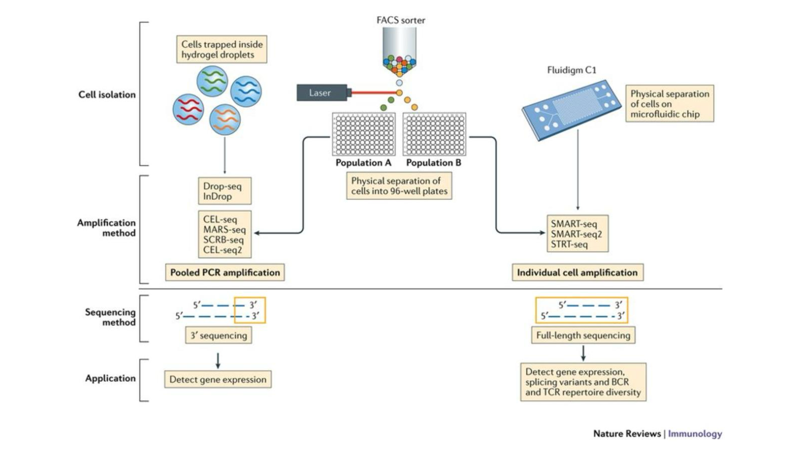
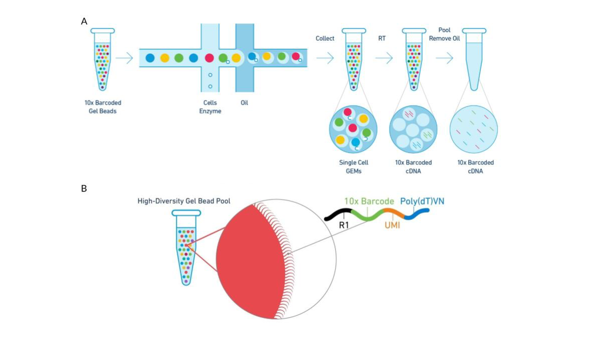
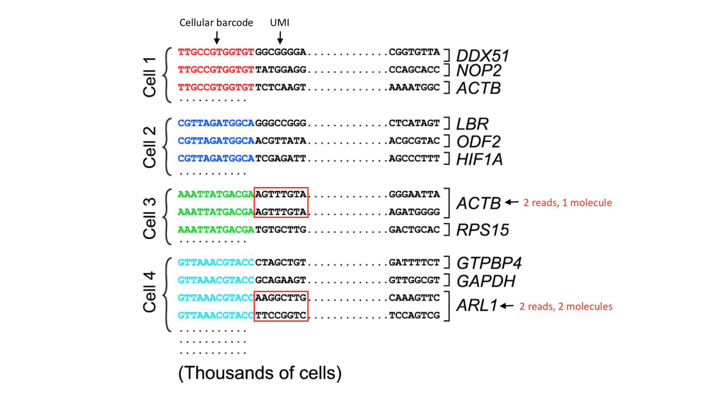
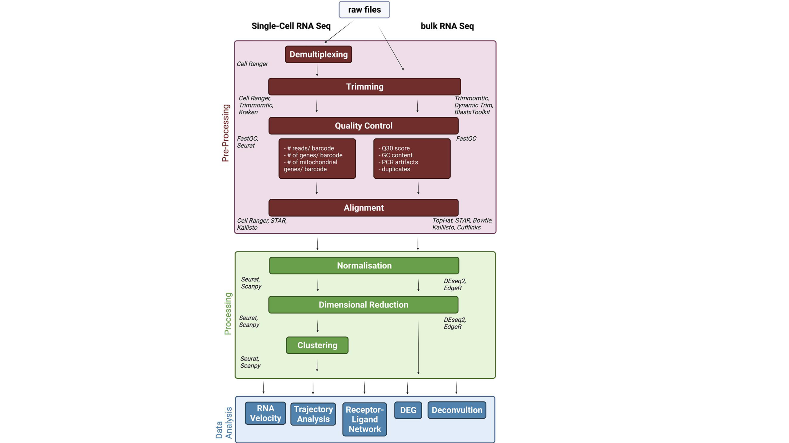

# Step By Step Single Cell RNAseq Analysis using CellRanger and R (Part 2 out of 6)
## Raw seque Ωncing data থেকে count matrix – কিভাবে? 
আমার লেখার আগের অংশে আপনারা দেখেছেন কেন single-cell RNA-seq দরকার। কেন bulk RNA-seq অনেক সময় যথেষ্ট না, এবং কেন আমরা কোষকে আলাদা করে দেখতে চাই। আমরা জানতাম আমরা কী পেতে চাই, কিন্তু এখন প্রশ্নটা উল্টো করি।
আমরা যা পাই, সেটা আসলে কী আর সেই জিনিসটা তৈরি হয় কীভাবে?
এই জায়গাটায় অনেকেই এখানে বেশি সময় দেয় না। একটা ready-made count matrix পাওয়া যায়, সেটা R-এ লোড করে analysis শুরু করে। clustering, visualization, marker gene identification, সবকিছু বেশ সহজ মনে হয়।
কিন্তু আমি আমার মনে হয় আপনি যদি কিভাবে এই ডেটা তৈরি হয়েছে, এই জিনিস না বুঝেন তাহলে কিছু ভুল থেকে যাবে। 
কারণ আপনি যখন matrix নিয়ে কাজ করছেন, তখন আপনি ধরে নিচ্ছেন সেই matrix সঠিকভাবে তৈরি হয়েছে। কিন্তু সেই matrix তৈরির সময় যে সব assumption নেওয়া হয়েছে, সেগুলো যদি আপনি না জানেন, তাহলে আপনি আসলে blind trust করছেন।
তাই এই অংশে আমরা একটু ধীরে যাবো। খুব basic থেকে শুরু করবো। raw sequencing data থেকে শুরু করে শেষ পর্যন্ত একটি  count matrix তৈরি হওয়া পর্যন্ত কিভবাএ সবকিছু হয়েছে সেটা বোঝার চেষ্টা করবো। 

এখানে বলে রাখা ভাল যে আপনারা যদি কেউ নতুন দেখে থাকেন এই ব্লগটি তাহলে দুটি কাজ করবেন। প্রথমতই হচ্ছে, আমার লেখা step by step RNAseq analysis ব্লগটি আগে পড়ে নিবেন, তাহলে এই অংশের অনেকগুলা বিষয় বুঝতে সুবিধা হবে। না পড়লেও সমস্যা নেই। আমি এমনভাবে লিখার চেষ্টা করবো যাতে এই ব্লগে সবকিছু ব্যাখ্যা পেয়ে যান। দ্বিতীয়ত হচ্ছে আমার ব্লগটি subscribe করে নিবেন, যাতে ব্লগ এর পরবর্তী লেখাগুলো আমি যখন লিখব তখন আপনাদেরকে email এর মাধ্যমে জানাতে পারি। 

# আপডেট পাওয়ার জন্য নিবন্ধন করুন (Register for Updates)

আপনি যদি এই ব্লগের নিয়মিত আপডেট পেতে চান, তাহলে নিচের ফর্মটি পূরণ করুন। আমি নতুন কোনো কন্টেন্ট যোগ করার সাথে সাথেই আপনাকে ইমেইলের মাধ্যমে জানিয়ে দেব।

# [**ফর্ম পূরণ করতে এখানে ক্লিক করুন**](https://forms.gle/6qyRGiE7WSpLJ9SA9)

## Sequencing data – এখান থেকে শুরু
Experiment শেষ হলে sequencing facility থেকে আপনি data পাবেন। এই data সাধারণত BCL বা FASTQ ফরম্যাটে থাকে। BCL হলো একেবারে raw machine output। FASTQ হলো processed version যেখানে nucleotide sequence এবং quality score দেওয়া থাকে।
আমরা সাধারণত FASTQ দিয়ে কাজ করি। যদি আপনাকে BCL file দেওয়া হয়, তাহলে প্রথমে এটাকে FASTQ-এ convert করতে হয়। bcl2fastq নামে একটি tool সাধারণত এই কাজের জন্য ব্যবহার করা হয়।
এই জায়গায় একটা ছোট কিন্তু গুরুত্বপূর্ণ বিষয় আছে। অনেকেই ধরে নেয় sample আলাদা আলাদা থাকবে। কিন্তু বাস্তবে তা হয় না। sequencing efficiency বাড়ানোর জন্য অনেক সময় multiple sample একসাথে run করা হয়। ফলে এসব গবেষণায় সব read একই জায়গায় থাকে।
এই “একসাথে থাকা” বিষয়টা পরে গুরুত্বপূর্ণ হয়ে দাঁড়ায়, যখন আমরা sample আলাদা করতে চাই।
FASTQ ফাইল খুললে প্রথমে যা দেখবেন, তা একটু ভিন্ন রকম লাগে। কিছু sequence, কিছু strange character, quality score। কোথাও লেখা নেই এটা কোন gene, বা কোন cell।
কিন্তু এই অগোছালো data-এর মধ্যেই সব তথ্য আছে।
## FASTQ ফাইল আসলে কী?
Experiment শেষ হওয়ার পরে আপনি যে FASTQ ফাইল পান, সেটাই হচ্ছে আপনার sequencing data-এর সবচেয়ে ব্যবহারযোগ্য form। এটাকে বলা যায় raw data আর processed data-এর মাঝামাঝি কিছু।
মানে, এটা পুরো raw না (কারণ base-calling হয়ে গেছে), আবার পুরো interpretable-ও না (কারণ এখনো gene বা cell জানা যায়নি)।
একটা FASTQ ফাইল মূলত অনেকগুলো sequencing read-এর collection। প্রতিটি read চারটি লাইনে লেখা থাকে। একটা example দেখি:
```r
@SEQ_ID_1
ATGCCGTAGCTAGCTAGCTA
+
IIIIIIIIIIIIIIIIIIII
```
এখন এই চারটা লাইন আলাদা আলাদা কিছু বোঝাচ্ছে।
### প্রথম লাইন: Identifier (Read ID)
প্রথম লাইনে সাধারণত @ দিয়ে শুরু হয়। এটা read-এর একটি unique identifier।
এখানে sequencing machine-এর কিছু metadata থাকতে পারে, যেমন কোন run, কোন lane, কোন cluster ইত্যাদি। সহজ ভাষায় বললে, এটা read-এর “নাম”।
### দ্বিতীয় লাইন: Nucleotide sequence
এই লাইনে থাকে আসল sequence- A, T, G, C দিয়ে লেখা। এইটাই সেই অংশ যেটা কোনো gene বা transcript থেকে এসেছে। কিন্তু এই মুহূর্তে আমরা জানি না এটা কোন gene থেকে এসেছে। এটা শুধু একটি string। এখানে এখনো কোনো biological meaning যুক্ত করা হয়নি।
### তৃতীয় লাইন: Separator
এই লাইনটা সাধারণত শুধু + হয়। কখনও কখনও identifier repeat হতে পারে, কিন্তু বেশিরভাগ ক্ষেত্রে শুধু + থাকে। এটার কাজ খুব বেশি না - মূলত format maintain করা।
### চতুর্থ লাইন: Quality score
এই লাইনটা একটু interesting। এখানে strange character দেখা যায়। যেমন IIIIIIII, @@@DDBD ইত্যাদি। এইগুলো আসলে প্রতিটি nucleotide-এর quality score represent করে।
মানে, sequencer কতটা confident যে ওই base ঠিকভাবে পড়েছে।
উদাহরণস্বরূপ:

•	উচ্চ quality → বেশি reliable 

•	কম quality → error হওয়ার সম্ভাবনা বেশি 

এই quality score পরে filtering-এ কাজে লাগে।
## scRNA-seq FASTQ কেন আলাদা?
Bulk RNA-seq-এ FASTQ মূলত শুধু sequence আর quality নিয়ে থাকে। কিন্তু scRNA-seq-এ FASTQ read-এর ভেতরে অতিরিক্ত তথ্য থাকে।
যেমন:

•	Cell barcode 

•	UMI (Unique Molecular Identifier) 

•	কখনও sample index 

এইগুলো সবসময় এক লাইনে লেখা থাকে না। বরং read-এর নির্দিষ্ট অংশে encode করা থাকে।
মানে, read-এর শুরুতে হয়তো barcode, তারপর UMI, তারপর actual gene sequence।
এই structure method অনুযায়ী বদলায়।
যেমন 10x Genomics-এর structure আর Drop-seq-এর structure একরকম না।
### একটা বাস্তব উদাহরণ (scRNA-seq context)
একটু conceptual example দিই।
ধরুন একটি read দেখতে এমন:
```r
@SEQ_ID_2
AACTTGGCCTAGGCTAAGCTTTGACCTGA
+
HHHHHHHHHHHHHHHHHHHHHHHHHHHH
```
এখানে ধরুন:
•	প্রথম 16 base → cell barcode 
•	পরের 10 base → UMI 
•	বাকি অংশ → gene sequence 
কিন্তু FASTQ ফাইল নিজে এটা বলে না।
আপনাকে জানতে হবে library preparation protocol থেকে।
এই কারণেই scRNA-seq analysis একটু tricky।

## Library preparation method - data কী রকম হবে, সেটার ভিত্তি কি?
Single-cell RNA-seq experiment করার সময় আপনি যে method ব্যবহার করেন, সেটাই নির্ধারণ করে data কেমন হবে।
মূলত দুই ধরনের approach আছে। একদিকে droplet-based 3’ বা 5’ end sequencing, অন্যদিকে full-length sequencing।
3’ end method-এ transcript-এর একটি নির্দিষ্ট অংশ capture করা হয়। এর ফলে expression quantify করা সহজ হয়, এবং UMI ব্যবহার করে PCR duplicate handle করা যায়। সবচেয়ে বড় সুবিধা হল অনেক বেশি cell একসাথে sequence করা যায়।
Full-length method-এ পুরো transcript capture করা হয়। এতে isoform-level variation দেখা যায়। কিন্তু এতে সাধারণত কম cell নিয়ে কাজ করা হয়।
এখানে একটা trade-off আছে, যেটা অনেক সময় overlooked হয়। আপনি সবকিছু একসাথে পেতে পারবেন না। বেশি cell চাইলে depth কমবে, depth বাড়াতে গেলে cell কমাতে হবে।
আমাদের এই আলোচনায় আমরা droplet-based 3’ method নিয়ে কাজ করছি, কারণ এটি সবচেয়ে widely used। যদিও আমি বর্তমান গবেষণায় isoform নিয়ে কাজ করছি সেজন্য আমার Full-length method। ব্যাপারটি শেষমেশ দাঁড়ায় আপনি কি কাজ করবেন তার উপর।

 


ছবি ১: এই ছবিটা আসলে single-cell RNA sequencing করার বিভিন্ন পদ্ধতির তুলনা দেখাচ্ছে। বিশেষ করে কোষ আলাদা করা, amplification, sequencing এবং শেষে কী ধরনের তথ্য পাওয়া যায়।শুরুতে cell isolation অংশে দুইটা প্রধান পদ্ধতি দেখানো হয়েছে। একদিকে droplet-based method (যেমন Drop-seq, inDrop), যেখানে কোষগুলো ছোট ছোট droplets-এর মধ্যে capture করা হয়। অন্যদিকে FACS বা microfluidic-based method, যেখানে কোষগুলো physically আলাদা করা হয়—মানে একে একে বাছাই করা হয়। এরপর আসে amplification step। Droplet-based method-এ অনেক কোষ একসাথে process করা হয় (pooled amplification), তাই একসাথে অনেক cell analyse করা যায়। কিন্তু SMART-seq এর মতো method-এ প্রতিটি কোষ আলাদা করে amplify করা হয় (individual amplification), ফলে depth বেশি পাওয়া যায়, কিন্তু cell সংখ্যা কম থাকে। তারপর sequencing step-এ পার্থক্য দেখা যায়। Droplet-based method সাধারণত শুধু 3’ end sequence করে, তাই gene expression quantify করা সহজ হয়। আর SMART-seq full-length sequencing করে, ফলে isoform বা mutation level তথ্য পাওয়া যায়। শেষে application অংশে দেখা যাচ্ছে,  Droplet method মূলত gene expression detect করতে ভালো, বিশেষ করে অনেক cell নিয়ে কাজ করার জন্য। আর full-length method (SMART-seq) gene expression-এর পাশাপাশি SNP, mutation, এবং receptor diversity (BCR/TCR) বোঝার জন্য বেশি উপযোগী।


## Droplet-based capture - কোষ আলাদা করার কৌশল
Droplet-based method-এর মূল ধারণা হলো প্রতিটি কোষকে আলাদা করা। কিন্তু সেটা physical ভাবে করা হয় না। microfluidic system ব্যবহার করে প্রতিটি কোষকে একটি ছোট droplet-এর মধ্যে encapsulate করা হয়। এই droplet-এর মধ্যে থাকে একটি bead, যার উপর barcode sequence থাকে। এই bead-এর সাথে mRNA bind করে। ফলে প্রতিটি কোষের mRNA একটি unique barcode পায়।এখন একটা subtle ব্যাপার আছে। এটা ideal scenario। বাস্তবে সব droplet perfect না। কিছু droplet-এ কোনো cell থাকে না, কিছুতে একাধিক cell ঢুকে যায়।এই imperfections-গুলো পরে problem তৈরি করে। কিন্তু pipeline ধরে এগোতে গেলে প্রথমে clean assumption ধরে কাজ করা হয়। এখানে মূলত আমার পিএইচডি এর কাজ আসে। অনেক সময় একাধিক cell ঢুকে গেলে সেখান থেকে আমরা দুটি cell এর মধ্যকার interaction জানতে পারি কি না। 

 

ছবি ২:  (A) শুরুর দিকে আপনি দেখবেন barcoded gel beads, কোষ (cells), এবং enzyme একসাথে একটি microfluidic chip-এর মধ্যে ঢুকছে। এখানে oil ব্যবহার করে ছোট ছোট droplet তৈরি করা হয়। এই droplet-গুলোকেই বলা হয় GEM (Gel Bead-in-Emulsion)। এখানে ideal scenario হলো, প্রতিটি droplet-এর মধ্যে একটি cell + একটি bead থাকবে। এই bead-এর উপর আগে থেকেই unique barcode লাগানো থাকে। এরপর droplet-এর ভেতরে cell ভেঙে যায় (lysis), এবং mRNA বের হয়ে bead-এর সাথে bind করে। এই সময় bead-এর barcode এবং UMI mRNA-এর সাথে যুক্ত হয়ে যায়। তারপর আসে RT (reverse transcription) step। এখানে mRNA → cDNA হয়ে যায়। এখন প্রতিটি cDNA molecule সেই cell-এর barcode বহন করছে। এরপর droplet ভেঙে ফেলা হয় (oil remove করা হয়), এবং সব cDNA একসাথে pool করা হয়। কিন্তু যেহেতু barcode আছে, তাই পরে আমরা আলাদা করতে পারি কোনটা কোন cell থেকে এসেছে। (B) নিচের অংশে bead-এর structure zoom করে দেখানো হয়েছে। একটি bead-এর উপর অনেকগুলো identical oligonucleotide থাকে, যার structure সাধারণত এমন: 10x Barcode + UMI + Poly(dT)। 10x Barcode → কোন cell থেকে এসেছে সেটা চিহ্নিত করে, UMI → কোন original mRNA molecule থেকে এসেছে সেটা বোঝায় , Poly(dT) → mRNA-এর poly-A tail-এর সাথে bind করে । এই তিনটা একসাথে কাজ করে পুরো system চালায়।


## Read architecture - একটি read-এর ভেতরে কী থাকে
3’ end sequencing-এ একটি read আসলে কয়েকটি আলাদা অংশ নিয়ে গঠিত।
একটি অংশ sample index, একটি অংশ cell barcode, একটি অংশ UMI, এবং একটি অংশ gene sequence।
এই চারটি layer একসাথে একটি read-কে meaningful করে তোলে।
Sample index বলে দেয় কোন sample থেকে এসেছে
Cell barcode বলে দেয় কোন cell থেকে এসেছে
UMI বলে দেয় কোন molecule থেকে এসেছে
Sequence বলে দেয় কোন gene থেকে এসেছে
এই চারটি layer ছাড়া single-cell analysis সম্ভব না।
## UMI - duplication সমস্যার সমাধান
PCR amplification একটি প্রয়োজনীয় step। কিন্তু এর একটি side effect আছে। একই molecule-এর অনেক copy তৈরি হয়। এখন যদি আপনি শুধু read count দেখেন, তাহলে মনে হবে gene expression বেশি। কিন্তু সেটা misleading।
UMI এই সমস্যার সমাধান দেয়। প্রতিটি molecule একটি unique tag পায়। ফলে duplicate read detect করা যায়।
একই UMI → same molecule
Different UMI → different molecule
এই simple logic দিয়েই quantification করা হয়।
কিন্তু এখানে একটা nuance আছে। sequencing error হলে UMI পরিবর্তিত হতে পারে। তখন duplicate molecule আলাদা মনে হতে পারে।
এই কারণে কিছু pipeline UMI correction ব্যবহার করে।


ছবি ৩: এখানে single-cell RNA sequencing ডেটা থেকে কীভাবে সঠিকভাবে gene expression count নির্ধারণ করা হয় তা দেখানো হয়েছে। প্রতিটি কোষ (Cell 1–4) একটি নির্দিষ্ট cellular barcode বহন করে, যার মাধ্যমে প্রতিটি sequencing read কোন কোষ থেকে এসেছে তা শনাক্ত করা সম্ভব হয়। প্রতিটি read-এর মধ্যে একটি UMI (Unique Molecular Identifier) থাকে, যা নির্দেশ করে read টি কোন মূল mRNA molecule থেকে এসেছে।প্রতিটি লাইনে একটি sequencing read দেখানো হয়েছে, যেখানে শুরুতে cell barcode, এরপর UMI, এবং শেষে gene sequence রয়েছে, যা নির্দিষ্ট gene (যেমন ACTB, GAPDH, ARL1) এর সাথে map করা হয়েছে। ছবিতে  দেখায় যে একই gene-এর জন্য একাধিক read পাওয়া গেলেও, যদি তাদের UMI একই হয়, তাহলে সেগুলো একই mRNA molecule থেকে এসেছে বলে ধরা হয় (যেমন Cell 3-এ ACTB: 2 reads, 1 molecule)। অন্যদিকে, যদি UMI ভিন্ন হয়, তাহলে সেগুলো আলাদা molecule হিসেবে গণনা করা হয় (যেমন Cell 4-এ ARL1: 2 reads, 2 molecules)। এইভাবে cell barcode ও UMI একত্রে ব্যবহার করে PCR amplification থেকে আসা duplicate read গুলোকে collapse করা হয় এবং প্রতিটি gene-এর জন্য প্রতিটি কোষে প্রকৃত molecule সংখ্যার উপর ভিত্তি করে expression count নির্ধারণ করা হয়। এই প্রক্রিয়ার ফলাফল হিসেবে একটি নির্ভুল cell-by-gene count matrix তৈরি করা সম্ভব হয়।


## Workflow - raw data থেকে structure তৈরি করা
 
এখন পুরো workflow দেখি। ছবিটি লক্ষ্য করুন। আমরা bulk RNA sequencing এবং single-cell RNA sequencing এর তুলনা করছি। এই ছবিতে raw sequencing data থেকে শুরু করে downstream analysis পর্যন্ত single-cell RNA sequencing (scRNA-seq) এবং bulk RNA sequencing-এর সম্পূর্ণ computational workflow তুলনামূলকভাবে উপস্থাপন করা হয়েছে। উপরের অংশে “raw files” থেকে প্রক্রিয়া শুরু হয়, যা উভয় পদ্ধতির জন্য common হলেও পরবর্তী ধাপগুলোতে গুরুত্বপূর্ণ পার্থক্য দেখা যায়।প্রথম ধাপে single-cell RNA-seq ডেটার জন্য demultiplexing করা হয় (যেমন Cell Ranger ব্যবহার করে), যেখানে cell barcode-এর মাধ্যমে প্রতিটি read কোন কোষ থেকে এসেছে তা নির্ধারণ করা হয়। এরপর উভয় ক্ষেত্রেই trimming করা হয়, যেখানে low-quality sequence বা adapter অংশগুলো সরিয়ে ফেলা হয় (যেমন Trimmomatic)।এরপর আসে quality control (QC) ধাপ, যেখানে data-এর গুণগত মান মূল্যায়ন করা হয়। scRNA-seq-এর ক্ষেত্রে প্রতিটি barcode (অর্থাৎ cell)-এর জন্য reads সংখ্যা, detected gene সংখ্যা এবং mitochondrial gene-এর অনুপাত বিবেচনা করা হয়। অন্যদিকে bulk RNA-seq-এ Q30 score, GC content, PCR artifact এবং duplicate read বিশ্লেষণ করা হয়। QC-এর পরে alignment ধাপে sequencing read-গুলোকে reference genome বা transcriptome-এর সাথে map করা হয় (যেমন STAR, Kallisto)। এই ধাপের পরে gene-level expression data তৈরি হয়। পরবর্তী অংশে “Processing” স্তরে scRNA-seq ডেটার জন্য বিশেষভাবে normalisation, dimensional reduction (যেমন PCA, UMAP), এবং clustering করা হয়, যা কোষগুলোর transcriptional similarity অনুযায়ী grouping করতে সাহায্য করে। Bulk RNA-seq-এ সাধারণত clustering-এর পরিবর্তে differential expression analysis-এর দিকে বেশি গুরুত্ব দেওয়া হয়। সবশেষে “Data Analysis” স্তরে বিভিন্ন advanced বিশ্লেষণ করা যায়, যেমন RNA velocity, trajectory analysis, receptor-ligand interaction network, differential expression (DEG), এবং deconvolution। 
এই ধাপগুলো একসাথে একটি pipeline তৈরি করে।
### Formatting reads - প্রথম ধাপের গুরুত্ব
FASTQ থেকে relevant information extract করা হয়। barcode, UMI আলাদা করা হয়।
এখানে একটি বড় সমস্যা হলো noisy barcode। অনেক barcode খুব কম read-এর সাথে যুক্ত থাকে। এই barcode গুলো remove করা হয়। না করলে পরে noise বাড়ে।

### Demultiplexing - sample আলাদা করা
Multiple sample থাকলে sample index ব্যবহার করে আলাদা করা হয়।
এখানে ভুল হলে sample mixing হয়ে যেতে পারে।
### Mapping - read কোন gene থেকে এসেছে

Mapping step-এ read কে reference-এর সাথে match করা হয়। Traditional alignment accurate কিন্তু slow। Pseudo-alignment fast কিন্তু approximate। scRNA-seq-এ pseudo-alignment অনেক সময় যথেষ্ট।

## UMI collapsing - quantification এর মূল ধাপ
একই gene, একই cell, একই UMI → একবার count
Different UMI → multiple count
এই logic দিয়েই expression তৈরি হয়।
### Count matrix — শেষ output
Row = gene
Column = cell
Value = count
এই matrix সাধারণত sparse হয়। অনেক zero থাকে।
এই zero-এর কারণ dropout।
শেষ কথা
এই পুরো process-টা বোঝা মানে শুধু pipeline বোঝা না। এটা বোঝা মানে- আপনি কীভাবে data interpret করছেন, সেটার ভিত্তি বোঝা। আপনি যদি এই অংশটা বুঝে ফেলেন, তাহলে পরের QC, clustering সবকিছু অনেক বেশি logical মনে হবে। আমরা এর পরের অংশে cellranger ব্যবহার করে দেখাব কিভাবে preprocessing করা হয়। 

# আপডেট পাওয়ার জন্য নিবন্ধন করুন (Register for Updates)

আপনি যদি এই ব্লগের নিয়মিত আপডেট পেতে চান, তাহলে নিচের ফর্মটি পূরণ করুন। আমি নতুন কোনো কন্টেন্ট যোগ করার সাথে সাথেই আপনাকে ইমেইলের মাধ্যমে জানিয়ে দেব।

# [**ফর্ম পূরণ করতে এখানে ক্লিক করুন**](https://forms.gle/6qyRGiE7WSpLJ9SA9)

Reference: 
1. https://hbctraining.github.io/Intro-to-scRNAseq/lessons/02_generation_of_count_matrix.html
