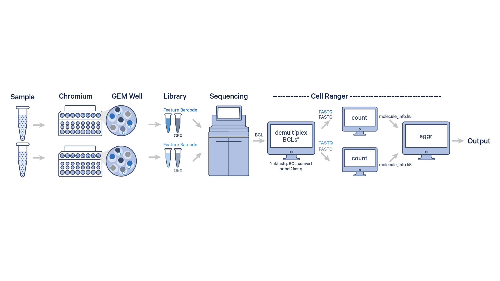

# Step By Step Single Cell RNAseq Analysis using CellRanger and R (Part 3 out of 6)
## Cell Ranger Output এবং Quality Control (QC) 
আমারে লেখার আগের অংশে (Part2) আমরা দেখেছি raw sequencing data থেকে কীভাবে count matrix তৈরি হয়। FASTQ file, barcode, UMI, mapping, quantification এই পুরো pipeline নিয়ে আলোচনা করেছি। কিন্তু এখন আমরা এমন একটা জায়গায় আসছি যেটা single-cell RNA-seq analysis-এর সবচেয়ে গুরুত্বপূর্ণ অংশগুলোর একটি। সেটা হলো Quality Control বা QC।
আমি ব্যক্তিগতভাবে মনে করি, single-cell RNA-seq analysis-এর সবচেয়ে underestimated অংশ এটা। অনেকেই QC-কে শুধু “filtering step” মনে করে। কিছু threshold বসিয়ে cell বাদ দেওয়া। কিন্তু বাস্তবে QC হচ্ছে data interpretation-এর প্রথম বড় judgement step। আপনাকে সিদ্ধান্ত নিতে হবে যে আপনি কোন কোন parameter ব্যবহার করছেন। এটা এমন না যে আপনি একই parameter সব রকম ডেটা এর জন্য ব্যবহার করবেন। আপনাকে প্রতিটি ডেটা এর জন্য আলাদা আলাদাভাবে parameter বের করতে হবে। এই ধাপে বেশ কিছু সিধান্ত নিতে হয়। যেমন ধরুনঃ  কোন cell এ biological signal আছে, কোন cell এর quality খারাপ, কোনগুলো dead cell, কোনটা empty droplet, কোনটা technical artifact। 
এই সিদ্ধান্তগুলো খুবই গুরুত্বপূর্ণ কারণ এর উপর ভিত্তি করে আপনার downstream analysis-এর উপর বিশাল প্রভাব পরবে। 
## একটু ভুল QC করলে কী হতে পারে?

•	fake cluster তৈরি হতে পারে 

•	mitochondrial stressed cell আলাদা cell type মনে হতে পারে 

•	doublet কে নতুন subtype মনে হতে পারে 

•	low-quality cell clustering distort করতে পারে 

আমি নিজে এমন paper দেখেছি যেখানে supposedly “novel cell population” বের করেছে বলেছে কিন্তু আসলে সেগুলো low-quality artifact ছিল। এজন্য মনে করতে পারেন যে আপনার analysis পুরোটাই ভুল হতে পারে যদি QC ঠিক মত না করেন। তাই QC শুধু technical step না। এটা biological interpretation-এর অংশ।

# আপডেট পাওয়ার জন্য নিবন্ধন করুন (Register for Updates)

আপনি যদি এই ব্লগের নিয়মিত আপডেট পেতে চান, তাহলে নিচের ফর্মটি পূরণ করুন। আমি নতুন কোনো কন্টেন্ট যোগ করার সাথে সাথেই আপনাকে ইমেইলের মাধ্যমে জানিয়ে দেব।

# [**ফর্ম পূরণ করতে এখানে ক্লিক করুন**](https://forms.gle/6qyRGiE7WSpLJ9SA9)

## Cell Ranger আসলে কী?
আগের অংশে আমরা Cell Ranger-এর নাম কয়েকবার বলেছি। Cell Ranger হলো 10x Genomics কোম্পানির তৈরি একটি software pipeline, যেটা তাদের single-cell sequencing data process করার জন্য design করা হয়েছে। এটার মানে দাঁড়াচ্ছে, আপনি যদি 10x Genomics kit ব্যবহার করেন, তাহলে Cell Ranger আপনার একমাত্র preprocessing tool। 
এটা raw sequencing data নিয়ে কয়েকটি গুরুত্বপূর্ণ কাজ করে:

•	FASTQ read process করা 

•	barcode correction করা 

•	UMI collapse করা 

•	alignment করা 

•	count matrix তৈরি করা 

•	এবং শেষে basic QC metrics generate করা 

এখানে একটা interesting ব্যাপার আছে। অনেকেই ভাবে Cell Ranger শুধু count matrix বানায়। কিন্তু বাস্তবে এটি অনেক ধরনের QC information generate করে, যেগুলো analysis শুরু করার আগেই sample quality সম্পর্কে ধারণা দেয়।
## Cell Ranger pipeline – ভেতরে কী হয়?
 

ছবি: 10x Genomics single-cell RNA-seq workflow এবং Cell Ranger processing pipeline
এই ছবিটা পুরো single-cell RNA sequencing workflow দেখান হয়েছে। শুরুতে sample নেওয়া হয়, যেখানে কোষগুলো 10x Chromium machine-এর মধ্যে প্রবেশ করানো হয়। এরপর microfluidic system ব্যবহার করে প্রতিটি cell ছোট ছোট droplet বা GEM (Gel Bead-in-Emulsion)-এর মধ্যে capture করা হয়। প্রতিটি GEM-এর মধ্যে একটি barcoded bead থাকে, যার মাধ্যমে প্রতিটি কোষের RNA পরে আলাদা করে শনাক্ত করা সম্ভব হয়। এরপর library preparation করা হয়, যেখানে mRNA থেকে cDNA তৈরি হয় এবং sequencing-এর জন্য library বানানো হয়। তারপর sequencing machine এই library sequence করে এবং raw sequencing output তৈরি হয়। এই output সাধারণত BCL format-এ থাকে। এরপর Cell Ranger pipeline শুরু হয়। প্রথম ধাপে mkfastq ব্যবহার করে BCL file থেকে FASTQ file তৈরি করা হয় (demultiplexing)। তারপর count step-এ FASTQ read reference genome-এর সাথে align করা হয়, barcode ও UMI process করা হয়, এবং gene expression count matrix তৈরি করা হয়। যদি multiple sample বা multiple run একসাথে combine করতে হয়, তাহলে aggr step ব্যবহার করা হয়, যা বিভিন্ন dataset aggregate করে একটি combined output তৈরি করে। সবশেষে pipeline থেকে filtered count matrix এবং অন্যান্য QC output পাওয়া যায়, যেগুলো downstream single-cell analysis-এর জন্য ব্যবহার করা হয়।
Cell Ranger pipeline-এর মূল ধাপগুলো আগের part-এর সাথে মিল আছে। প্রথমে FASTQ read reference genome-এর সাথে align করা হয়। এরপর low-quality read filter করা হয়। Cell barcode এবং UMI correction করা হয়। তারপর PCR duplicate collapse করা হয়। শেষে raw count matrix এবং filtered count matrix তৈরি করা হয়।
এখানে একটি subtle পার্থক্য আছে আপনি যেই output পাবেন তার মধ্যে। একটি পাবেন raw  matrix আরেকটি filtered matrix। Raw matrix-এ essentially সব barcode থাকে। কিন্তু filtered matrix-এ Cell Ranger যেগুলোকে high-quality cell মনে করে শুধু সেগুলো থাকে। এই filtering perfect না। এজন্য আমরা পরবর্তীতে আবার QC করি। কিন্তু শুরু হিশেবে এটা একটি ভাল দিক যে আপনি শুরুতেই কিছু cell কে বাদ দিয়ে দিতে পারবেন। 
## শুধু scRNA না — Cell Ranger-এর বিভিন্ন version
10x-এর বিভিন্ন single-cell technology -এর জন্য আলাদা Cell Ranger mode আছে। scRNAseq শুধু একটি technology না। এখন এর সাথে ক্রোমোজোম এর অবস্থা, antibody এর পরিমাণ, প্রোটিন এর পরিমাণ, artefact বের করা সহ ভিন্ন কাজের জন্য ভিন্ন পদ্ধতি তৈরি হয়েছে। এজন্য preprocessing pipeline একটু কঠিন মনে হয়। এখানে আরেকটি কোথা বলি cellranger software টি আপনি 10X genomics এর ওয়েবসাইট থেকে নামাতে পারবেন। যদি আপনি নিজের local computer এ এই ধাপ run না করাই শ্রেয়। এর কারণ আমরা পরের অংশে ব্যাখ্যা করবো।
নিছে আমি কিছু টেকনোলজি এবং এর জন্য কোড দিয়েছি। 
যেমন:
•	RNA → cellranger count 
•	ATAC → cellranger-atac 
•	Multiome → cellranger-arc 
•	VDJ → cellranger vdj 
•	Hashtagging → cellranger multi 
এটি আপনি terminal এ cellranger software install করার পর run করবেন। 
## Cell Ranger run করা এত কঠিন কেন?
এখন একটা practical reality নিয়ে কথা বলি। Cell Ranger run করা computationally heavy। অনেক সময় একটি sample process করতেই 16 CPU core , 64GB RAM , কয়েক ঘণ্টা runtime লাগতে পারে। এই কারণেই সাধারণ laptop-এ Cell Ranger run করা কঠিন এবং করা হয় না সচরাচর। সাধারণত High Performance Computing (HPC) cluster ব্যবহার করা হয়। আবার অনেক সময় আপনি যখন সেকুঞ্চিং করতে পাঠাবেন, ওরা নিজেরাই Cell Ranger run করে output দিয়ে আপনাকে দিয়ে দিবে।। কিন্তু research-এ অনেক সময় নিজেকেও run করতে হয়। আমার নিজের অভিজ্ঞতা হচ্ছে নিজে run করার চেষ্টা করুন, তাহলে পুরা কাজের উপর ভাল control থাকে। 
## Reference genome – ছোট কিন্তু critical জিনিস
Cell Ranger run করার আগে reference genome দরকার। Human বা mouse হলে 10x prebuilt reference দেয়। কিন্তু অন্য organism হলে নিজেকে reference build করতে হয়। এখানে দুটি file লাগে:
•	FASTA → genome sequence 
•	GTF → gene annotation 
এই দুটো দিয়ে cellranger reference তৈরি করে। 
## Cellranger এর মূল command:
cellranger count
এখানে input:

•	FASTQ path 

•	reference genome 

•	project name 

এই command-ই পুরো preprocessing pipeline চালায়।
## Cell Ranger run শেষ হলে কী পাওয়া যায়?
Cell Ranger run শেষ হলে একটি outs/ folder তৈরি হয়। এখানে অনেক file থাকে। সব file equally দরকার হয় না। আপনার কাজের উপর depend করে আপনি হয় filtered_feature_bc_matrix অথবা raw_feature_bc_matrix এই দুটি ডেটা ব্যবহার করবেন। 
## সবচেয়ে গুরুত্বপূর্ণ output file কোনগুলো?
### filtered_feature_bc_matrix
এটাই সাধারণত downstream analysis-এর মূল input।এখানে: barcode , feature (gene), matrix  থাকে। এই matrix filtered cell নিয়ে তৈরি।
### raw_feature_bc_matrix
এখানে সব barcode থাকে। যেমন real cell, empty droplet, noisy barcode  সবকিছু। এই raw matrix QC বোঝার জন্য useful। আপনি চাইলে filtered অথবা raw দুটি ডেটাই ব্যবহার করতে পাবেন। ডেটার উপর বেশি কন্ট্রোল চাইলে বলবো raw ব্যবহার করতে। 
web_summary.html
এটা useful QC file। এটা browser-এ খুললে interactive report দেখা যায়। এখানে sequencing quality, mapping quality, barcode quality, clustering,সব basic overview পাওয়া যায়। এই অনহশে অনেকগুলো বিষয় বোঝার আছে, আমি লেখার শেষ অংশে সেই বিষয় এর একটি reference দিয়ে দিব। কিন্তু আমি বিস্তারিত লিখব না। কারণ, কাজ করার ক্ষেত্রে আপনি cellranger run করার পর দেখা যায় আমরা mostly analysis এ চলে যাই। 

## Cell Ranger command আসলে কী করছে?
আগের অংশে আমরা দেখেছি Cell Ranger কী ধরনের কাজ করে। এখন আমরা একটি বাস্তব command দেখে বোঝার চেষ্টা করবো কীভাবে Cell Ranger run করা হয়। এখানে বলে রাখা ভালো, নিচের example টি শুধুমাত্র শেখানোর উদ্দেশ্যে দেওয়া হচ্ছে। এখানে ব্যবহৃত sample name, path এবং location সব dummy example হিসেবে ধরা হয়েছে। sample
একটি typical Cell Ranger command দেখতে এমন হতে পারে:
```r
cellranger count \
--disable-ui \
--fastqs=/path/to/fastq_files/ \
--id=Sample_1 \
--project=PBMC_Project \
--transcriptome=/path/to/reference_genome/ \
--sample=PBMC_sample \
--description=PBMC_dataset \
--localcores=16 \
--localmem=240
```
## প্রথমে cellranger count অংশটি দেখি।
এই command-টাই মূলত Cell Ranger-এর gene expression pipeline চালায়। FASTQ file থেকে শুরু করে alignment, barcode correction, UMI collapsing, count matrix generation সবকিছু এই command-এর ভেতরে হয়।
### --disable-ui
এই option ব্যবহার করলে Cell Ranger graphical monitoring interface বন্ধ রাখে। HPC cluster-এ অনেক সময় graphical interface প্রয়োজন হয় না, তাই এই option ব্যবহার করা হয়।
### --fastqs=/path/to/fastq_files/
এখানে FASTQ file কোথায় আছে, সেই directory path দেওয়া হয়। ধরুন আপনার sequencing facility আপনাকে FASTQ file দিয়েছে, এবং সেগুলো একটি folder-এ রাখা আছে:
### /data/scRNAseq/PBMC_FASTQ/
তাহলে সেই folder path এখানে ব্যবহার করবেন। একটা subtle ব্যাপার হলো, এখানে সাধারণত FASTQ file-এর individual নাম দেওয়া হয় না। বরং যে folder-এর মধ্যে FASTQ file আছে, সেই folder path দেওয়া হয়। Cell Ranger সেই folder scan করে প্রয়োজনীয় FASTQ file detect করে।
### --id=Sample_1
এই parameter output folder-এর নাম নির্ধারণ করে। যদি আপনি --id=Sample_1 দেন, তাহলে শেষে একটি folder তৈরি হবে:
### Sample_1/
এই folder-এর ভেতরে থাকবে:
•	count matrix 
•	BAM file 
•	QC report 
•	web_summary.html 
•	এবং অন্যান্য output 
এটা basically project run-এর unique identifier।
### --project=PBMC_Project
এই option অনেক সময় organisational purpose-এর জন্য ব্যবহার করা হয়। যদি আপনি অনেক sample নিয়ে কাজ করেন, project name ব্যবহার করলে dataset organize করা সহজ হয়। যেমন:
•	Cancer_Project 
•	PBMC_Project 
•	Lung_Tissue_Project 
### --transcriptome=/path/to/reference_genome/
এখানে Cell Ranger compatible reference genome-এর location দেওয়া হয়। এখন প্রশ্ন হলো reference genome কোথা থেকে আসে? Human এবং mouse-এর জন্য 10x আগে থেকেই prebuilt reference দেয়। এগুলো download করা যায়। এখান থেকে নামাতে পারবেন। 
### https://www.10xgenomics.com/support/software/cell-ranger/downloads#reference-downloads
যেমন Human GRCh38 reference:
### /references/refdata-gex-GRCh38-2020-A/
এই folder-এর ভেতরে থাকে:
•	genome FASTA 
•	gene annotation (GTF) 
•	STAR index 
•	Cell Ranger compatible files 
এখন Cell Ranger sequencing read-গুলোকে এই reference-এর সাথে align করে determine করে যে কোন read কোন gene থেকে এসেছে
### --sample=PBMC_sample
এই option ব্যবহার করা হয় specific sample select করার জন্য। কারণ FASTQ folder-এ multiple sample থাকতে পারে। ধরুন FASTQ file-এর নাম এমন:
PBMC_sample_S1_L001_R1_001.fastq.gz
PBMC_sample_S1_L001_R2_001.fastq.gz
তাহলে --sample=PBMC_sample দিলে Cell Ranger ওই sample-এর FASTQ file process করবে।
### --description=PBMC_dataset
এটা মূলত একটি text description। এটি analysis-এর metadata হিসেবে useful হতে পারে। যেমন: control sample  অথবা stimulated PBMC  অথবা tumour tissue ইত্যাদি।
### --localcores=16
এখন আসি computational resource-এর কথায়।এই parameter বলে দেয় Cell Ranger কয়টি CPU core ব্যবহার করবে। এখানে:
### --localcores=16
মানে 16 CPU core ব্যবহার করা হবে। Cell Ranger multi-threaded software। বেশি core দিলে alignment, sorting, counting step দ্রুত হয় 
CPU core আসলে কী?
একটু সহজভাবে বললে: CPU core হচ্ছে computer-এর worker।
১ core → ১ worker
১৬ core → ১৬ worker
যত বেশি worker, তত parallel কাজ সম্ভব।
সবসময় বেশি core ভালো?
সবসময় না। কারণ: cluster limit থাকতে পারে ,  memory যথেষ্ট না হলে benefit কমে যায় , queue time বাড়তে পারে  তাই balance দরকার।
### --localmem=240
এখানে memory বা RAM allocate করা হয়। --localmem=240 মানে: Cell Ranger সর্বোচ্চ 240 GB RAM ব্যবহার করতে পারবে। এখন প্রশ্ন হল এত memory কেন লাগে?
কারণ scRNA-seq data বিশাল হতে পারে। বিশেষ করে:
•	লাখ লাখ read 
•	হাজার হাজার cell 
•	genome alignment 
•	barcode processing 
সবকিছু memory-intensive।
## RAM কম হলে কী হবে?
যদি memory insufficient হয়:
•	job crash করতে পারে 
•	slow হতে পারে 
•	incomplete output আসতে পারে 
বিশেষ করে large dataset-এর ক্ষেত্রে এটা common problem।
Typical resource requirement
ছোট dataset: 8 core এবং 32–64GB RAM 
Medium dataset: 16 core এবং 64–128GB RAM 
Large dataset: 32+ core এবং 200GB+ RAM 
## HPC cluster কেন দরকার?
এই কারণেই সাধারণ laptop-এ Cell Ranger চালানো কঠিন।
একটি modern scRNA-seq sample process করতে অনেক সময়:কয়েক ঘণ্টা runtime , কয়েকশ GB temporary storage এবং high RAM লাগতে পারে। তাই সাধারণত HPC cluster ব্যবহার করা হয়।
## Cell Ranger run করার পরে কী হয়?
Command run শেষ হলে একটি output folder তৈরি হয়।যেমন:
Sample_1/
এর ভেতরে থাকে:
•	filtered matrix 
•	raw matrix 
•	web summary 
•	BAM file 
•	QC report 
শেষ কথা
এই command প্রথমে একটু intimidating লাগতে পারে। অনেক parameter, অনেক path, অনেক resource setting। কিন্তু ধীরে ধীরে বুঝলে দেখা যায়, বেশিরভাগ parameter-এর কাজ logical।
মূলত Cell Ranger-কে বলা হচ্ছে:
•	FASTQ কোথায় 
•	reference কোথায় 
•	output কোথায় হবে 
•	কত computational resource ব্যবহার করবে 
এবং তারপর Cell Ranger পুরো preprocessing pipeline চালিয়ে একটি count matrix তৈরি করে।
## শেষ কথা
একটা important কথা মনে রাখা দরকার। Single-cell RNA-seq-এ downstream sophistication যতই advanced হোক, poor-quality input data ভালো হয়ে যায় না। 
পরবর্তী অংশে আমরা R এবং Seurat ব্যবহার করে manually QC করা শুরু করবো।
সেখানে আমরা অনেক বিষয় এই hands-on ভাবে দেখবো।


